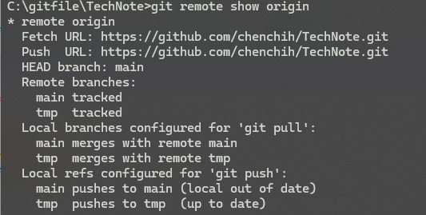
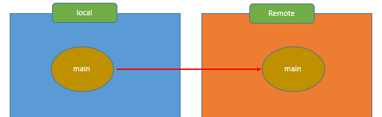
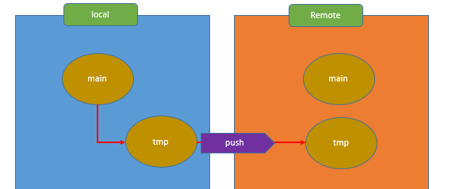
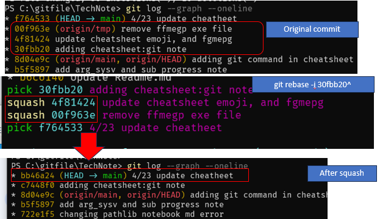
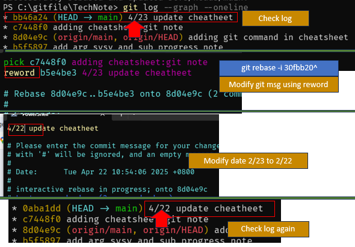

# Cheat Sheet
Record Cheat Sheet Note
## Update Record
- 2025/3/10:
	- adding remove branch, remove remote branch, fetch -- plume
- 2025.2.24: 
	- update git push setting
	- window shortcut
- 2025.05.04: reedit git note	

## Git Command Notes

<a name="top"></a>
- [1. Git Push and Upstream Settings](#1.Git_push_upstream)
	- [1.1 setting git upstream](#1.1git_set_upstream)
	- [1.2 Checking Tracking Status](#1.2_checktracking)
 	- [1.3 Git Push](#1.3_gitpush)
 	- [1.4 Git Pull](#1.4_gitpull)
- [2. Creating, Pushing, and Pulling Branches](#2.Common-case-usecase)
  - [Case 1: Pushing to Remote Branches](#2.case1)
    - [1.1 PC1 Push: Same Local and Remote Branch Name](#2.case1.1)
    - [1.2 PC1 Push: Different Local and Remote Branch Names](#2.case1.2)
  - [Case 2: PC2 Pulling a Remote Branch to a New Local Branch](#2.case2)
  - [Case 3: PC1 Pulling a Remote Branch to the Current Local Branch](#2.case3)
- [3. Checking Remote Branches](#3.CheckRemoteBranch)
	- [Remote Tracking](#3.1RemoteTracking)
- [4. Git Stash](#4.gitstash)
- [5. Interactive Rebase (`git rebase -i`)](#5.InteractiveRebase)
  - [Squashing Commits](#5.1squash)
  - [Rewording Commits](#5.2reword)
- [6. Checking Commit Logs (`git log`)](#6.gitLog)
	- [Visualize your Git branch graph](#VisualizeLog)
- [7. Undoing and Recovering Commits](#7.reset)
  - [Case 1: `git reset` - Accidentally Removing a Commit](#7.case1)
  - [Case 2: `git restore` - Undoing Uncommitted Changes](#7.case2)
  - [Case 3: `git revert` - Undoing Commits Safely](#7.case3)
  - [Case 4: `git reset` - Back to Uncommitted](#7.case4)
  - [Case 5: `git reset` - Back to Unstaged](#7.case5)
  


**Git Command Summary**
This section provides a quick overview of some common Git commands and their modern or recommended alternatives.
- `git reset` -> Use `git restore` for working directory and staging area changes.
- `git status` -> Consider using `git status -sb` for a more concise output.
- `git pull` -> It's often recommended to use `git pull --rebase` to maintain a cleaner history.
- `git checkout` -> Use `git switch` for branch switching and creation.
- `git stash` -> Explore `git worktree` as a potential alternative for managing multiple working directories.
- `git merge` -> Consider `git rebase` for integrating changes, especially for a linear history.

<a name="1.Git_push_upstream"></a>
### 1. Git push and upstream setting [🔝](#top)

- [setting git upstream](#1.1git_set_upstream)
- [Checking Tracking Status](#1.2_checktracking)
- [Git Push](#1.3_gitpush)
- [Git Pull](#1.4_gitpull)

<a name="1.1git_set_upstream"></a>
#### 1.1 setting git upstream [🔙](#1.Git_push_upstream)
The point of setting upstream is to then simply use `git push` or `git pull` in the future, instead of entering full remote name like `git push origin main`. Just imagine setting upstream is like setting a `git push` or `git pull` alias, without explicitly including the remote branch name.

- `git branch --set-upstream-to=origin/<branchname>`
	- This command establishes the tracking relationship between your current local branch and the specified remote branch (`origin/<branchname>`). It tells your local branch where to push to and pull from by default.
	
- `git push -u origin <branchname>`
	- This command pushes your local branch to the remote branch (`origin/<branchname>`) **and** sets up the upstream tracking for your local branch to that remote branch. The `-u` flag is crucial for setting the upstream.
	- It pushes your local branch to the remote branch (origin/branchname).
	- It sets the upstream tracking for your local main branch to origin/main. and 
	- It create upstream tracking , which allow you to `git push` from local to remote. 
	
<a name="1.2_checktracking"></a>
#### 1.2 Check tracking status [🔙](#1.Git_push_upstream)
- `git branch -vv` : Checking Upstream tracking Settings
It lists your local branches and shows which remote branch track (which we set in the previous section in 1.1) of the local to the remote side. 

[list tracking](#img/git_trackinglist.png)

<a name="1.3_gitpush"></a>
#### 1.3 git push [🔙](#1.Git_push_upstream)

Once upstream is set, you can simply use:
- `git push`:will push to the tracked remote branch. Explicitly telling `git push` my current local branch to origin/main, regardless of what my upstream setting is.
	- `git push origin main`: you can also use this to bypass upstream to push to remote, which means if you didn't set upstream, you can use this the original path.  
	- `git push -f <remote_name ex:origin> <local_branch>:<remote_branch>` ex: `git push origin main:tmp`

You can use `git remote -v` to check the remote name default is origin
<a name="1.4_gitpull"></a>
#### 1.4 git pull [🔙](#1.Git_push_upstream)

- `git pull`: will pull from the tracked remote branch, it will download and merge. Go to remote repository, download any new changes (git fetch), and then automatically try to combine those changes into my current local branch (git merge).
- `git fetch`: Download the new change, just like a browser refresh key to see the change.
- `git rebase`: Will automatically take the commit in your current working directory and apply to head of the branch. 

**better way of using git pull**
- `git pull`: Means `git fetch+git merge`. 
- `git pull --rebase`: `git fetch+ merge/rebase` use this instead of git pull

**These are other option**
- `git pull --ff only`: only fetch new commit 
- `git pull -- ff`: 

<a name="2.Common-case-usecase"></a>
###  2. Common case of Create, Push and Pull [🔝](#top)

- **Create Branch**:`git checkout <branch_name>`
- **Remove Local Branch**: `git branch [-D|-d] <branch_name>`
	- `-d`: Checks if the branch has been fully merged into its upstream branch. If it has, it deletes the branch. If not, it will return an error.
	- `-D`: If you want to force deletion (even if it's not fully merged)
- **Remove Remote Branch**: `git push origin --delete <branch_name>` or `git push origin :<branch_name>`
- **Show remote Branch**: `git remote show origin`



<a name="2.case1"></a>
#### Case1: Push remote branch with same and different branch name [🔙](#2.Common-case-usecase)
Imagine PC1 use at office, and PC2 use at home. 

- [Case 1: Pushing to Remote Branches](#2.case1)
- [Case 2: PC2 Pulling a Remote Branch to a New Local Branch](#2.case2)
- [Case 3: PC1 Pulling a Remote Branch to the Current Local Branch](#2.case3)

<a name="2.case1.1"></a>
##### Case1.1 [Git push] PC1 push both local and remote branch with same name
This example will show using **same branch name** on both local and remote. 



- Create local `tmp` branch and push to remote branch `tmp` 
Local branch and remote branch use the same name
```
git checkout -b tmp #create and change new branch in local side
git add .
git commit -m <message to commit> 

#Pushes your current local branch to a remote branch with the same name
git push -u origin <remote branch name, ex:tmp>
```

<a name="2.case1.2"></a>
##### Case1.2 [Git push] PC1 push: local and remote branch with different branch name
Push the local main branch to the remote branch name `tmp`. If `tmp` doesn't exist on the remote, it will auto created.



- Push local `main` branch to remote branch `tmp`(or different remote branch name)
Local branch and remote branch use different name
```
#main branch 
git add .
git commit -m <message to commit> 
#Pushes your local main branch to a remote branch named tmp branch
git push origin main:tmp #Does not set upstream tracking, if upstream set can use git push
```
<a name="2.case2"></a>
#### Case2 [Git pull] PC2 pull remote origin/tmp to local tmp branch(auto create it) [🔙](#2.Common-case-usecase)
This command creates a new local branch tmp that tracks the remote `origin/tmp branch` and switches to it. 
This is PC2 which don't have `tmp` branch in local side, and want to download remote `origin/tmp` data to local side. In PC2 just `case1-1` or `case1-2` create a remote branch `tmp`, if you want the branch to download local branch, just this method. 

```
git fetch --all #will update remote branch list
git checkout -b tmp origin/tmp
git commit -m "commit msg"
git push -u origin tmp
```

you can use the `remote <branch> -r` to see your updated remote list. 

<a name="2.case3"></a>
#### Case3: [Git pull] PC1 pull origin/tmp to local main without create `tmp` or any branch  [🔙](#2.Common-case-usecase)
In PC2 push to remote tmp, now what if I want to pull down to main branch. 

- > Pull `Remote tmp -> local main branch`
```
method1:
#Fetch the Remote tmp Branch
git fetch origin
#switch to main, in case only main branch can ignoire)
git checkout main
#Merge origin/tmp into main(local)
git merge origin/tmp

#method2: Fetches and merges origin/tmp into the local main branch in a single command.
git pull origin tmp:main
```
<a name="3.CheckRemoteBranch"></a>
### 3. Check Remote branch [🔝](#top)
This command will lists your remote-tracking branches 

- `git branch -r`: check the available remote branches
```
 origin/HEAD -> origin/main
  origin/main
  origin/tmp
```
- `git remote show origin`: tells you about the remote repositories themselves (URLs, settings, etc.).
```
* remote origin
  Fetch URL: https://github.com/chenchih/TechNote.git
  Push  URL: https://github.com/chenchih/TechNote.git
  HEAD branch: main
  Remote branches:
    main tracked
    tmp  tracked
  Local branch configured for 'git pull':
    main merges with remote main
  Local ref configured for 'git push':
    main pushes to main (up to date)
```
<a name="3.1RemoteTracking"></a>
#### Remote Tracking
`--prune` is used to clean up  remote-tracking branches in your local repository. When you delete a branch on your GitHub server, Git doesn't automatically remove the corresponding remote-tracking branch from your local repository.

**When using it?**
When you delete a branch on GitHub (or any remote), the corresponding remote-tracking branch in your local repository are old. It still exists locally, but it no longer matches the state of the remote

**Sumamry:**
When you delete a branch on GitHub, you need to use git fetch --prune (or its variations) to remove the stale remote-tracking branch from your local repository.
This command fetches the latest changes from the remote and removes any remote-tracking branches that no longer exist on the remote.

- `git fetch --prune`: remove remote-tracking branches 
	- `git fetch origin --prune`: Specific to the origin remote, working with a single remote
	- `git fetch --prune`: Specific to the default or tracked remote. Unsure which remote you are tracking, and want to prune the remote you are tracking
	- `git fetch --all --prune`: Applies to all configured remotes, working with multiple remotes

if you are working with a repository where origin is your primary remote and most of your branches track origin, then these two commands will produce the same result.
```
# some remote tracking is been remote
PS C:\gitfile\TechNote> git branch -r
  origin/HEAD -> origin/main
  origin/main
  origin/tmp
  origin/tmp_pathlib

# using prune the not exist wil remove 
PS C:\gitfile\TechNote> git fetch --prune
  origin/HEAD -> origin/main
  origin/main
  origin/tmp
```
<a name="4.gitstash"></a>
### 4. git stash [🔝](#top)
- `git stash`: is a local operation. It does not interact with remote repositories. It is a **temporary** holding area for your **uncommitted changes**.
update from the remote, and then reapply your work.This helps you avoid conflicts during the git pull process. If the remote changes and your local changes affect the same lines in the same file, you will need to manually solve the merge conflicts. 

- commonly used:
	- `git stash`
	- `git stash pop` : apply the changes I made earlier in tmp and apply to it (attempts to merge your stashed changes with the current state of your working directory) and will alert you to any conflicts that arise. **It applies and deletes**
	- `git stash apply`: is similar to git stash pop, it **apply and keep**, allow to apply stashed changes repeatedly..
- Other option can use:
	- `git stash list`: list multiple stash if you create multiple 
	- `git stash apply stash@{}`: switch to specific stash 
	- `git stash drop stash@{id}`: remove git stash
	- `git clear`: clear all stash

I am editing `test.py`, then there are some new updates on the remote. I need to save my uncommitted changes and perform a git pull to update my local repository with the latest changes from the remote. In this case, I will use git stash to save my uncommitted changes to a temporary location (the stash).

Now, I will use git pull to fetch and merge the latest changes from the remote into my current local branch. After the git pull is complete, I will use git stash pop to reapply the changes I made to test.py before the pull.

<a name="5.InteractiveRebase"></a>
### 5.Interactive rebase [🔝](#top)
interactive rebase `git rebase -i` to modify history, you can use these options below:
- `pick` (or p): Use this commit as is.
- `squash` (or s): Combine this commit into the previous commit. You'll get a chance to edit the combined commit message.
- `fixup` (or f): Combine this commit into the previous commit, discarding this commit's log message.
- `reword` (or r): Use this commit, but edit the commit message.
- `drop (or d)`: Remove this commit entirely.

<a name="5.1squash"></a>
#### 5.1 squash commit (squeeze multiple commit into one)
If you have long commit history, you can use the squash with interactive rebase command (`git rebase -i`). This method will make history cleaner and easier to follow, especially if many of those commits are small fixes.

Step1: check log `git log --graph --oneline #show log` 
```
git log --graph --oneline #show log 
* f764533 (HEAD -> main) 4/23 update cheatheet 
* 00f963e (origin/tmp) remove ffmegp exe file
* 4f81424 update cheatsheet emoji, and fgmepg
* 30fbb20 adding cheatsheet:git note
```

Step2: squash 00f963e and 4f81424 into 30fbb20: ` git rebase -i 30fbb20^`

The `<commitID>^` for example: 4f81424^ refers to the parent commit of 4f81424, so in the log the parent of 4f81424 is 30fbb20.

When you use `rebase -i` which will go to inactivate mode, which allow you to modify commit. Change the commit you want to squash with `squash`, and save the file.  
```
pick 30fbb20 adding cheatsheet:git note
squash 4f81424 update cheatsheet emoji, and fgmepg
squash 00f963e remove ffmegp exe file
pick f764533 4/23 update cheatheet
```

Step3: Check the log again
When you chek the log, you will realize the original commit is been squashed. 
After squashing commit will have a brand new and different Git commit ID, please keep in mind. 
```
git log --graph --oneline #show log 
* bb46a24 (HEAD -> main) 4/23 update cheatheet
* c7448f0 adding cheatsheet:git note
* 8d04e9c (origin/main, origin/HEAD) adding git command in cheatsheet
```

Please refer picture below for more details:


<a name="5.2reword"></a>
#### 5.2 reword commit(edit your commit msg)
If you want to modify your commit msg, you can use the `reword` like above rebase inactive. Please refer below picture for more detail. 


<a name="6.gitLog"></a>
### 6. gitlog [🔝](#top)
- `git log --graph --oneline --decorate --all`
- `gitk --all` : (GUI)
- `git log  --pretty=format:"%h %s"`
`%h` is shorthand for hash_id and `%s` shorthand for subjectName[message_name]
```
git log  --pretty=format:"%h %s"
#output
5e923eb to organize note for readme
ce17fb7 adding link to each section of a page, and examples folder
8976dcd adding response model's account normal usage example

git log --pretty=format:%s # first line of the messages
```

- `git log --pretty=format:"%h   %s %C(yellow)(%cr)"`
`%C` is a shorthand for color

```
 show date behind commit-id and message
```

- `git log --oneline --grep="add"`

<a name="VisualizeLog"></a>
#### Visualize your Git branch graph 
- `git log --graph --oneline --decorate --all`

<a name="7.reset"></a>
### 7. Undo and recover commit [🔝](#top)

- `Reset`: Primarily used to move the branch pointer (HEAD) to a specific commit, effectively undoing commits on the current branch. Options like --hard can also discard changes, potentially rewriting history
	- `hard`: Undo everything (commits, staging, working directory) back to the specified point.
	- `soft`: Move back to uncommitted (changes are staged, ready to commit again).
	- `mixed(default)`: Move back to unstaged (changes are in the working directory, ready to be staged).
- `restore`:  Used to undo changes in the working directory (unstaged) or to unstage files (move from staging back to working directory). It operates on the current working state and staging area, not directly on committed history
- `revert`: sed to undo a specific commit by creating a new commit that reverses its changes. This preserves the original commit and the history, making it safe for shared branches

------------
- [Case 1: `git reset` - Accidentally Removing a Commit](#7.case1)
- [Case 2: `git restore` - Undoing Uncommitted Changes](#7.case2)
- [Case 3: `git revert` - Undoing Commits Safely](#7.case3)
- [Case 4: `git reset` - Back to Uncommitted](#7.case4)
- [Case 5: `git reset` - Back to Unstaged](#7.case5)


<a name="7.case1">
#### Case1 git reset: if accidentally remove commit [🔙](#7.reset)

Step 1: Check your log status
```
PS C:\gitfile\testlog> git log --oneline
c153b52 (HEAD) add comment
d0159e4 add python file name testhello
6c097d5 update
aa60785 Revert "modify xx to real name"
44bb243 hello added

```
Step2: accidentally delete a commit
```
PS C:\gitfile\testlog> git reset --hard d0159e4
HEAD is now at d0159e4 add python file name testhello

#check log again
PS C:\gitfile\testlog> git log --oneline
d0159e4 (HEAD) add python file name testhello
6c097d5 update
```
Step3: reflog to check deleted commit id
```
#use reflog to check removed commit
PS C:\gitfile\testlog> git reflog
d0159e4 (HEAD) HEAD@{0}: reset: moving to d0159e4
c153b52 HEAD@{1}: commit: add comment
d0159e4 (HEAD) HEAD@{2}: commit: add python file name testhello
6c097d5 HEAD@{3}: commit: update
```

Step4: recovery d0159e4
```
PS C:\gitfile\testlog> git reset --hard c153b52
#check log again, add comment is been recovered
PS C:\gitfile\testlog> git log --oneline
c153b52 (HEAD) add comment
d0159e4 add python file name testhello
6c097d5 update
```

<a name="7.case2">
#### Case2 git restore: restore to untrack [🔙](#7.reset)

Restore undoing changes in your local, uncommitted work (working directory and staging area). It only operates on the working directory and the staging area, fter commit will not be able to undo. 

It have two method one is to undo your editing file, and the one is adding `staged` option to move back to unstaged. 

- Restore
```
#edit your file, add hello to it
PS C:\gitfile\gitdemotest> notepad.exe .\note.txt
#it will undo the file to original file content
PS C:\gitfile\gitdemotest> git restore .\note.txt
```

- Restore with staged

Create file and stage it
```
PS C:\gitfile\gitdemotest> notepad.exe .\note.txt
PS C:\gitfile\gitdemotest> git add .\note.txt #stage your file
PS C:\gitfile\gitdemotest> git status
On branch master
Changes to be committed: #change to stage
  (use "git restore --staged <file>..." to unstage)
        modified:   note.txt
```

Resore back to unstage:
```
PS C:\gitfile\gitdemotest> git  restore --staged note.txt
PS C:\gitfile\gitdemotest> git status
On branch master
Changes not staged for commit:   #change not staged
  (use "git add <file>..." to update what will be committed)
  (use "git restore <file>..." to discard changes in working directory)
        modified:   note.txt
```

<a name="7.case3">
#### Case3 git revert: undo commit [🔙](#7.reset)

git revert provides a safe way to undo changes because it adds a new commit, instead of remove it. It focuses on **creating a new commit that explicitly reverses the changes introduced by a specific past commit**.

It designed to undo the changes of a commit by creating a new commit that reverses those changes, thereby preserving the history of the repository. It's the safe and recommended way to undo changes in a collaborative environment.

Step1: add and commit file 
```
git init
echo "Initial text" > README.md
git add README.md
git commit -m "initial commit"

# in case this is a typo which we want to undo 
echo "bad update" > README.md
git commit -am "bad update"
```

Check log:
```
PS C:\gitfile\test_revert> git log --oneline
568e132  (HEAD -> master) bad update
7b5b95b ading readme
```

Step2: revert the head, which is the typo we want to undo it
```
git revert HEAD

Revert "bad update"

This reverts commit 568e132b11facae397b05902d9234d0739fc06a6.

# Please enter the commit message for your changes. Lines starting
# with '#' will be ignored, and an empty message aborts the commit.
#
# On branch master
# Changes to be committed:
#       modified:   README.md

```

If you want to leave a default message, just press `wq` to save and exit 

Step3: Check log 
```
PS C:\gitfile\test_revert> git log --oneline
1ede0b9 (HEAD -> master) Revert "bad update"
568e132 bad update
7b5b95b ading readme
```
You can see it create a new commit `1ede0b9 (HEAD -> master) Revert "bad update"` instead of removing the `568e132 bad update`. 
Using revert will be safer, which preserves the commit in the history. This allows you to switch back in future if you want to use. 

<a name="7.case4">
#### Case4 reset back to uncommit [🔙](#7.reset)
In this example, I will show you how to reset back to uncommitted status and return to commit status:
- step2: undo commit(return to step1)
- step3: undo step2 (return to step1)

Step1: Add and commit file 
```
git init
echo "Initial text" > README.md
git add README.md
git commit -m "initial commit"

# in case this is a typo, which we want to undo 
echo "bad update" > README.md
git commit -am "bad update"
```
Check log:
```
PS C:\gitfile\reset_test> git log --oneline
bf82263 (HEAD -> master) bad update
29938d0 initial commit
```

Step2: undo commit by `reset --soft`
moves the master branch pointer back 
```
PS C:\gitfile\reset_test> git reset --soft HEAD^
PS C:\gitfile\reset_test> git log --oneline
29938d0 (HEAD -> master) initial commit
```

Step3: undo commit by `reset --soft`
In case in you want to undo step2 to original place, use `git reflog` to find your git ID

```
PS C:\gitfile\reset_test> git reflog show HEAD
29938d0 (HEAD -> master) HEAD@{0}: reset: moving to HEAD
29938d0 (HEAD -> master) HEAD@{1}: reset: moving to HEAD
29938d0 (HEAD -> master) HEAD@{2}: reset: moving to HEAD
29938d0 (HEAD -> master) HEAD@{3}: reset: moving to HEAD^
```
git reset to step1

```
git reset --hard bf82263

PS C:\gitfile\reset_test> git log --oneline
bf82263 (HEAD -> master) bad update
29938d0 initial commit
```

<a name="7.case5">
#### Case5 reset back to unstage [🔙](#7.reset)
Undoing git reset --soft HEAD^ to go back to the unstaged state

Step1: continue Case4 and check log
```
PS C:\gitfile\reset_test> git log --oneline
bf82263 (HEAD -> master) bad update
29938d0 initial commit
```
Step2: reset to uncommit to stage
```
git reset --soft HEAD^

PS C:\gitfile\reset_test> git log --oneline
29938d0 initial commit

PS C:\gitfile\reset_test> git status
On branch master
Changes to be committed:
  (use "git restore --staged <file>..." to unstage)
        modified:   README.md
```		
Step3 reset to unstage `git reset` or `git reset --mixed` as default
```
PS C:\gitfile\reset_test> git reset
Unstaged changes after reset:
M       README.md

PS C:\gitfile\reset_test> git status
On branch master
Changes not staged for commit:
  (use "git add <file>..." to update what will be committed)
  (use "git restore <file>..." to discard changes in working directory)
        modified:   README.md
```


## PYTHON


### Create virtual env
This is a useful way to isolate your current environment from a new environment. Sometimes, some packages might conflict with a specific version and prevent to installation or run.  You can just create a virtual environment with a fresh environment  which will not affect your current environment. 


#### using venv:

- `python3.13 -m venv testbuild`
	
#### using virtualenv: 
- install with pip

- `virtualenv <venv_name>`
When you run virtualenv <venv_name> without specifying a Python interpreter, virtualenv typically uses the Python interpreter that is first in your system's PATH environment variable.

- specific version: `virtualenv -p py -3.12 <venv_name>` 
- Explicitly Specifying the Interpreter Path: 
	- window: `virtualenv -p "C:\path\python3.12\python.exe" <venv_name>`, use `<venv_name>\Scripts\activate` to activate
	- linux: `virtualenv -p "/usr/bin/python3.12" <venv_name>`, use `source <venv_name>/bin/activate` to activate

### Convert Python to an executable file
Convert your Python code to an executable file (`.exe`) which allows to run code in  different environments without installing Python or pkg

Install pyinstaller pkg: `pip install pyinstaller`

```
#simple convert 
pyinstaller your_script.py
#include icon
pyinstaller --onefile --icon=desktop.ico  xxx.py

```

- Please refer other option command you can use:
	- Single File: `pyinstaller  --onefile  your_script.py`
	- Adding Icons: `pyinstaller --onefile --icon=myicon.ico your_script.py`
	- no console window: `pyinstaller --onefile --windowed your_script.py`
	- Adding Data Files: `pyinstaller --onefile --add-data "data_file.txt;." your_script.py`

- Ico download link:
	- Icon URL: `https://www.flaticon.com/`
	- convert `.png` to `ico`: https://convertio.co/zh/


### Convert python to executable file

Convert your code to executable file in different envirnoment without install package
```
pyinstaller --onefile --icon=desktop.ico  xxx.py
```
- Icon URL: `https://www.flaticon.com/`
- convert `.png` to `ico`: https://convertio.co/zh/


## Window 

### Shortcut command

#### window run window
Press `window+R` to run some shortcut and enter below command:

- Network interface網路連線: `ncpa.cpl`
- check PC HW information: `msinfo32` 
- check services running: `services.msc`
- system setting: `msconfig`
- check window version: `winver`
- open specific or drive: `explorer <path>`, ex: `explorer d:` 
	- also work on `command prompt`
- open home path: `%HOMEPATH%`
- devices management: `devmgmt.msc` checking driver version and install or not  
- firewall setting: `wf.msc`
- remote desktop: `MSTSC`

#### command promopt
- check process: `tasklist  |grep nameapp`
- kill process: 
	- stop process ID: `taskkill /pid <process ID> /f`
	- stop python: `taskkill /IM python.exe /f` 
	- stop cmd: `Get-Process -Name "cmd" | Stop-Process`
- check recursive of working directory: `tree /f pathname` 
- remove unempty dirctory: `Remove-Item <foldername>  -Recurse -Force`
## Linux


## Emoji 

### ✅ Status / Progress
| Emoji | Meaning                |
|-------|------------------------|
| ✅     | Success / Done         |
| ❌     | Error / Failed         |
| ⚠️     | Warning               |
| 🔄     | In Progress / Refresh  |
| 🔍     | Searching / Scanning   |
| 🔧     | Config / Setup         |
| 💾     | Saving / Backup        |
| 🛠️     | Tools / Processing     |
| ⏳     | Waiting / Loading      |

### 📂 Files & Folders
| Emoji | Meaning                |
|-------|------------------------|
| 📂     | Open folder            |
| 📁     | Closed folder          |
| 📄     | Document / File        |
| 📑     | Section / Bookmark     |
| 🗂️     | File Organizer         |
| 📝     | Writing / Notes        |

### 📶 Network & Data Transfer
| Emoji | Meaning                |
|-------|------------------------|
| 📶     | Signal / Network       |
| 📡     | Download / Comm        |
| 📲     | Upload / Mobile        |
| 🔌     | Connect / Plug         |
| 🌐     | Internet / Web         |

### 📊 Data & Analytics
| Emoji | Meaning                |
|-------|------------------------|
| 📊     | Bar Chart              |
| 📈     | Line Chart Up          |
| 📉     | Line Chart Down        |
| 🧮     | Calculation / Stats    |

### 🧪 Testing & Debugging
| Emoji | Meaning                |
|-------|------------------------|
| 🧪     | Testing / Experiment   |
| 🧬     | Data Science / DNA     |
| 🔬     | Debug / Inspection     |

### 👨‍💻 Coding & Terminal
| Emoji | Meaning                |
|-------|------------------------|
| 💻     | Laptop / Dev Work      |
| 👨‍💻    | Programmer             |
| ⌨️     | Keyboard               |
| 🖥️     | Monitor / Desktop      |
| 🧾     | Logs / Reports         |

### 🚀 Deployment & Lifecycle
| Emoji | Meaning                |
|-------|------------------------|
| 🚀     | Launch / Deploy        |
| 🛫     | Begin / Takeoff        |
| 🛬     | End / Landing          |
| 🔚     | Finish / End           |

