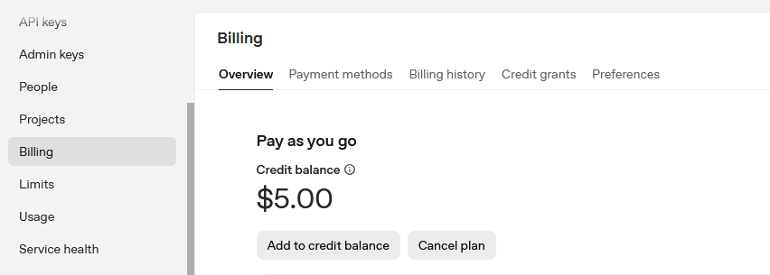

# API for AI
In this note I am going to show using AI to send prompt like AI-BOT

I will include: 
- OpenAI: ChatGPT API (PAID)
- Gemini: Free Gemini

## Open AI example

### OpenAI API Note

- Register an account and creat API Key
- Add an API Key(keep this secret, recommend put on .env file)
- Add Billing information(If billed not set then not able to use apikey)
You have to set billing like credit card and add specfic amount to it. In my case I only add `$5.00`, you can added according to your need. 




- Please install openai package:
```
pip install openai
```

### Basic write an OpenAI prompt

```
from openai import OpenAI

#give a fixed prompt
prompt= "Hi what't up"

#api key
client = OpenAI(api_key="sk-xxxx")

completion = client.chat.completions.create(
        model="gpt-4o-mini",    
        max_tokens=50,            # limit response length
        messages=[
            {"role": "system", "content": "hello chatgpt."},
            {"role": "user", "content": "Write a hello world code"}
        ]
	)

print(completion.choices[0].message.content)
```


### Example Code

#### `sendPrompt_openAI.py`: An easy example of sending prompt
- **Description:** Prompt is been hotcoded, token is been restrict to 20, so below output will see response incomplete it's the problem.

- **Output:**


#### `chatbot_openAI.py`:　Example of a easy AI bot
- **Description:** User just input prompt like a bot, it will response you. 

- **Output:**


#### Check Usage

Now after run the two code on sending prompt, you can see how much token I use, not much. My billing account to stay `$5.00`. 

To avoid using too  much token , just limit your token. 


## Google Gemini Note
- Register an account and create API google [google AI Studio api](https://aistudio.google.com/app/api-keys) 


- install Gemini package
```
pip install google-generativeai
```

- Write prompt:
```
import google.generativeai as genai
Google_API_Key="Google API Key"
genai.configure(api_key=Google_API_Key)
model = genai.GenerativeModel("gemini-2.5-flash")
response = model.generate_content("Hello from Gemini!")
print(response.text)
```

> Source: 
>> - https://www.youtube.com/shorts/_pqHsIcArwM
>> - https://ai.google.dev/gemini-api/docs/quickstart?


## Free API
Please access to [openrouter](#https://openrouter.ai) and search free to check on some free model.
- DeepSeek V3.1
- Qwen: Qwen3 Coder(free)