# fastAPI Note
This is a note on how to use FASTAPI base on many youtube tutorial and noted as my note. 
## Update
- 2024.08.19 : initial release
- 2024.08.23: update basics of the response model, and case1
- 2024.10.25: update md syntax error and a new note
	- update some MD syntax errors and adjust the order of heading content, like adding numbers to be clear and visualize
	- adding Case2 Example: account password example
 - 2024.10.27: adding a link to each section, and add examples folder contain some example
 - 2024.11.13: reorganize part section and adding example
 
### Planing todo 
- [X] adding content to link each item on the Content heading section [updated 2024.10.27]
- [X] add some examples of accounts not sure 
- [X] adding some examples 

## Content 
- [Part1 Introduction fundamental of using FastAPI](#part1)
	- [1. Installation and Module](#1-installation-and-module)
 	- [2. Running fastapi service](#2-running-fastapi-service)
		- [2.1 Method1: manual run the server by command](#part1-2.1)
  		- [2.2 Method2: write server into `__main__()`](#part1-2.2) 
	- [3. Create route](#3-create-route) 
	- [4. Accesing Endpoint](#4-accesing-endpoint)
	- [5. FastAPI Documentation](#5-fastapi-documentation)
	- [6. Troubleshooting](#6-troubleshooting)
- [Part2 Path Parameter](#part2-path-parameter)
	- [1. Create route](#1-create-route)
		- [1.1 Create get method](#create-get-method)
		- [1.2 Create a query parameter](#create-a-query-parameter)
		- [1.3 Create Post](#create-post)
		- [1.4 Summary of Route](#summary-of-route)
	- [2. Error Handling](#2-error-handling)
- [Part3 Define and Using Response Models](#part3)
	- [Install pydantic module](#install-pydantic)
	- [1. Define BaseModel](#1-define-basemodel)
		- [1.1 Sending Request](#11-sending-request)
		- [1.2 Response Error](#12-response-error)
		- [1.3 Solution for fixing missing field- Optional keyValue](#13-solution-Optional-pathpar)
	- [2. Define Fixed data (without POST)](#define-fixed-data)
		- [2.1 Fixed Data example](#21-fixed-data-example)
		- [2.2 adding response-mode](#22-adding-response-mode)
	- [3. Optional Key value: missing field](#optional-key-value)
	- [4. Response Model Parameter](#response-model-parameter)
		- [include](#include)
		- [exclude](#exclude)
		- [exclude_unset](#exclude-unset)
			- [Case1: when description is set `None`](#exclude_unset_case1)
			- [Case2: when description is set `String` default value](#exclude_unset_case2)
	- [ 5. Response result in list](#responsemodel-list)
- [Examples](#examples)
	- [Password response-model](#ex1-password)
		- [Case1: Password hidden](#ex1-password-case1)
		- [Case2: Password hash](#ex1-password-case2) 	
		- [Case3: Storing and Retrieving User Data](#ex1-password-case3)
	- [Example2: Add Item and store data](#ex2-add item)
		- [Define Data Mode](#ex2-add item)
		- [ResponseMode argument](#ex2-2responsemodel)
		- [Adding and Removing response_model validate](#ex2-3addingRemove)
	- [Example3: Random Number](#ex3-random)
- [Summary](#summary)
- [Reference](#reference)

<a name="part1"></a>
## Part1 Introduction fundamentals of using FastAPI [🔝](#content)
FastAPI is a powerful and fast module use in Python to create an API, you can create it with either methods below which I will explain in part2 and part3:
- **Path Parameter**: are dynamic parts of a URL that allow you to define flexible endpoints based on variable values. This means you can use the same endpoint for different values 
- **Response Model**: defines the structure of the data that the API will return. It is useful because it validates and formats the data, ensuring a clear structure that makes it easier for other developers to understand and use. 

I will explain in part 2 and part3 section on some explaination, and example. Before creating API you need to know how to start the server, which I will cover in this section. 
### 1. Installation and Module[🔼](#part1)
- Installation:
  > Install fastapi: `pip install fastapi`
  > Install server: `pip install uvicorn`

- Import module and initial

```
from fastapi import FastAPI
app= FastAPI()
```

Let me explain FastAPI and Uvicron:
- **FastAPI:** The framework used to define the API, is an application should do when a request is received
- **Uvicorn:** The server that runs the FastAPI app and manages requests and responses(client-server communication).  Uvicorn listens for incoming HTTP requests, runs your FastAPI application, and sends the responses back to the client. To run a FastAPI app, you typically launch it using Uvicorn

<a name="part1-2"></a>
### 2. Running fastapi service [🔼](#part1)

You can create serveral ways to start the server with command or write into a python file and run the file. 
> **syntax**: `uvicorn <file_name>:<app_instance> [options]`  


<a name="part1-2.1"></a>
#### 2.1 Method1: run fastapi server by uvicorn command[⏫](#part1-2)

use this command to run services:

> `uvicorn main:app --reload`
>> `main` is your python file name

You can use these option as below which I think used often, however there are many more you also use the command `uvicorn --help` or reference [ucicorn official site](https://www.uvicorn.org/) for more detail options. 

- `--reload` or `reload=True`: This enables automatic reloading of the server whenever you make changes to your code
- `log_level="info"`: This sets the logging level. "info" provides general information about server events.
- `port=8000`: This defines the port number on which the server listens for incoming requests, you can change different port number if you like.
- `filename:app`: uvicorn looks for the file `<filename>.py`, and the app is look inside the `filename.py` for fastapi instance call `app`


<a name="part1-2.2"></a>
#### 2.2 Method2: add uvicorn inside the code and run fastapi services[⏫](#part1-2)

You can also add `uvicorn` in the python file, which will execute the fastapi servies when execute the code. 
```
from fastapi import FastAPI
import uvicorn

app= FastAPI()

if __name__=='__main__':
# choose either one in below:	
	
	#using the default setting
	uvicorn.run("main:app", reload=True)
	#assign more detail information
	uvicorn.run("main:app", host="127.0.0.1", port=8000, reload=True, log_level="info")
	
```

### 3. Create route[🔼](#part1)
A route in FastAPI defines a specific URL path and the HTTP method (GET, POST, PUT, DELETE, etc.) that will trigger a particular function.

This is a simple example on creating a route.

```
from fastapi import FastAPI
app= FastAPI()
@app.get('/')
def root():
    return {'Hello': 'World'}
	
@app.post("/items")
def create_item(item: str):
    items.append(item)
    return items
```

- **Route Definition**: The `@app.get("/")` decorator defines a GET request for the root path (/).
- **Route Handler**: The root function is the handler for this route
<a name="part1-4"></a>
### 4. Accesing Endpoint[🔼](#part1)

In API, to access to endpoint you need to know the term **CRUD** which means:

- **Create** also mean POST
- **Read** also mean GET
- **Update** also mean PUT
- **Delete** also mean DELETE

> **Note**: When you access to endpoint using the 4 http method, please use capital letter, else will occur problem.

You can use a couple of ways to access the endpoint or send a request, you can use either way.

#### 4.1 fastAPI UI[⏫](#part1-4)  

  > You can access to UI url: `http://127.0.0.1:8000/docs`
  > You can also use FastAPI provide for validating and debugging:
  >
  > > `http://127.0.0.1:8000/docs`

#### 4.2 using command to send a request (to remove)[⏫](#part1-4)
This is a quick overview of the command to send request, GET and POST method. 

- **GET request**
```
curl -H "Accept: application/json" http://127.0.0.1:8000
# output:
{"hello":"world"}
```

- **POST Request**
```
curl -X POST -H "Content-Type: application/json" 'http://127.0.0.1:8000/items?item=appleddd22'
```


#### 4.3 Write code to send request[⏫](#part1-4)

- **get request**

```
import requests
request = requests.get('http://127.0.0.1:8000')
print(request.json())
```

- **post request**
```
import requests
import json
requests.post(url='http://127.0.0.1:5000/register',  data=json.dumps({X:Xvalue)).text
```

### 5. FastAPI Documentation[🔼](#part1)

I would like to talk about interactive URLs for FastAPI Documentation. `http://127.0.0.1:8000/docs` is the default URL for accessing the interactive API documentation generated by FastAPI using Swagger UI. In this URL you can do many validations with your endpoint.

Essentially it provides a user-friendly interface to explore your API endpoints, see their parameters, response bodies, and try out requests directly in the browser. It allow you to: 

- allow to do testing using get or post just like Postman tool(an API Tool) 
- documentation

Overall it allows you to debug by testing and see working or not, with a GUI, instead of command. If you are not familiar with the `cli` command, then this URL is also a great option.


### 6. Troubleshooting[🔼](#part1)

Sometimes when you run the `uvicorn main:app --reload` services, and `ctrl+c` not able to stop  then you might need to force to stop it by command. 
There are some way to solve this issue, you can use either of the comamnd to force stop uvicorn services. 

> **kill process ID**

- Step1:In Window please run this command to check process ID: `tasklist  |grep python`
- Step2: Kill the process by the ID: `taskkill /pid <process ID> /f`

> **kill process name**

Another way to kill process with one command, I like this one, it will kill all the process at once without finding the PID. 

- window:
	- kill python process: `Taskkill /IM python.exe /F` 
	- kill cmd process: ` Get-Process -Name "cmd" | Stop-Process`
- linux: use below method 
	- Combining pgrep and kill: `kill $(pgrep python)`
	- using pkill: `pkill python` or kill with file: `pkill -f "python my_script.py"`
	- xargs for More Complex Scenarios like filter: `pgrep python | xargs kill`
	
<a name="part2"></a>
## Part2 Path Parameter[🔝](#content)

In part 1 I show you the fundamentals of using FastAPI include:
- start the server using `uvicorn`
- Access the endpoint
- Troubleshoot not able to stop services 
- API doc or API UI interface
These are important steps you need to know before creating API. In this part, I will explain how to create FASTAPI method using path parameter. 

Understand some terms in Path Parameter:
- Route:
  - Defines the endpoint or URL path for an API. It's like the address of a resource
  - example of route: `/`, `/users`,`/items`
  - access endpoint:
    - route set `/`: access by `http://127.0.0.1:8000`
    - route set `/users/` access by `http://127.0.0.1:8000/users`
- Path Parameters(without a data model):
  - Purpose: Identify a specific resource within the API, like user_id'. It's parts of the URL path, indicated by curly braces (`{}`)
  - Syntax: {parameter_name}
  - Example: /users/{user_id}, where `user_id` is a path parameter.
  - Use case:
    - Fetching a single item (e.g., getting a specific user by ID).
    - Updating or deleting a specific resource.
- Query Parameters:
  - Purpose: Provide additional information provided in the URL after a question mark (`?`). It's like providing filters or options for the request.
  - Location: Appended to the URL after a question mark (`?`) and separated by ampersands (`&`).
  - Syntax: `?param1=value1&param2=value2`
  - Example: `/users?page=2&limit=10`, where page and limit are query parameters
  - Use case:
    - Pagination (specifying page number and items per page).
    - Filtering data (e.g., searching for users by name or age)
    - Sorting results (e.g., sorting users by name or creation date).
- Base Model: Path parameter with a data model, validation is performed the incoming data with data model
Please refer below picture for more understand of what is path and query parameter:
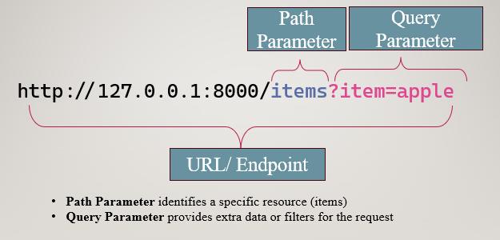


- [Part2 Path Parameter](#part2-path-parameter)
	- [1. Create route](#1-create-route)
		- [1.1 Create get method](#create-get-method)
		- [1.2 Create a query parameter](#create-a-query-parameter)
		- [1.3 Create Post](#create-post)
		- [1.4 Summary of Route](#summary-of-route)
	- [2. Error Handling](#2-error-handling)

<a name="part2-1"></a>
### 1. Create route[🔼](#part2)
The root route I showed in part1, basically means when access the endpoint without adding anything will be your root route, like `http://127.0.0.1/8000` it will get the root route which is display `hello:world`

```
from fastapi import FastAPI
app= FastAPI()
@app.get('/')
def root():
    return {'Hello': 'World'}
```

To access this you just use this command: `curl -X GET http://127.0.0.1:8000`

Let me show with different route

```
@app.get('/test/')
def root():
    return {'Hello': 'test'}
```

if my route is set as `/test` to access the endpoint by `http://127.0.0.1:8000/test` nut if your route is set as `/test/` then you need to access by `http://127.0.0.1:8000/test/`

I will not explain too detail on the get method here, In the next section I will talk about the get method. I just want you to have a quick overview of it, on how to access it.
<a name="create-get-method"></a>

#### 1.1 Create get method[⏫](#part2-1)
Let's create another route using the GET method which is use to send a get reques to retrieve data from the endpoint. 

```
from fastapi import FastAPI
import random

app = FastAPI()
@app.get("/")
def root():
    return {"hello":"world"}


@app.get("/random")
def get_random():
    randomNumber= random.randint(0,100)
    return {"number":randomNumber, 'limit':100}
```

Now you can run it by access to url or by command and will return a random number each time you refresh it.

- **Access endpoint by URL:** `http://127.0.0.1:8000/docs`
- **Access endpoint by command:** `curl -H "Accept: application/json" http://127.0.0.1:8000/random`
- **Response Output:** `{"number":96,"limit":100}`, each time will display a different random numbers.

<a name="create-a-query-parameter"></a>
#### 1.2 Create a query parameter[⏫](#part2-1)

you can also add a variable for limit, which is not hard code, so when you access it you can use this: `http://127.0.0.1:8000/random/99` which `99` is your limit number. The limit here mean will be range from `0~limit`

```
#continue from the above code
.....
@app.get("/random/{limit}")
def get_random(limit: int):
    randomNumber= random.randint(0,limit)
    return {"number":randomNumber, 'limit':limit}
```

Now you can access the endpoint with either method:

- with the **path parameter**: `http://127.0.0.1:8000/random/99`, the refresh page will keep updating random numbers.
- with **query parameters** like `http://127.0.0.1:8000/random?limit=20`. The refresh page will keep updating random numbers. The limit value is specified after the question mark? and is used to provide additional information to the function.

<a name="create-post"></a>

#### 1.3 Create Post [⏫](#part2-1)
There are two approach with basic data type, and one using a data model for structured validation. The different between these two are: 

- Baic data type: FastAPI would not validate the request payload 
- Data Model: FastAPI will validate the incoming data against the Item model structure.

In the above, I have shown you the get method, which means read endpoint. In this part let me show how to create post. 
```
from fastapi import FastAPI
import random

app = FastAPI()
@app.get("/")
def root():
    return {"hello":"world"}
items = []

#create a post
@app.post("/items")
def create_item(item: str):
    items.append(item)
    return items

#get items with
@app.get("/items")
def list_items(limit: int = 3):
    return items[0:limit]

# get item with Index ID
@app.get("/items/{item_id}")
def get_item(item_id: int) -> str:
    item= items[item_id]
    return item
```

Now here I have created a **post method**, in which you can enter your item and it will add into the list. After creating a `post`, you can use the `get` method to get the value you add. There are two get method one with the `/items` which can list all data in a list or limit data, and the other one can filter the index of the data. Please refer below to how to use it.

- `@app.get("/items")`: Lists all items or a limited number of items.
  - `http://127.0.0.1:8000/items`: Lists all items.
  - `http://127.0.0.1:8000/items?limit=3`: Lists the first 3 items.
- `@app.get("/items/{item_id}")`: Retrieves a specific item based on its ID.
  - `http://127.0.0.1:8000/items/1`: to retrieve the item with ID 1

Let access to the endpoint, please remember you can access by using the command, UI inactivate mode or using request. I will be using the command, you can refer in part 1 with the request method.

- **Create Post** 
  Let's use the get method to access the items endpoint, it will be empty. We need to use post method to create data, you can create a post using this command:

```
#create an item in the items list
curl -X POST -H "Content-Type: application/json" 'http://127.0.0.1:8000/items?item=apple'
#["apple"]

curl -X POST -H "Content-Type: application/json" 'http://127.0.0.1:8000/items?item=lemon'
#["apple","lemon"]

curl -X POST -H "Content-Type: application/json" 'http://127.0.0.1:8000/items?item=orange'
#["apple","lemon","orange"]

curl -X POST -H "Content-Type: application/json" 'http://127.0.0.1:8000/items?item=banana'
#["apple","lemon","orange","banana"]

```

- **get the items endpoint** 

Ｉ have added `limit` to this variable `limit: int = 3`, which `limit=3` will be the default items display. This means without adding a limit will display 53 items.

You can add a path parameter like `?limit` to display the limit of items, so if you add `?limit=2`, then it will display 2 items. Please refer below for more details.

```
#display all list, default as 3, so list only 3 items
curl -X GET htp://127.0.0.1:8000/items
# ["apple","lemon","orange"]

# Lists the first 2 items
curl -X GET http://127.0.0.1:8000/items?limit=2
# ["apple","lemon"]

#  Lists the first 4 items
curl -X GET http://127.0.0.1:8000/items?limit=5
# ["apple","lemon","orange","banana"]
```

You can also use `curl -X POST -H  "Content-Type: application/json" <URL>`, this mean header indicates to the server that the client expects a JSON response. It helps the server determine the appropriate format for the response.

- **Get item index**
  You can also use the index since I also add the get method with `"/items/{item_id}"`. If you enter the ID does not exist then it will occur an `Internal Server Error`.

```
#Retrieves a specific item based on its ID
curl -X GET http://127.0.0.1:8000/items/0
#"apple"
curl -X GET http://127.0.0.1:8000/items/1
#"lemon"
curl -X GET http://127.0.0.1:8000/items/2
#"orange"
```

<a name="summary-of-route"></a>
#### 1.4 Summary of Route[⏫](#part2-1)

Let me recap the important note here:

- **Route:** API route defines the paths and methods (like GET, POST, PUT, DELETE) in an API. You will use this method to access the endpoint.
- **Endpoint:** it's a specific URL, where the client can be accessed to. Just think like server and client, and the client needs to access the server by endpoint.
- **HTTP Method to access endpoint:**
  - Post: matches create_item route, which adds an item to the item list
  - Get: match the list_items route, which retrieves and returns items.
- **Access endpoint:**
  - by inactivate **UI**:`http://127.0.0.1:8000/` or `http://127.0.0.1:8000/doc`
  - by **cli command**: `curl -X <http method> http://127.0.0.1:8000/<route>`
- **path parameter**: variable parts of URL PATH that point to a specific resource like ID, used curly braces for example: `/files/{file_path}`
- **query parameter**: access to endpoint with URL after with `?` or`&` of name value. For example: `/users?page=2&limit=10`

> **Note:** If multiple routes share the same path, FastAPI generally prioritizes routes defined earlier in the code

### 2. Error Handling [🔼](#part2)

In the previous example, you can see if I enter a wrong ID it will display `Internal Server Error` which description is not much clear. We can also write our own error, like below. Let modify the `@app.get("/items/{item_id}")`, and also import `HTTPException`

```
from fastapi import FastAPI, HTTPException
.....

@app.get("/items/{item_id}")
def get_item(item_id: int) -> str:
    if item_id< len(items):
        return items[item_id]
    else:
        raise HTTPException (status_code=404, detail= f"Item {item_id}  not found")

```

Let access to the endpoint and enter non-existent ID

```
#get the items list
curl -X GET http://127.0.0.1:8000/items
["apple","lemon","lemon"]

curl -X GET http://127.0.0.1:8000/items/111
# {"detail":"Item 111  not found"}

```
<a name="part3"></a>
## Part3 Define and Using Response Models[🔝](#content)

In the above, I have mentioned **path parameter**, which is based on typically used to specify unique identifiers for a resource. In this part I will talk about Response Models, and define the expected structure of the response data. It’s excepting it to be into json payload request.

- [Part3 Define and Using Response Models](#part3)
	- [Install pydantic module](#install-pydantic)
	- [1. Define BaseModel](#1-define-basemodel)
		- [1.1 Sending Request](#11-sending-request)
		- [1.2 Response Error](#12-response-error)
		- [1.3 Solution for fixing missing field- Optional keyValue](#13-solution-Optional-pathpar)
	- [2. Define Fixed data (without POST)](#define-fixed-data)
		- [2.1 Fixed Data example](#21-fixed-data-example)
		- [2.2 adding response-mode](#22-adding-response-mode)
	- [3. Optional Key value: missing field](#optional-key-value)
	- [4. Response Model Parameter](#response-model-parameter)
		- [include](#include)
		- [exclude](#exclude)
		- [exclude_unset](#exclude-unset)
			- [Case1: when description is set `None`](#exclude_unset_case1)
			- [Case2: when description is set `String` default value](#exclude_unset_case2)
	- [ 5. Response result in list](#responsemodel-list)

**When to Use Them:**

- **Path**: are used to identify specific resources. For example, to get a specific user by their ID, use a path parameter.
- **Query Parameters**: When you need to provide additional options or filters for the requested resource. For example, filter them by name, use query parameters
- **Response Models**: define the expected structure of the response data and ensure validation
	- **Response Model Purpose**: used to define the structure of the response returned by the API. This helps inform other developers who want to use this API about what the response will look like, such as the fields and data types, without displaying the source code. 
	- **Response Model control Output**: You can control which data field are displayed in the response. For example if you want to hide certain data like password then you can create different model that excludes(not include) the password field. 


<a name="install-pydantic"></a>
### Install pydantic module[🔼](#part3)

Pydantic models are used as response models in FastAPI.

> Install: `pip install pydantic`
> Import: `from pydantic import BaseModel`


<a name="part3-1"></a>
### 1. Define BaseModel[🔼](#part3)
Let me show you an example below, needs to be defined in class as data model, and the decorator needs to add `response_model=Item`. When adding `response_model=Item`, which Item is the model name. This essential mean it will refer the Item's model structure. 

```
from fastapi import FastAPI
from pydantic import BaseModel

items = []
#create model
class Item(BaseModel):
    id: int
    name: str
    price: float
    is_active: bool = True

app = FastAPI()

#POST endpoint: sends or creates new data
@app.post("/items")
def create_item(item: Item):
    items.append(item)
    return items
	
#GET endpoint: retrieves data  data
@app.get("/items/{item_id}", response_model=Item)
async def read_item(item_id: int):
    return {"id": item_id, "name": "Foo", "price": 35.4, "is_active": True}
```
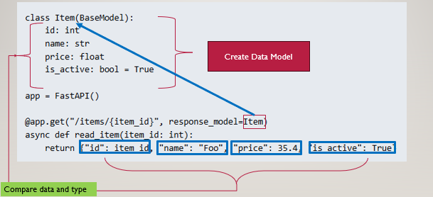

When you send a **POST** request, you need to append the data to a list otherwise, it won’t be saved. Unlike a GET request, which retrieves data, a POST request is used to submit and store data.


#### 1.1 Sending Request[⏫](#part3-1)
When you define a **BaseModel** (in this case, `Item`), you're creating a data structure that represents the expected format of the data in your API. This means that any data returned by the endpoint should **match the fields and data types defined in this model**.
- Send a **GET request** to the endpoint, use the following:
```
curl -X GET http://127.0.0.1:8000/items/1
```

This will return the response: 
```
{"id":1,"name":"Foo","price":35.4,"is_active":true}
```
As you can see, the response matches the structure of the Item model.

- Send a **Post request** to the endpoint, use the following:
```
curl -X POST -H "Content-Type: application/json"  -d '{  "id": 0,  "name": "test",  "price": 0,  "is_active": true}' 'http://127.0.0.1:8000/items'
```
#### 1.2 Response Error[⏫](#part3-1)

- **Error with wring data type**

 If any key is missing or a field has the **wrong data type**, FastAPI will **raise a validation error** and return  `Internal Server Error` response. This validation ensures that the data returned by the endpoint matches the expected structure defined in the Item model.
please refer below picture, the above one is response matches the structure of the Item model, and bottom one is wrong data type.

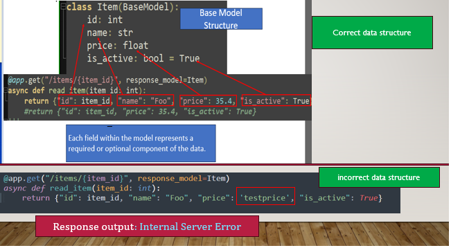

- **Error with missing field (using GET method)**
Each field within the model represents a required or optional component of the data. If a field (key-value pair) is missing in the data returned, FastAPI will raise a validation error, since the data does not match the structure defined in the model.  

Let me show if your field does not match the Base Model,  then what will happen? 
Let me remove the name field `"name": "Foo"`, and send get request it will **raise error**.

```
# remove "name": "Foo"
@app.get("/items/{item_id}", response_model=Item)
async def read_item(item_id: int):
	#return {"id": item_id, "name": "Foo", "price": 35.4, "is_active": True}
    return {"id": item_id,"price": 35.4, "is_active": True}
```
As you can see it will response same error `Internal Server Error` as above wrong data type. Below picture can see the different between correct data field and missing field response output. 

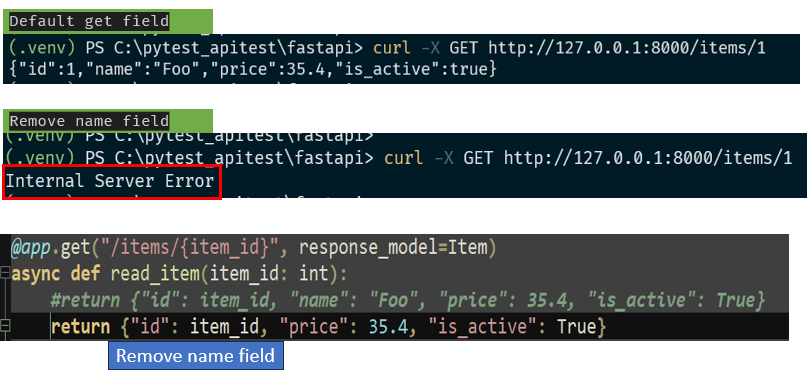


- **Error with missing field (using POST method)**

To send a **POST request** to the endpoint, use the following:
```
# all field present
curl -X POST -H "Content-Type: application/json"  -d '{  "id": 0,  "name": "test",  "price": 0,  "is_active": true}' 'http://127.0.0.1:8000/items'
```
> `output`: `[{"id":0,"name":"test","price":0.0,"is_active":true}]`

Let me send **POST request** with a missing field, it will give you a warming telling you missing, please see the below picture for the output.
```
# send POST Request and omits one field will occur error
curl -X POST -H "Content-Type: application/json"  -d '{ "name": "test",  "price": 0,  "is_active": true}' 'http://127.0.0.1:8000/items'

# response output:
{
  "detail": [
    {
      "type": "missing",
      "loc": ["body", "id"],
      "msg": "Field required",
      "input": {
        "name": "test",
        "price": 0,
        "is_active": true
      }
    }
  ]
}
```
Base on the response result, you can see API returns error message indicating that the `id` field is missing, along with the provided input data for context.
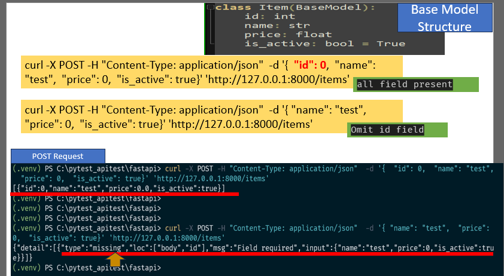


Overall, the response model helps validate that the data returned from the API matches the defined data model structure, including required fields and their data types. This ensures consistent and predictable data for clients and helps catch errors if the response data is incomplete or of the wrong type.

Let summary it:
- **Base Model Structure:** The Item model defines the data structure specifying four fields: id, name, price, and is_active.
- **Data Validation:** FastAPI uses this model to validate incoming or outgoing data. If the data doesn't match the model's structure, it can lead to errors.   
- **Missing Fields:** If the returned data lacks any required fields defined in the model (such as missing name or price), FastAPI will likely raise an error as it expects the data to match the model structure exactly.

<a name="solution-Optional-pathpar"></a>
#### 1.3 Solution for fixing missing field- Optional keyValue[⏫](#part3-1)

In the example above, if the data returned doesn't match the structure defined in the data model, it raises a validation error. To **avoid this error when fields are missing**, you can assign a default value or set the field to `None` in the model. This approach ensures that even if a field is omitted, the response still includes that field, either with a default value or as null.

Let’s look at the example where a GET request is sent, but the name field is omitted. Without a default value, this results in an Internal Server Error:
```
class Item(BaseModel):
    id: int
    name: str 
    price: float
    is_active: bool = True
	
async def read_item(item_id: int):
	return {"id": item_id, "price": 35.4, "is_active": True}
```
To avoid this error, you can set `name: Optional[str] = None` in the Item model. This way, if name is missing, it defaults to None and no error is raised:
```
#import Optional 
from typing import Optional
class Item(BaseModel):
    id: int
    name: Optional[str] = None
    price: float
    is_active: bool = True
```
Now, when you send a GET request with the `name` field omitted, the response will return null for name instead of raising an error.
 
> send get request: `curl -X GET http://127.0.0.1:8000/items/1`
> response output: `{"id":1,"name":null,"price":35.4,"is_active":true}`

Refer to the image below to understand how setting name=None allows the missing field to appear as null rather than causing an error. .This ensures the response includes all fields in the model, with null as the placeholder for any field that are missing. I made a comparison between adding with and without adding None value. 

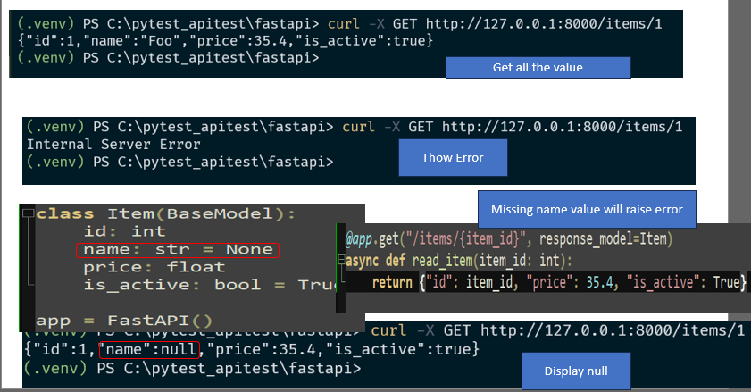


Let's make a summary with the post and get when the missing value:

- **POST requests**: When sending a **POST request** with a defined model, FastAPI expects the request body to contain data that matches the model's structure. If any required fields are missing, Pydantic validation will detect the error and return a message specifying which field is missing. This ensures that data submitted with a POST request is validated before processing.
- **GET requests** If you do include a request body with a **GET request**, it must still match the model's expected format to avoid unexpected behavior. Missing or incorrect data can lead to Internal Server Error. In most cases, GET requests use query parameters or path parameters for data

<a name="define-fixed-data"></a>
### 2. Define Fixed data (without POST)[🔼](#part3)
In the previous example, I defined the data model Item with only variable names, like `id` and `name`, without assigning any values. In order to set(populate) these fields , you typically send values via a POST request, which provides the required data in a structured format.
In this section, I’m using a fixed data dictionary to assign values that match the structure of the data model, similar to what you’d send in a POST request. This approach is useful for testing, as it allows you to simulate a complete data model without needing to send an actual **POST** request. This fixed data is beneficial when testing endpoints directly, as it provides sample data that developers can use to verify their code without requiring real user input.

```
from fastapi import FastAPI
app = FastAPI()
item_data = {
    "id": 1,
    "name": "Sample Item",
    "price": 19.99,
    "is_active": True
} 

@app.get("/items")
def get_item():
    return item_data
```
In the above code, you can now define a predefined dictionary or fixed value and add a GET endpoint to retrieve it directly. The get_item can be called to retrieve item_data without needing a POST request to create data. This is especially helpful when debugging or testing the endpoint.
> **send get request**: `curl -X GET http://127.0.0.1:8000/items`
> **response output**: `{"id":1,"name":"Sample Item","price":19.99,"is_active":true}`


#### 2.1 Fixed Data example[⏫](#define-fixed-data)
In this section I will explain base on below this code: 

```
from fastapi import FastAPI
from pydantic import BaseModel
from typing import Opttional
app= FastAPI()

#fixed data 
users= {
#"x": {'id':0},
"a": {'id':1, 'username':'a'},
"b": {'id':2, 'username':'b', 'username':'bbb'},
"c": {'id':3, 'username':'c', 'username':'ccc', 'description':'default'},
"d": {'id':4, 'username':'d', 'username':'ddd', 'description':'user d'},
"e": {'id':5, 'username':'e', 'username':'eee', 'description':'user e', 'gender':'F'},
}

#define data model 
class UserOut(BaseModel):
    id: int
    username: str
	
#endpoint
@app.get('/users/{username}')
#@app.get('/users/{username}', response_model=UserOut)
async def get_user(username: str):
    return users.get(username, {})
```

#### 2.2 adding response-mode[⏫](#define-fixed-data)
I want to show you the response output of using response_model and without using it.

Let use the FASTAPI GUI to see the different adding repsonse and not adding it. 

> without adding response-mode: `@app.get('/users/{username}')`
You can see below picture when navigate to the api web (http://127.0.0.1:8000/docs). Without adding response-model it will just display a default `string`, nothing is showing. Now you can change adding response-model and see what's the different. 

> with adding response-mode: `@app.get('/users/{username}', response_model=UserOut)`

When you add `response_model=UserOut` option this mean the output of the endpoint  will follow the structure defined in the UserOut model (this is model structure ). When you navigate to the API UI it is showing a sample of what the data structure looks like, including the data types and variable names. You need to use the get or post to send request. 
Add response model, it will display the model structure’s key and value `"id": 0` and `"username": "string"`. The value is not the real data look like, it’s fastapi **auto generate to illustrate** what API response will look like, so you know what value to put in real data. 

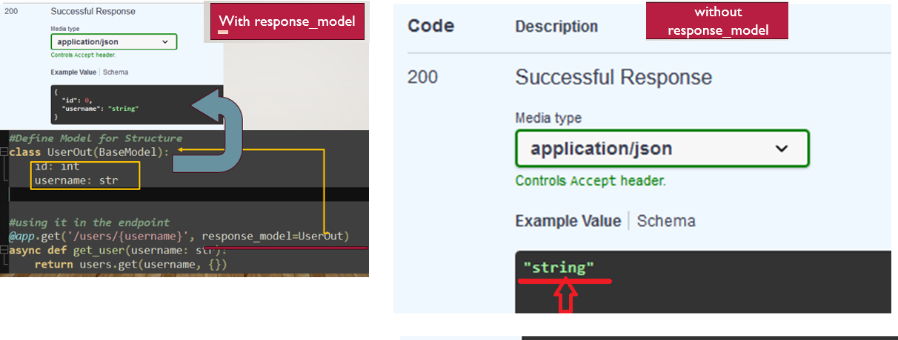

If you want to see the sample response by command you can use this command: ` curl -X GET http://127.0.0.1:8000/openapi.json` but it will show many information. Accesing the GUI page is the best option. 

- **send GET request and see the response** 
This command sends a GET request to the `/users/{username}` endpoint. This means the server will try to retrieve information about the user whose username is 'a'. In the code I have add fixed data of username, so to access it you can use the username. 
The get is just to(solely ) retrieve information about the user with username='a', not to set or change the data.
Essentially it check if a user with that username exists and to fetch their data. You can think as testing what the response data look like. 

You can either send by command or access to the fastapi docs url to get it as below example. When you send GET request with `/user/a` which `a` is your username, it will response `username` and `id`

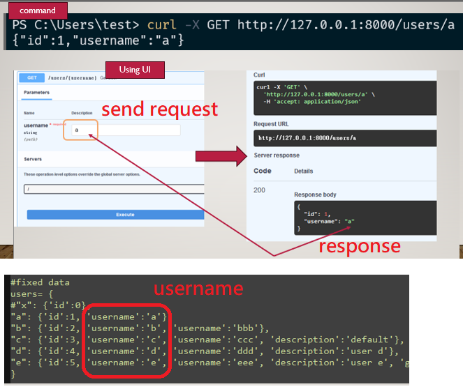

<a name="optional-key-value"></a>
### 3. Optional Key value: missing field[🔼](#part3)

In previous section I have mention about the **Optional** keyword, I will still cover in this section using with fix data value. 

If I send a `GET` request to `/users/x` with `response_model=UserOut` to the endpoint, then will an Internal Server Error will occur due to the missing username field, as UserOut expects both id and username. However if you don't include `response_model` in the endpoint then no error will be raised. 

Let breakdown some point here: 
- Without `response_model=UserOut`: If `response_model=UserOut` isn’t specified in the decorator, a GET request to `/users/x` will not raise an error. Instead, it will return {} an empty dictionary because users.get("x", {})  defaults to an empty dictionary,  if the username key doesn't exist.
- With `response_model=UserOut`: If you specify `response_model=UserOut` in the decorator, FastAPI  will validate the return dictionary match the model stucture. If data  doesn't match (ex: if `username` is missing) then it will raise an Error. Otherwise it will return the fields defined in UserOut, such as `id` and `username`. 

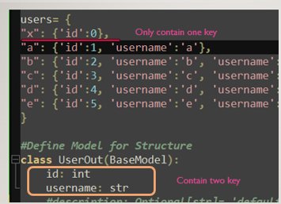

- **How to solve this problem if missing some field?**
To fix this issue, you can make certain fields optional in the model, so if a field doesn’t exist, it uses a default value instead. Let me show an example to solve this when an entry doesn’t fully match the model.

In the example below, some entries don’t completely align with the expected model. For instance, users 'a' and 'b' don’t have a description field.

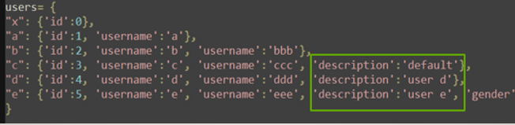

If you define description as a required str in UserOut, then sending a request for these users would cause an Internal Server Error due to the missing description field. By making description optional, you avoid this error.
```
class UserOut(BaseModel):
    id: int
    username: str
    description: str
```

To address the issue where a user entry might not fully match the expected model, we can make certain fields optional in the model definition. For instance, the description field is missing for usernames 'x' and 'a'.
If we define description in UserOut as a required str, sending a request for these users would raise an `Internal Server Error` due to the missing description field.

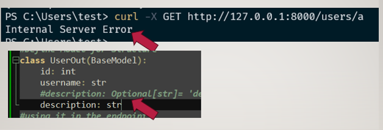

To prevent this, we can define description as `optional` in the model using Optional[str], with a default value, like this: `description: Optional[str] = 'default'`. This way, if description is missing in the data, the API will return the default value instead of raising an error. To use this, you need to first `import typing module`. 

```
from typing import Optional
.....
class UserOut(BaseModel):
    id: int
    username: str
    description: Optional[str]= 'default' #if not contain description will display default
```

Now, if you send a GET request for usernames like `a` or `b`  the API will return 'default' for the description field when it’s missing, preventing an error. 
Let send GET request with username='b', and see  it won’t raise an error; instead, it will display the description as 'default'.. 

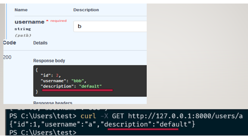

Overall this solution uses optional fields in the model to  to prevent errors when data is missing. 

- **Existence data check**
You can directly check if a user exists in the users dictionary. For example, if you try to access a non-existent username like mary, it would lead to an Internal Server Error. To prevent this, it’s better to add an exception that checks if the username exists. If it doesn’t, the API will respond with a 404 Not Found error, improving the clarity and reliability of your endpoint.

```
from fastapi import FastAPI, HTTPException
....

@app.get('/users/{username}', response_model=UserOut)
async def get_user(username: str):
    user = users.get(username)
    if user is None:
        raise HTTPException(status_code=404, detail="User not found")
    return users.get(username, {})
```

Let make some sumamry on optional and existence check:
- **optional**: Used to handle missing fields within a model by allowing a **default value to replace any missing field**.
- **existence**: Used to ensure a field or entry exists, by checking the data in a dictionary to **prevent errors when accessing non-existent data**.

<a name="part3-4"></a>
### 4. Response Model Parameter[🔼](#part3)

There are some **response-model parameter** that you can use, but I will only mention some of them. If your are interested on other item, you can go to refer documentation for more details. 

The example I will be using will continue from previously. 
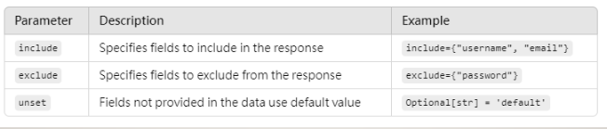


#### 4.1 include[⏫](#part3-4)
The `response_model_include` option specifies which fields to include in the response. For example if you only want the `id` field returned, you can set `response_model_include={"id"}` in the endpoint, and only `id` field will display. 

> include option: `response_model_include={"id"}`

```
.....
@app.get('/users/{username}', response_model=UserOut, response_model_include={"id"})
async def get_user(username: str):
    user = users.get(username)
    if user is None:
        raise HTTPException(status_code=404, detail="User not found")
    return users.get(username, {})
```
When you send `GET` request,only the `id` field will appear in the response, while other field will be ommitted. You can add any field in side the `{}`
 
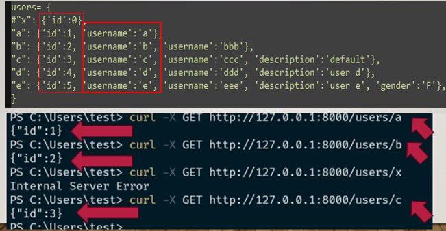


#### 4.2 exclude[⏫](#part3-4)
The `response_model_exclude` option specifies which fields excluded from the response. For example if you don’t want `id`, `username` to appear in the response,  you can add  `response_model_exclude={"id", "username"}`

> exclude option: `response_model_include={"id", "username"}`

```
.....
@app.get('/users/{username}', response_model=UserOut, response_model_include={"id", "username"})
async def get_user(username: str):
    user = users.get(username)
    if user is None:
        raise HTTPException(status_code=404, detail="User not found")
    return users.get(username, {})
```

When you send `GET` request, the response will exclude `id` and `username` field while other will display. This allow you to cutomize which field should be hidden in the response output. This is often use on password field, which don't want to display out. 
 
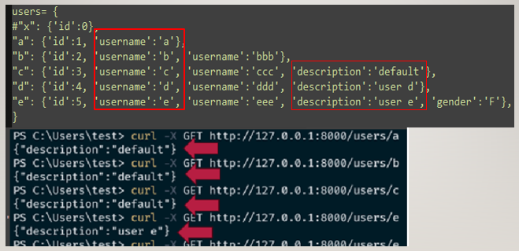


<a name="part3-4-3"></a>
#### 4.3 exclude_unset[⏫](#part3-4)

The `response_model_exclude_unset=True` option **omits any fields that don’t have explicitly assigned values**. This means that only fields with assigned values in the instance or in the fixed data, like users, will appear in the response. With response_model_exclude_unset=True, any fields without values in user will be omitted from the response.

> exclude option: `exclude_unset=bool`

<a name="exclude_unset_case1"></a>
##### Case1: when description is set `None`[⤴](#part3-4-3)️
In this example, the `id` and `username` fields will appear in the response because they have assigned values. However, description is set to None, so it considered  "unset", because there's no value has been set

```
class UserOut(BaseModel):
    id: int
    username: str
    description: Optional[str] = None
```
For `username='a'`, only `id` and `username` have values,and the description field will be exclude(not shown) in the response due to `response_model_exclude_unset=True`. When this option it set to `True`, **fields without assigned values are not going to appear** in the response.  When `exclude_unset=True`, FastAPI **ignores any unassigned fields or value** in the output, which helps avoid errors for missing data.


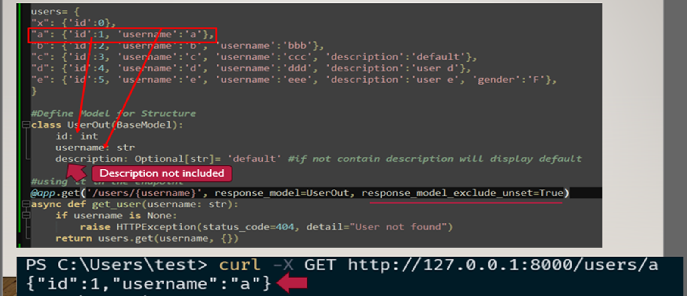

<a name="exclude_unset_case2"></a>
##### Case2: when description is set `String` default value[⤴](#part3-4-3)️
```
class UserOut(BaseModel):
    id: int
    username: str
    description: Optional[str] = 'default'  # if not provided, defaults to "default"
```

For `username = 'c'`, the description will appear as "default" in the response because "description" is explicitly set to "default" in the user data, so it does not overwrite the model’s default description value. This means that even though the data model assigns a default value of "default" to description, it doesn’t take effect here because the user data already provides a value for the "description" field.
For `username = 'd'`, since description is set to "user d" in the user data, it will appear as "user d" in the response, overriding the model’s default value.

If an user data does not provide a value for a field, the model’s default value is used. If no default value is specified, that field is considered "unset." When a field is unset, it will not be appear in the response.
When `exclude_unset=True` is used, the API response will only display fields that have been explicitly assigned values in the model instance.

- For `username='a'`: Since both the `id` and `username` fields have assigned values, they will be included in the response.
- For `username='b'`: The `id`, `username`, and `description` fields all have assigned values, so these will be displayed in the response as well.


When fields in the users data and data model do not match, there are two ways to resolve the issue:
- **Method 1 (Optional fields)**: Add `Optional` to the model field. This allows the field to be optional, preventing errors if it is not provided in the instance.
- **Method 2 (Exclude unset fields)**: Use `response_model_exclude_unset=True`. This option excludes any fields that are unset in the response, avoiding errors due to missing values.

Using either method can help prevent errors when there are mismatches between instance data and model fields.

<a name="responsemodel-list"></a>
### 5. Response result in list[🔼](#part3)

The parameter `response_model=list[UserOut]` specifies that the endpoint will return a response containing a list of items. This means that when you access the endpoint with curl -X GET http://127.0.0.1:8000/users, the response will be a JSON array displaying all data entries formatted according to the UserOut model.

```
@app.get('/users', response_model=list[UserOut])
async def get_users():
    return users.values()
```

You have to comment out the x entry in the user data because it does not match the UserOut data model. The UserOut model expects both id and username fields, but the "x" entry only includes id and is missing username, which causes a validation error.

```
users= {
#"x": {'id':0},
"a": {'id':1, 'username':'a'},
"b": {'id':2, 'username':'b', 'username':'bbb'},
"c": {'id':3, 'username':'c', 'username':'ccc', 'description':'default'},
"d": {'id':4, 'username':'d', 'username':'ddd', 'description':'user d'},
"e": {'id':5, 'username':'e', 'username':'eee', 'description':'user e', 'gender':'F'},
}
```

When you call `users.values()`, it returns a list of dictionaries. The UserOut model then validates each dictionary against its required fields (id and username). If any dictionary is missing these required fields, a validation error occurs, causing FastAPI to return an error response.
To resolve this, you can either comment out the "x" entry or add a username field to it. Let run the GET request to see response of data model look like: 

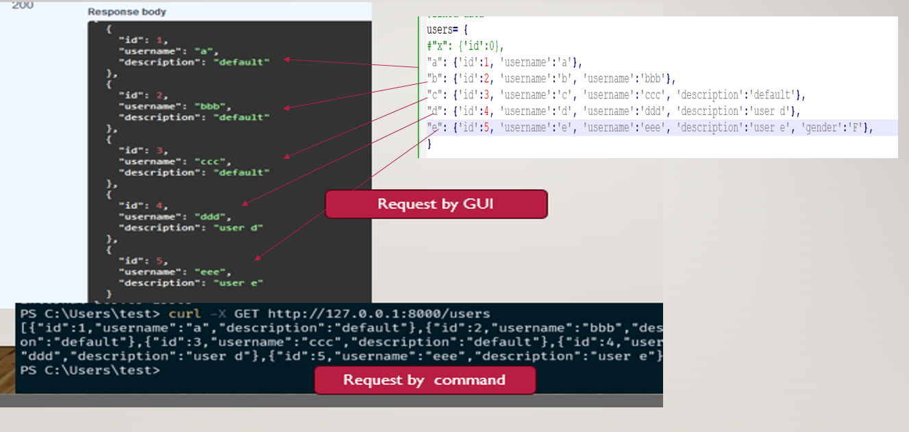

## Examples[🔝](#content)

In this section I want to show some example that might use often. 

- [Examples](#examples)
	- [Password response-model](#ex1-password)
		- [Case1: Password hidden](#ex1-password-case1)
		- [Case2: Password hash](#ex1-password-case2) 	
		- [Case3: Storing and Retrieving User Data](#ex1-password-case3)
	- [Example2: Add Item and store data](#ex2-add item)
		- [Define Data Mode](#ex2-add item)
		- [ResponseMode argument](#ex2-2responsemodel)
		- [Adding and Removing response_model validate](#ex2-3addingRemove)
	- [Example3: Random Number](#ex3-random)

<a name="ex1-password"></a>
### Example1:Password response-model[🔼](#examples)
In this example, I will demonstrate how to handle account data with fields for username and password. It’s common to use such an example to show how to hide sensitive information like passwords. This example prevents the password from appearing in the response, ensuring it remains hidden on the response page. 

In the note I will show with use data-model, but I also provide without data-model, file as below: 
- **Basic data type**: `Examples\Example1_password_hidden\useraccount_pathparameter.py`
- **DataModel and response-model**:  `Examples\Example1_password_hidden\useraccount_responsemodel.py`

**I will show two method: **
- **password hidden (Case1: first aproach)**
- **password with hash  (Case2: second aproach)**
- **Storing account  (Case3)**

> This code example I reference this video tutorial: https://www.youtube.com/watch?v=YGrOBwDgD0U&t=313s


<a name="ex1-password-case1"></a>
#### Case1: Password hidden[⏫](#ex1-password)

The code will look like this below:
```
from fastapi import FastAPI, HTTPException
from pydantic import BaseModel
import hashlib
 
class RegIn(BaseModel):
    username: str
    password: str
    email: str
#hidden not shown password
class Regout(BaseModel):
    username: str
    email: str
    
#@app.post("/register", response_model=RegIn) #show all data
@app.post("/register", response_model=Regout) #show only user and email
def register(user: RegIn):
    return user
```

**Send Request:**
> send **POST** request with CURL command
```
curl -X POST -H "Content-Type: application/json" -d '{"username": "hellotest", "password": "123456", "email": "hello@test.com"}' "http://127.0.0.1:8000/register"
```

> send **POST** request with Json

```
import json, requests
requests.post(url='http://127.0.0.1:8000/register', 
data=json.dumps({'username': 'hellotest', 'password': '123456','email': 'hello@test.com'})).text
```
or 
```
requests.post(
    url='http://127.0.0.1:8000/register',
    json={'username': 'hellotest', 'password': '123456', 'email': 'hello@test.com'}
)
```

**Response Result:**

> **output with `response_model=RegIn`**: `{"username":"hellotest","password":"123456","email":"hello@test.com"}`
> **output with `response_model=RegOut`**:`{"username":"hellotest","email":"hello@test.com"}`

In the code above, setting response_model=RegIn will display all the data fields in the response, including username, password, and email. However, if you set response_model=RegOut, only username and email will be displayed, while password remains hidden. This is because the RegOut model does not include the password field, so it won’t appear in the response. 

> **Display all data:** `response_model=RegIn`
> **Hide the password:** `response_model=RegOut`

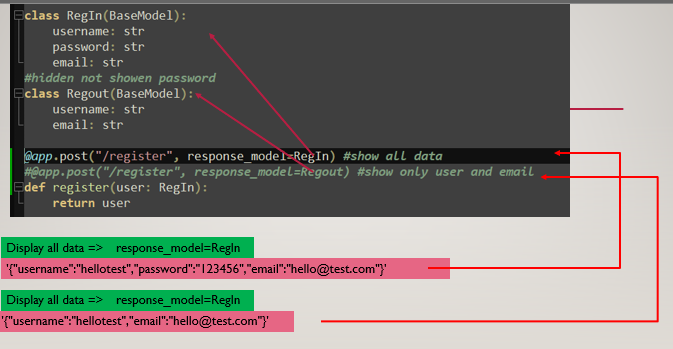

> send **POST** request with Session 

```
import requests

session = requests.Session()
response = session.post(
    url='http://127.0.0.1:8000/register',
    json={'username': 'hellotest', 'password': '123456', 'email': 'hello@test.com'}
)
print(response.text)
```

<a name="ex1-password-case2"></a>
#### Case2: Password hash[⏫](#ex1-password)
Another approach to handle the password instead of hiding it is to hash the password using the `hashlib` module.

> import the hashlib module:`import hashlib`
 
Define a new `registerhash` endpoint to show the difference between hiding the password and hashing it.  Here’s how to hash the password before returning it:

> **hash password:** `user.password= hashlib.sha1(user.password.encode('utf-8')).hexdigest()`

```
import hashlib 
...... 
#skip other code
@app.post("/registerhash", response_model=RegIn)
def registerhash(user: RegIn):
    user.password= hashlib.sha1(user.password.encode('utf-8')).hexdigest()
    return user
```

**Response Result:**

When you send a GET request, the response will look like this:

> **Response output**:
>> `{"username":"hellotest","password":"7c4a8d09ca3762af61e59520943dc26494f8941b","email":"hello@test.com"}`
As you can see, the password is now hashed so it does not appear in plain text. 

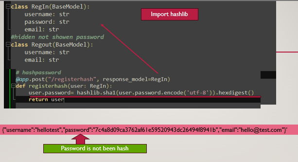

<a name="ex1-password-case3"></a>
#### Case3: Storing and Retrieving User Data [⏫](#ex1-password)
This example I will demonstrate sending Post Request does not store data permanently unless you save it in a collection like list or dictionary. Here, I will store the data in a dictionary.

```
users_db = {}
@app.post("/registerNew", response_model=Regout)
def register(user: RegIn):
    # Store the user in a dictionary
    users_db[user.username] = user
    return user
    
# GET endpoint to retrieve user data by username
@app.get("/registerNew/{username}", response_model=RegIn)
def get_user(username: str):
    user = users_db.get(username)
    if not user:
        raise HTTPException(status_code=404, detail="User not found")
    return user
```

- **POST Request**: 
> command: `curl -X POST -H "Content-Type: application/json" -d '{"username": "test", "password": "123456", "email": "hello@test.com"}' "http://127.0.0.1:8000/registerNew"`
>> Response Result:`{"username":"test","email":"hello@test.com"}`

- **GET Request**:
> command: `curl -X GET http://127.0.0.1:8000/registerNew/test`
>>Response Result: `{"username":"test","password":"123456","email":"hello@test.com"}`

**Note**: Without the GET method, your data is only temporarily available in the POST response and cannot be accessed again after the initial request. By adding the GET endpoint, you can retrieve the stored data by username whenever needed.

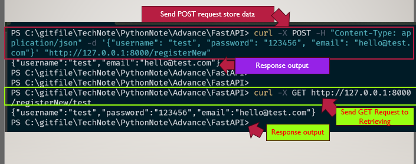


<a name="ex2-add item"></a>
### Example2:Add Item and store data[🔼](#examples)
Full Code File: `\Examples\Example2_Items\response.py` this file. 
I've explained this example in section [part2](#part2). In this section, however, I will demonstrate using a defined data model (e.g., Item) to validate incoming data against the structure of the model, rather than using basic data types.

<a name="ex2-datamode"></a>
#### Define Data Mode[⏫](#ex2-add item)
This example defines a response model, Item(BaseModel), which sets the expected structure for the data that the API endpoint will receive.
It tells FastAPI to validate the incoming data against this structure, ensuring that it meets the model's requirements.
```
from fastapi import FastAPI, HTTPException
from pydantic import BaseModel
app = FastAPI()
items = []
#define response model
class Item(BaseModel):
    text: str = None
    is_done: bool = False

@app.post("/items")
def create_item(item: Item):
    items.append(item)
    return items
```

The Item model defines the data structure for incoming data when the create_item endpoint is called. FastAPI validates the incoming request with the data model. 
If the data doesn’t match the model, FastAPI raises a ValidationError.

Note:  If  you don’t specify a response_model in an endpoint, the response will simply return the data from the return statement as-is, without additional validation on the response structure.

- **Send Post request**

You need to add `-d` with json payload `{:}` like below:

>  Send Post request: `curl -X POST -H "Content-Type: application/json" -d '{"text": "apple"}' 'http://127.0.0.1:8000/items'`
>> Response outout: `[{"text":"apple","is_done":false}]`
Since is_done wasn’t included in the payload, it takes its default value of false, which appears in the response.

If we remove the default `None` and make text required , like `text: str`, the model will validate the incoming data more strictly:

```
#define response model
class Item(BaseModel):
    text: str
    is_done: bool = False
```

>  **Send Post request**: `curl -X POST -H "Content-Type: application/json" -d '{"text2": "apple"}' 'http://127.0.0.1:8000/items'`
>> **Response outout:** `{"detail":[{"type":"missing","loc":["body","text"],"msg":"Field required","input":{"text2":"apple"}}]}`
The error occurs because the payload lacks the required "text" field specified in the Item model. The field names in the incoming JSON must match exactly with the model’s fields for successful validation.
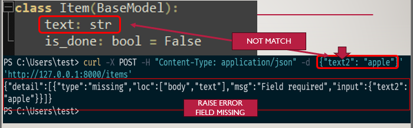

<a name="ex2-2responsemodel"></a>
#### Using response_model for FastAPI Responses[⏫](#ex2-add item)

- **GET Endpoint Without response_model**

Without `response_model`, it simply returns the data as-is without validating it against a data model. 

```
@app.get("/items")
def list_items(limit: int = 3):
    return items[0:limit]
	
@app.get("/items/{item_id}")
def get_item(item_id: int) -> Item:
    if item_id< len(items):
        return items[item_id]
    else:
        raise HTTPException (status_code=404, detail= f"Item {item_id}  not found")
```
**Example of making requests:**

> POST request  to add items: `curl -X POST -H "Content-Type: application/json" -d '{"text": "orange"}' 'http://127.0.0.1:8000/items'`
>> respose: `[{"text":"orange","is_done":false},{"text":"apple","is_done":false},{"text":"mango","is_done":false}'

> GET request to list items: `curl -X GET http://127.0.0.1:8000/items`
>> respose: `[{"text":"orange","is_done":false}]`'

- **GET Endpoint With response_model:**

Adding the `response_model` argument specifies the expected structure of the response, ensuring that the data returned matches the defined Item model before it’s sent to the client.
In this example, the output remains the same whether or not response_model is added. However, the key difference is that with `response_model`, FastAPI validates the response data against the Item model, whereas without it, no validation occurs for the response structure.

Adding response_model is generally recommended, even if it doesn’t affect the current response outcome, these are are benefit of adding reesponse_model:
> - Validates the output against the model on every response.
> - Provides clear documentation of the response structure for clients.


```
@app.get("/items",response_model=list[Item] )
def list_items(limit: int = 3):
    return items[0:limit]

@app.get("/items/{item_id}", response_model=Item)
def get_item(item_id: int) -> Item:
    if item_id< len(items):
        return items[item_id]
    else:
        raise HTTPException (status_code=404, detail= f"Item {item_id}  not found")
```
You can send POST and GET like this, which will be same as above. 

**Example of making requests:**

> **POST Requests**
```
curl -X POST -H "Content-Type: application/json" -d '{"text": "apple"}' 'http://127.0.0.1:8000/items'
#[{"text":"apple","is_done":false}]

curl -X POST -H "Content-Type: application/json" -d '{"text": "banana"}' 'http://127.0.0.1:8000/items'
[{"text":"apple","is_done":false},{"text":"banana","is_done":false}]

curl -X POST -H "Content-Type: application/json" -d '{"text": "apple"}' 'http://127.0.0.1:8000/items'
#[{"text":"apple","is_done":false},{"text":"banana","is_done":false},{"text":"apple","is_done":false}]

curl -X POST -H "Content-Type: application/json" -d '{"text": "blueberry"}' 'http://127.0.0.1:8000/items'
#[{"text":"apple","is_done":false},{"text":"banana","is_done":false},{"text":"apple","is_done":false},{"text":"blueberry","is_done":false}]
```

**GET Requests:**
```
 # List all items
curl -X GET http://127.0.0.1:8000/items 
#[{"text":"apple","is_done":false},{"text":"banana","is_done":false},{"text":"apple","is_done":false}]

# Get item by ID
curl -X GET http://127.0.0.1:8000/items/1  
#{"text":"banana","is_done":false}
curl -X GET http://127.0.0.1:8000/items/3
#{"text":"blueberry","is_done":false}
```
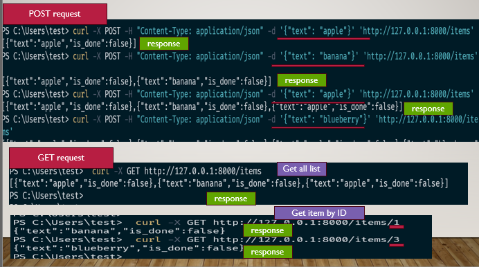

This is a comparison between adding response_Model:


<a name="ex2-3addingRemove"></a>
#### Adding and Removing response_model Validation[⏫](#ex2-add item)
The following example demonstrates the difference between adding and not adding the response_model argument to a FastAPI endpoint.

```
# Define data model
class Item(BaseModel):
    text: str
    is_done: bool = False

# Storage with intentionally mismatched data
items = [
    {"text": "apple", "is_done": False},        # Valid item
    {"text": "banana"},                         # Missing `is_done`, but it defaults to False, so it's valid
    {"description": "A tasty fruit"}            # Missing both `text` and `is_done`
]

@app.get("/items/{item_id}", response_model=Item)
def get_item(item_id: int):
    if item_id < len(items):
        return items[item_id]
    else:
        raise HTTPException(status_code=404, detail="Item not found")
```

> **With response_model**: The response_model argument validates the returned data against the Item model.
>> **GET request**: `curl -X GET "http://127.0.0.1:8000/items/2"`
>> **Response** :　`Internal Server Error`

It returns an`Internal Server Error` if the data doesn’t match the model (Item). Here, {"description": "A tasty fruit"} does not have the required text field, so validation fails.


> **Without response_model**: Removing response_model disables this validation, allowing any data structure to be returned. 
>> **GET request**: `curl -X GET "http://127.0.0.1:8000/items/2"`
>> **Response** :　`{"description":"A tasty fruit"}`

It returned directly, with no validation, so it reflects the data exactly as it is stored.

Using a response_model validates the response data structure before sending it, which helps ensure that clients receive consistent data types and fields.

<a name="ex3-random"></a>
### Example3: Random Number[🔼](#examples)

This is a basic example of Path Parameter which I mention in [part2](#part2) above section 
Full Code File: `Example3_randomnumber\main.py`, `sendingreq.py` is to run request by the code, you can run by curl command. 

```
from fastapi import FastAPI
import random
app= FastAPI()

@app.get('/')
async def root():
    return {'example': 'This is an example', 'data':0}

@app.get('/random')
async def get_random():
        ranNum:int = random.randint(0,1000)
        return {'numbers': ranNum, 'limit': 1000 }

@app.get('/random/{limit}')
async def get_random(limit :int):
    ranNum:int = random.randint(0,limit)
    return {'numbers': ranNum, 'limit': limit }
```

**Send Request with request**
```
import request
request= requests.get('http://127.0.0.1:8000')
print(request.json())
#{'example': 'This is an example', 'data': 0}

#get the random 
print('===========================')
request= requests.get('http://127.0.0.1:8000/random')
print(request.json())
#{'numbers': 127, 'limit': 1000}

#send request with limit id
print('===========================')
request= requests.get('http://127.0.0.1:8000/random/100')
print(request.json())
```

**with CURL command**
> random endpoint:  `curl -X GET "http://127.0.0.1:8000/random"`
> random with ID endpoint:  `curl -X GET "http://127.0.0.1:8000/random/22"` 

## Summary[🔝](#content)
So let me make a summary of how to execute it:
 
- Step1: Write a code with the server and run it 
	- Method1: Run the server with command: `uvicorn <filename>:app --reload`
	- Method2: Adding the server in code and run the code
		```
		from fastapi import FastAPI
		import uvicorn
		app= FastAPI()
		if __name__=='__main__':
			uvicorn.run("main:app", reload=True, log_level='debug' )
		```
	
- Step2: Sending a request with get or post:
	- Method1: Write an individual code to send a request  
		```
		import requests
		#sending request with get 
		request= requests.get('http://127.0.0.1:8000')
		```
	- Method2: Execute in `cli` command in shell mode 
		- Post request: 
		```
		import requests
		requests.post(url='http://127.0.0.1:5000/register',  data=json.dumps({X:Xvalue, Y:Yalue})).text
		```
		- Get request: 
		```
		import requests
		request= requests.get('http://127.0.0.1:8000')
		print(request.json()) #{'example': 'This is an example', 'data': 0}
		```
	- Method3: Using WebUI
		- Fastapi UI to test your endpoint
		- Postman: this is a tool to test api
		
## reference[🔝](#content)

- https://www.youtube.com/watch?v=ZZhBIyXbY4I&t=5s
- https://www.youtube.com/watch?v=YGrOBwDgD0U&t=351s
- https://www.youtube.com/watch?v=XMMmAY8NMCo
- https://www.youtube.com/watch?v=tVJe14xlQBs&t=300s
- https://www.youtube.com/watch?v=nIVg0aY_cHU&t=13s
- https://www.youtube.com/watch?v=2wJ2kaVej_0&t=368s
- https://dev.to/jamesbmour/part-3-pydantic-data-models-4gnb
- https://medium.com/coderhack-com/introduction-to-fastapi-c31f67f5a13