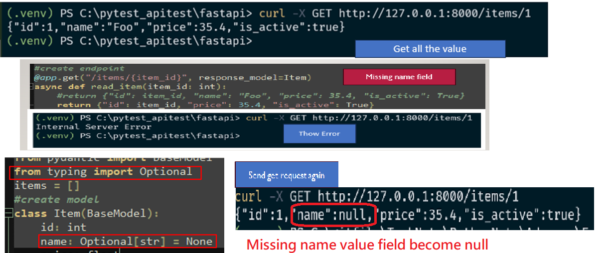

# fastAPI Note

## Update

- 2024.08.19 : inital release
- 2024.08.23: update basic of response model, and case1
- 2024.10.25: update md syntac error and new note
	- update some md syntax error and adust order of heading content , like add number to be clear visualize
	- adding Case2 Example: account passoword example 
### Planing . Todo 
- [planning] adding content to link each item on Content heading section
- [planning] add some example of account not sure 

## Content 


## Part1 Introduction fundamental of using FastAPI

This is some note of fastapi note. FastAPI is a powerful and fast module use in python to create a api

### 1. Installation and Module

- Installation:

  > Install fastapi: `pip install fastapi`
  > Install server: `pip install uvicorn`

- Import module and inital

```
from fastapi import FastAPI
app= FastAPI()
```

### 2. Running fastapi service

You can create multiply way to start server by cli command as method1, or write into python file and run file as method2.

> syntax: `uvicorn <file_name>:<app_instance> [options]`  

You can use some flag or option, I want to explain each flag in case you want to know. So you also use this command `uvicorn --help` to see all options. I will not mention all of them, only pick I think it's useful or commonly use. You can reference [ucicorn offical site](https://www.uvicorn.org/)

- `--reload` or `reload=True`: This enables automatic reloading of the server whenever you make changes to your code
- `log_level="info"`: This sets the logging level. "info" provides general information about server events.
- `port=8000`: This defines the port number on which the server listens for incoming requests, you can change different port number if you like.
- `filename:app`: uvicorn looks for the file `<filename>.py`, and the app is look inside the `filename.py` for fastapi instance call `app`

#### 2.1 Method1: manual run the server by command

use this command to run services:

> `uvicorn main:app --reload`
>
> > `main` is your python file name

#### 2.2 Method2: write server into `__main__()`

```
from fastapi import FastAPI
app= FastAPI()

@app.get('/')
def hello():
    return {'Hello': 'World' }

if __name__=='__main__':
    import uvicorn

    # please select either one

	#default main.py will be your file
	uvicorn.run(app, host="127.0.0.1", port=8000)
	# specify your main file with other option
	uvicorn.run("filename:app", host="127.0.0.1", port=8000, reload=True, log_level="info")
```

### 3. Create route

A route in FastAPI defines a specific URL path and the HTTP method (GET, POST, PUT, DELETE, etc.) that will trigger a particular function.

This is a simple example on creating a route.

```
from fastapi import FastAPI
app= FastAPI()
@app.get('/')
def root():
    return {'Hello': 'World'}
```

- Route Definition: The `@app.get("/")` decorator defines a GET request for the root path (/).
- Route Handler: The root function is the handler for this route

### 4. Run API:  send Request or accessing endpoint

In API, to accessing to endpoint you need to knwo the term **CRUD** which means:

- **Create** aslo mean POST
- **Read** also mean GET
- **Update** also mean PUT
- **Delete** also mean DELETE

> **Note**: When you access to endpoint using the 4 http method, please use capital letter, else will occur problem.

You can use couple of way to access endpoint, or send request, you can use either way.

- fastAPI UI

  > You can access to UI url: `http://127.0.0.1:8000/docs`
  > You can also use FastAPI provide for validating and debug:
  >
  > > `http://127.0.0.1:8000/docs`

- using command to send request

```
curl -H "Accept: application/json" http://127.0.0.1:8000
# output:
{"hello":"world"}
```

- send request

```
import requests
request = requests.get('http://127.0.0.1:8000')
print(request.json())
```

### 5. FastAPI Documentation

I would like to talk about interactive FastAPI Documentation. `http://127.0.0.1:8000/docs` is the default URL for accessing the interactive API documentation generated by FastAPI using Swagger UI. In this URL you can do many validation with your endpoint.

Essentially it provides a user-friendly interface to explore your API endpoints, see their parameters, response bodies, and try out requests directly in the browser.

### 6. TroubleShooting

Sometime when you manual run the `uvicorn main:app --reload` services, and `ctrl+c` not able to close it, there are some way to solve this issue.

- Step1:In Window please run this command to check process ID: `tasklist  |grep python`
- Step2: Kill the process by the ID: `taskkill /pid <process ID> /f`

Note: sometimes you you access endpoint and it show the result wrong, then maybe you need to use the above method to stop services and run the services again.

## Part2 Essential Concepts

In part1 I show you the fundamnetal of using FastAPI, like how to start server, how to access the endpoint. These are important step need to know before creating api. In this part I will dive into core concept of it.

Understand some terms in FastAPI:

- Route:
  - Defines the endpoint or URL path for an API. It's like the address of a resource
  - example of route : `/`, `/users`,`/items`
  - access endpoint:
    - route set `/`: access by `http://127.0.0.1:8000`
    - route set `/users/` access by `http://127.0.0.1:8000/users`
- Path Parameters:
  - Purpose: Identify a specific resource within the API, like user_id'. It's parts of the URL path, indicated by curly braces (`{}`)
  - Syntax: {parameter_name}
  - Example: /users/{user_id}, where `user_id` is a path parameter.
  - Use case:
    - Fetching a single item (e.g., getting a specific user by ID).
    - Updating or deleting a specific resource.
- Query Parameters
  - Purpose: Provide additional information provided in the URL after a question mark (`?`). It's like providing filters or options for the request.
  - Location: Appended to the URL after a question mark (`?`) and separated by ampersands (`&`).
  - Syntax: `?param1=value1&param2=value2`
  - Example: `/users?page=2&limit=10`, where page and limit are query parameters
  - Use case:
    - Pagination (specifying page number and items per page).
    - Filtering data (e.g., searching for users by name or age)
    - Sorting results (e.g., sorting users by name or creation date).

> Note:
> We need to understand these term in order to more unstrand when creating route. In the previous part1, the create route is a easy example, and in this part I will mention different using different HTTP method like get, post,etc.

### 1. Create route

The root route I shown in part1, basically it mean when access endpoint without add any thing will be your root route, like `http://127.0.0.1/8000` it will get the root route which is display `hello:world`

```
from fastapi import FastAPI
app= FastAPI()
@app.get('/')
def root():
    return {'Hello': 'World'}
```

To access this you just use this command: `curl -X GET http://127.0.0.1:8000`

Let me show with different route

```
@app.get('/test/')
def root():
    return {'Hello': 'test'}
```

if my route set as `/test` to access endpoint by `http://127.0.0.1:8000/test` nut if your route set as `/test/` then you need to access by `http://127.0.0.1:8000/test/`

I will not explain too detail on the get method here, In the next section I will talk about the get method. I just want you to have a quick overview of it, on how to access it.

#### 1.1 Create get method
Let's create another route using the GET method, which is used to retrieve data from the endpoint.

```
from fastapi import FastAPI
import random

app = FastAPI()
@app.get("/")
def root():
    return {"hello":"world"}


@app.get("/random")
def get_random():
    randomNumber= random.randint(0,100)
    return {"number":randomNumber, 'limit':100}
```

Now you can run it by access to url or by command and will return random number each time you refresh it.

- Access endpoint by URL: `http://127.0.0.1:8000/docs`
- Access endpoint by command: `curl -H "Accept: application/json" http://127.0.0.1:8000/random`
- Output: `{"number":96,"limit":100}` , each time will display different random number.

#### 1.2 Create a query parameter

you can also add a variable for limit, which is not hot code, so when you access it you can use this: `http://127.0.0.1:8000/random/99` which `99` is your limit number. The limit here mean will be range from `0~limit`

```
#continue from above code
.....
@app.get("/random/{limit}")
def get_random(limit: int):
    randomNumber= random.randint(0,limit)
    return {"number":randomNumber, 'limit':limit}
```

Now we you can access endpoint with either method:

- with path parameter: `http://127.0.0.1:8000/random/99`, refresh page will keep update random number.
- with query parameter like `http://127.0.0.1:8000/random?limit=20`. refresh page will keep update random number. The limit value is specified after the question mark ? and is used to provide additional information to the function.

#### 1.3 Create Post

In above I have shown you get method, which mean read endpoint. In this part let me show how to create post

```
from fastapi import FastAPI
import random


app = FastAPI()
@app.get("/")
def root():
    return {"hello":"world"}
items = []

#create a post
@app.post("/items")
def create_item(item: str):
    items.append(item)
    return items

#get items with
@app.get("/items")
def list_items(limit: int = 3):
    return items[0:limit]

# get item with Index ID
@app.get("/items/{item_id}")
def get_item(item_id: int) -> str:
    item= items[item_id]
    return item
```

Now in here I have create post method, which you can enter your item and it will add into list. After create `pos`t, you can use the `get` method to get the value you add. There are two get method one with the `/items` which can list all data in list or limit data , and the other one is able to filter the index of the data. Please refer below on how to use it.

- `@app.get("/items")`: Lists all items or a limited number of items.
  - `http://127.0.0.1:8000/items`: Lists all items.
  - `http://127.0.0.1:8000/items?limit=3`: Lists the first 3 items.
- `@app.get("/items/{item_id}")`: Retrieves a specific item based on its ID.
  - `http://127.0.0.1:8000/items/1`: to retrieve the item with ID 1

Let access to the endpoint, please remember you can access by using command, UI inactivate mode, or using request. I will be using command, you can refer in part1 with the request method.

- 1. Create Post
  Let use the get method to access items endpoint, it will be empty. We need use post method to create data, you can create post using this command:

```
#create item into items list
curl -X POST -H "Content-Type: application/json" 'http://127.0.0.1:8000/items?item=apple'
#["apple"]

curl -X POST -H "Content-Type: application/json" 'http://127.0.0.1:8000/items?item=lemon'
#["apple","lemon"]

curl -X POST -H "Content-Type: application/json" 'http://127.0.0.1:8000/items?item=orange'
#["apple","lemon","orange"]

curl -X POST -H "Content-Type: application/json" 'http://127.0.0.1:8000/items?item=banana'
#["apple","lemon","orange","banana"]

```

- 2. get the items endpoint

Ｉ have add `limit` this variable `limit: int = 3`, which `limit=3` will be default items display. This mean without adding limit will display 53 items.

You can add parse parameter like `?limit` to display limit of items,so if you add `?limit=2`, then it will display 2 items. Please refer below for more detail.

```
#display all list , default as 3, so list only 3 items
curl -X GET http://127.0.0.1:8000/items
# ["apple","lemon","orange"]

# Lists the first 2 items
curl -X GET http://127.0.0.1:8000/items?limit=2
# ["apple","lemon"]

#  Lists the first 4 items
curl -X GET http://127.0.0.1:8000/items?limit=5
# ["apple","lemon","orange","banana"]
```

You can also use `curl -X POST -H  "Content-Type: application/json" <URL>`, this mean header indicates to the server that the client expects a JSON response. It helps the server determine the appropriate format for the response.

- 3. get the items index
  You can also use the index, since I also add get method with `"/items/{item_id}"`. If you enter the ID not exist then it will occur `Internal Server Error`.

```
#Retrieves a specific item based on its ID
curl -X GET http://127.0.0.1:8000/items/0
#"apple"
curl -X GET http://127.0.0.1:8000/items/1
#"lemon"
curl -X GET http://127.0.0.1:8000/items/2
#"orange"
```

#### 1.4 Summary of Route

Let me recap the important note here:

- Route: API route define the paths and methods (like GET, POST, PUT, DELETE) in an API. You will use these method to access the endpoint.
- Endpoint: it's a specific URL, where client can be access to. Just think like server and client, and client need to access server by endpoint.
- HTTP Method to access endpoint:
  - Post: matches create_item route, which adds an item to the item list
  - Get: match the list_items route, which retrieves and returns items.
- Access endpoint:
  - by inactivate UI :`http://127.0.0.1:8000/` or `http://127.0.0.1:8000/doc`
  - by cli command: `curl -X <http method> http://127.0.0.1:8000/<route>`
- path parameter: variable parts of URL PATH that point to a specific resource like ID, used curly braces for example: `/files/{file_path}`
- query parameter: access to endpoint with URL after with `?` or`&` of name value. For example: `/users?page=2&limit=10`
- If multiple routes share the same path, FastAPI generally prioritizes routes defined earlier in the code

### 2. Error Handling

In the previous example you can see if I enter a wrong ID it will display `Internal Server Error` which description is not much clear. We can also write our own error, like below. Let modify the `@app.get("/items/{item_id}")`, and also import `HTTPException`

```
from fastapi import FastAPI, HTTPException
.....

@app.get("/items/{item_id}")
def get_item(item_id: int) -> str:
    if item_id< len(items):
        return items[item_id]
    else:
        raise HTTPException (status_code=404, detail= f"Item {item_id}  not found")

```

Let access to endpoint and enter non exist ID

```
#get the items list
curl -X GET http://127.0.0.1:8000/items
["apple","lemon","lemon"]

curl -X GET http://127.0.0.1:8000/items/111
# {"detail":"Item 111  not found"}

```

### 3. Response Models

Now let move into more complicate part. In above I have mention path parameter, which is base on typically used to specify unique identifiers for a resource. In this part I will talk about Response Models, define the expected structure of the response data. It’s excepting it to be into json payload request.

When to Use Them:

- Path: are used to identify specific resources. For example, to get a specific user by their ID, use a path parameter.
- Query Parameters: When you need to provide additional options or filters for the requested resource. For example filter them by name, use query parameters
- Response Models: define the expected structure of the response data and ensure validation

#### 3.1 Basic Model pydantic

Pydantic models are used as response models in FastAPI.

> Install: `pip install pydantic`
> Import: `from pydantic import BaseModel`

#### 3.2 Define Base Model Example

Let me show you example as below, need to define in class, and decorator need to add `response_model=Item`

```
from fastapi import FastAPI
from pydantic import BaseModel

class Item(BaseModel):
    id: int
    name: str
    price: float
    is_active: bool = True

app = FastAPI()

@app.get("/items/{item_id}", response_model=Item)
async def read_item(item_id: int):
    return {"id": item_id, "name": "Foo", "price": 35.4, "is_active": True}
```

To run endpoint to get method:

```
curl -X GET http://127.0.0.1:8000/items/1

# {"id":1,"name":"Foo","price":35.4,"is_active":true}
```

### 3.3. Base Model occur Error: when missing Field of data raise Error

Let me show is your field not match Base Model, then what will happen? It will **raise error**, let me show you an example.

```
items = []
app = FastAPI()

class Item(BaseModel):
    id: int
    name: str
    price: float
    is_active: bool = True

@app.post("/items")
def create_item(item: Item):
    items.append(item)
    return items

# remove "name": "Foo"
@app.get("/items/{item_id}", response_model=Item)
async def read_item(item_id: int):
    return {"id": item_id, "name": "Foo", "price": 35.4, "is_active": True}
```

When you define a BaseModel like Item, you're essentially creating a template for the data structure that your API expects. Each field within the model represents a required or optional component of the data.

Please first refer to below picture, I draw arrow from data field to data mode.


I will show you missing field on both POST and GET method, what will happen. Let summary it:

- Base Model Structure: The Item model defines the structure with four fields: id, name, price, and is_active
- Data Validation: FastAPI uses this model to validate incoming or outgoing data. If the data doesn't match the model's structure, it can lead to errors.
- Missing Fields: If you return data that omits any of the required fields, FastAPI will likely encounter an error, especially when using the response_model decorator.

#### 3.3.1 Post Method missing one Field

Let run post request, and omits one required fields like `"id": item_id`

```
# all field present
curl -X POST -H "Content-Type: application/json"  -d '{  "id": 0,  "name": "test",  "price": 0,  "is_active": true}' 'http://127.0.0.1:8000/items'

# omits one field will occur error
curl -X POST -H "Content-Type: application/json"  -d '{ "name": "test",  "price": 0,  "is_active": true}' 'http://127.0.0.1:8000/items'

```

Please refer below output, as you can see the second one I remove ID field, and run it it will raise Error. It mention `"type": "missing"` related message.


I will show how to solve this solution later, let move to Get method.

#### 3.3.2 Get Method Missing one Field

The GET method has a default field value (fallback behavior), which mean If access get method, it will return the default field I provide.

Let run get method to get the field value: `curl -X GET http://127.0.0.1:8000/items/1`, please refer below picture to see output.

Let remove field for name `"name": "Foo"`, which will look like this below

```
# remove "name": "Foo"
@app.get("/items/{item_id}", response_model=Item)
async def read_item(item_id: int):
    return {"id": item_id, "price": 35.4, "is_active": True}
```

Let run get method to get the field value, this time it will occur `Internal Server Error`, the reason is because in your Base Model add four fields, but I remove one field for name then it will raise error.


#### 3.3.3 Solution for fixing missing field

To solve this problem, if you miss a field you can just add variable with `None`.This basically means assign a default value even if missing value. As in above Get example I omit name field, when I add `name: str=None`, this mean name default will be `None` if you don't enter that field.

Please refer below picture to me more clear understanding of the output. As you can see I omit the name, it will not occur Error, it will place missing field as `Null`.



Let make summary with post and get when missing value:

- POST requests:
  When using a POST request with a defined model, FastAPI expects the request body to contain data that matches the model's structure. If any required fields are missing, Pydantic validation will usually detect the error and provide a specific message indicating the missing field.

- GET requests:
  GET requests typically don't expect data in the request body. If you're providing data in the request body for a GET request, it's essential to ensure it matches the expected format. If the data is incorrect or missing, FastAPI might encounter unexpected behavior, potentially leading to an internal server error.

This is a quick overview of how to use response model, in below I will show different example on how to use response models.

### 3.4 Response Model Case Example normal 

#### 3.4.1 Case1 Example: adding items 
Let use from above items example, and change into response model, if you want to see full code, please refer `response_items.py` this file.

- Define response model data structure
  This is define response model `Item(BaseModel)`, it define the expected structure of the data that API endpoint will return. It's telling FASTAPI to validate the return data against this structure.

```
from fastapi import FastAPI, HTTPException
from pydantic import BaseModel
app = FastAPI()

items = []
#define response model
class Item(BaseModel):
    text: str = None
    is_done: bool = False

```

- create post method:
  change from `#def create_item(item: str)` to `#def create_item(item: Item)`

```
@app.post("/items")
def create_item(item: Item):
    items.append(item)
    return items
```

Item is the response model. When the create_item endpoint is called, the incoming data will be validated against this model. If the data doesn't match the structure, a `ValidationError` will be raised.

Send Post request to endpoint using this command:

```
 curl -X POST -H "Content-Type: application/json" -d '{"text": "apple"}' 'http://127.0.0.1:8000/items'
```

- Create get method and add response_model
  The response_model parameter it's essential to provide comprehensive documentation and other resources to help users fully understand your API's capabilities. It tell user who want to access to this API to see the response structure.

```
@app.get("/items",response_model=list[Item] )
def list_items(limit: int = 3):
    return items[0:limit]

@app.get("/items/{item_id}", response_model=Item)
def get_item(item_id: int) -> Item:
    if item_id< len(items):
        return items[item_id]
    else:
        raise HTTPException (status_code=404, detail= f"Item {item_id}  not found")
```

change from `@app.get("/items")` to `@app.get("/items",response_model=list[Item] )`, and also `#@app.get("/items/{item_id}")` to `@app.get("/items/{item_id}", response_model=Item)`

This is comparison between adding response_Model:


#### 3.4.2  Case2  Example: account passowrd

In this example it's commonly use with an account which don't want to display the password. This example I refer this youtube video which is easy to understand:
> reference example: https://www.youtube.com/watch?v=YGrOBwDgD0U&t=313s

##### Password hidden

Please reference full code:`useraccount.py`, Below is the fastapi code:

```
#skip the import libary 
...... 
class RegIn(BaseModel):
    username: str
    password: str
    email: str
#hidden not showen password
class Regout(BaseModel):
    username: str
    email: str
    
#@app.post("/register", response_model=RegIn) #show all data
@app.post("/register", response_model=Regout) #show only user and email
def register(user: RegIn):
    return user
```

Please run the server first, and to run request as below:
> `import request, json
> `requests.post(url='http://127.0.0.1:8000/register', data=json.dumps({'username': 'hellotest', 'password': '123456','email': 'hello@test.com'})).text`
>> output with response_model=RegIn: `{"username":"hellotest","password":"123456","email":"hello@test.com"}`
>> output with response_model=RegOut:`{"username":"hellotest","email":"hello@test.com"}`


Notice above code, if you set response_model=RegIn all the data will be shown. I have create a Regout which will only display account and email. 
- Display all the data:`response_model=RegIn`
- Hide the password: `response_model=RegOut`
You can just remove the comment on the decorator of app.post


##### Password hash 

There is another aproach instead of hidden password you can also hashlib your password withotut hidden password. You just add this code
> `user.password= hashlib.sha1(user.password.encode('utf-8')).hexdigest()`

I will define a new registerhash which you can see comparsion between hidden password and hash password:

```
import hashlib 
...... 
#skip other code
@app.post("/registerhash", response_model=RegIn)
def registerhash(user: RegIn):
    user.password= hashlib.sha1(user.password.encode('utf-8')).hexdigest()
    return user
```
Run the reuest again with same command will return below output: 
> output:`{"username":"hellotest","password":"7c4a8d09ca3762af61e59520943dc26494f8941b","email":"hello@test.com"}`
The passowrd is been hash it which will not show plain password. 


### 4. fastapi gui

FastApi provide interactive URL that allow to do testing and have documentation in it. You just have to use doc after the URL like `http://127.0.0.1:8000/doc`.

The page allow you to debug by testing and see working or not. If you are not familiar with the cli command, then this URL is also a great option.


## Summary
So let me make a summary of how to execute it:
 
- Step1: run the sever by uvicorn `filename`:app --reload
- Step2: Send get or post to get and set value:
	- write inside the code
	- execute in cli command 
		- Post: `requests.post(url='hrttp://127.0.0.1:5000/register',  data=json.dumps({X:Xvalue, Y:Yalue})).text`
		- get:`requests.get()`
		
## reference:

- https://www.youtube.com/watch?v=ZZhBIyXbY4I&t=5s
- https://www.youtube.com/watch?v=YGrOBwDgD0U&t=351s
- https://www.youtube.com/watch?v=XMMmAY8NMCo
- https://www.youtube.com/watch?v=tVJe14xlQBs&t=300s
- https://www.youtube.com/watch?v=nIVg0aY_cHU&t=13s
- https://www.youtube.com/watch?v=2wJ2kaVej_0&t=368s
- https://dev.to/jamesbmour/part-3-pydantic-data-models-4gnb
- https://medium.com/coderhack-com/introduction-to-fastapi-c31f67f5a13
