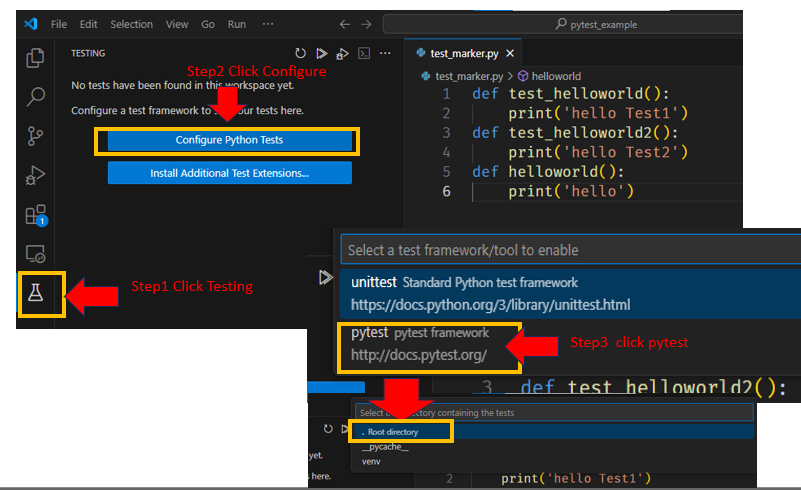
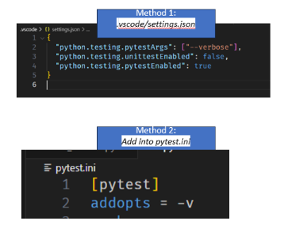
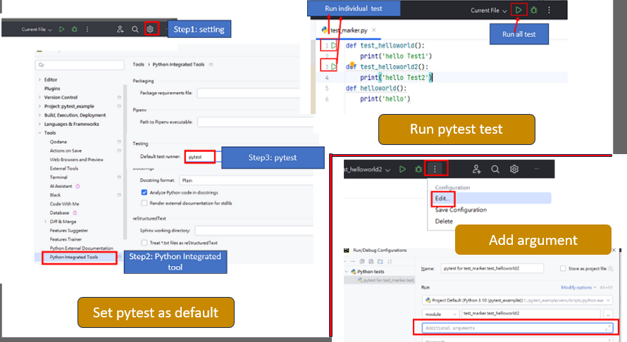

# My Pytest Note 
## Update Status 
- 2024.07.19 initial update 
- 2024.07.26 update readme 
	- create img folder to store the image
	- create each `pytest` feature folder and move related files in it
	- Parameterized add selenium project

## Intoduction
In this page, I would like to share on some of the basic example of using `pip` test. 


# Table Of Content 
<details open>
<summary><b>(click to expand or hide)</b></summary>
	
1. [How to run Test case](#RunTestCase)
   1. [cli command](#cli)
   2. [Flag and option](#flag)
   3. [IDE Setting](#IDE)
	- [VScode Setting](#vscode)
	- [Pycharm Setting](#Pycharm)
	4. [Pytest configure](#Pytest_onfigure)
2. [Fixture](#part2_Fixture)
3. [contest](#part3_conftest)
4. [parameterized](part4_parameterized)
5. [Grouping test marker](part5_marker)

</details>

##  <a id="part1_basic"> 1. Basic Understanding of pytest </a>
### Install module 
> Install pytest module or libary
>> `pip install pytest`

Pytest is a powerful framework on automation, which allow you to run testcase. 
### define test case:
- Each file with each function name with a test will be an test case, like:
```
def test_hello():
	print("helloworld")
```

###  <a id="RunTestCase"> How to run Test case </a> 
####  <a id="cli"> cli command  </a>  

- File naming convention:
	- File name with `test_*.py` or `*_test.py` will automatic run your test case 
	> running test case: `pytest [option -v|s|rp|k] test_file.py` 

**Note:** If you don't assign your testfile.py name, then when you use `pytest` all the tests will be execute in the current directory. 

####  <a id="flag"> Flag and option</a>  
When we run with `pytest` we can add some flag or option, if not added will not display test result information. 

| Flag          | Description | example/command |
| :-- |:-- |:--:|
| `-v` or `--verbose`             | Provide more detail about test execution | `pytest -v file.py` |
| `-s` or `--nocapture`  | Prints standard output of your test cases by default will not display  on the console only fail will display| pytest -s file.py |
| ::  | Run specfic testcase| `pytest -v file.py::testcase` |
| `-q` or `--quiet`  | show only failure, summary, and errors| `pytest -q file.py` |
| `-k` or `--keyword`  | Select tests based on keyword expression, or matching keyword will run| `pytest -k <substring> file.py` |
| `-m` or `--marker`  | Seelct group test base on marker | pytest -m <marker tag> file.py |

#### <a id="IDE">IDE Setting</a>  
We can also use IDE editor to run `pytest`, I will show using VSCODE and Pycharm as examples. 

##### <a id="vscode">VScode Setting</a>  
You can click on "Testing" on the left sidebar navigator, click on the configure setting, and select `pytest` and your project name.
This setting will use the default setting, if you want to use the argument of `pytest` flag, please access this setting: 
	- (Method1)go to `settings`>`Workspace`>`TextEditor`>edit in `settings.json` 
	- (Method2)go to `settings`>`Workspace`>click on the top right side `open settings` 
	- (Method3) press `Ctrl+Shift+P` and type in `open workspace settings (json)`>TextEditor>edit in `settings.json` 
Add below into the setting, and `["."]` add your flag like 
```
{
  "python.testing.pytestArgs": ["--verbose",
								"--exitfirst",
								""test/",
								// more ..],
  "python.testing.unittestEnabled": false,
  "python.testing.pytestEnabled": true,
  "editor.codeActionsOnSave": {
    
  }
}

#reference:
#https://stackoverflow.com/questions/60785825/vscode-how-to-pass-pytest-command-line-arguments-running-in-debugger
```
	
	

##### <a id="Pycharm">Pycharm Setting</a>  
	- go to `settings`>search for `integrate tool` or under `Tools`> `Python Integrated tool` 
	- In the testing section change `default` to `pytest`
	- To add an argument please click on the three dot beside the setting, and press `edit`
	- Please refer photo below for more detail
	
	

#### <a id="Pytest_onfigure">Pytest configure </a>  
Please refer to this [site](https://docs.pytest.org/en/7.1.x/reference/customize.html) for more information to set `pytest` configure. 

If you don't like to use the IDE or Option, then you can choose to add inside the `pytest` configure file with `pytest.ini`, `pyproject.toml`, etc.
This is my pytest.ini, you can refer to my file:
```
[pytest]
addopts = -vs
markers =
    windows: mark test as windows-specificrrr
    nonwindows: mark test as non-windows
filterwarnings =
    error
    ignore::UserWarning
```
## <a id="part2_Fixture"> 2.Fixture </a>
Reusable blocks of code that handle specific testing needs like setting up environments, providing mock data, or cleaning up resources (teardown).
You will often use for setup or teardown

- Syntax: `@pytest.fixture`

```
import pytest
@pytest.fixture
def setup():
    print("Lanuch Browser")
    print("Login")
    print("Browser Product")
    yield
    print("Logout")
    print("Close browser")
    
def testAllitemtoChart(setup):
    print("Login Success")

def removeItemfromChart():
    print("Logout Success")
```

Example file will use:,`test_dbFixture.py`, `test_db.py`,`mydb.py`

## <a id="part3_conftest"> 3.conftest </a>
The purpose of using `conftest.py` is to reuse the function, or if you have many tests, and not wanting to write setup or tear down function, then you can write it in the conftest. 

In the fixture example you have to write a  setup in this case will move the setup into a new file `conftest.py` , and `yeild` for teardown

> Syntax:@pytest.fixture


### <a id="autouse_option">  autouse option</a>
You can also add an option `autouse=True` inside the fixture. This means all the tests will default read confest.py. 
Without this option, you need to pass your setup function to fixture
```
import pytest
#adding fixture without autouse=True
@pytest.fixture
def setup():
	pass

def test_without_autouse(setup):
	pass

#enable autosue=True
@pytest.fixture(autouse=True)
def setup():
	pass

def test_with_autouse():
	pass

```

From the above example if you add `autouse=True` then you do need to pass in function into your test case function. This means no matter whether you pass in or not it will always read the `confest.py`. 


> - test_fixtureexample.py
```
def testAllitemtoChart():
    print("Login Success")

def testremoveItemfromChart():
    print("Logout Success")

def test_hello():
    print("Hello World")
```

> - `conftest.py`

```
import pytest

@pytest.fixture(autouse=True)
def setup():
    print("Lanuch Browser")
    print("Login")
    print("Browser Product")
    yield
    print("Logout")
    print("Close browser")
```

Now when you run it will read the conftest.py and run the setup

### <a id="understand_scope">  understand scope</a>
The default scope is `function`, there are a couple of scopes:
- `function`: default scope, the fixture is destroyed at the end of the test 
- `class`: fixture is destroyed during teardown of the last test in the class
- `module`: fixture is destroyed during teardown of the test in the module
- `package`: fixture is destroyed during teardown of the last test in the package`
- `session`: fixture is destroyed` at the end of the test session`

So in the above, I use the default scope since I didn't assign it. You can assign like this:　`pytest.fixture(scope="function",autouse=True)`
In the function scope: all the tests will run like `setup`, your test, and `teardown`
In the session scope: each test will run like `setup` test1, test2..., and then `teardown` which means if you only want to run one time setup and teardown then you can use this.

## <a id="part4_parameterized"> 4.parameterized </a>
It allows you to create multiple test cases from a single test function by providing different input values and expected outputs.

-  Reduced Code Duplication: multiple test case with the same logic but different input, you can use a parameterized test function.
-  Test Readability: provide clear and concise manner, like test data and expected result
-  Allows for passing different input values

> Syntax: 
```
@pytest.mark.parametrize("test_input, expected_result", 
          [ (value1_for_test_input, value1_for_expected_result),
           (value2_for_test_input, value2_for_expected_result))
 def test_function(test_input, expected_result):
```

> Example file will use:`test_parameter.py`,`string_num.py`

### <a id="without_parameterized"> without Parameterized</a>
> `string_num.py`
```
def greting(name):
    return f"{name}"
def square_calculate(num):
    return num*num
```

>`test_parameter.py`
```
from string_num import greting as greetlib
from string_num import square_calculate as squarelib
                
import pytest
def test_gretting_1():
    name=greetlib("James")
    assert name == "James"
def test_gretting_2():
    name=greetlib("Anna")
    assert name == "Anna"
```

Notice that the test_greeting_1 and test_gretting_2 logic is the same, just the passing Name is different. 
If you have alot of name to test, then you have to keep changing the name or writting more test case function. 
Instead of doing that you can write a parameterized function. 


### <a id="with_parameterized"> with Parameterized</a>
```
import pytest

# STRING NAME
@pytest.mark.parametrize("test_input, expected_output",
                         [
                            ("sam", "sam"), 
                            ("john", "john"),
                            ("emily", "emily")
                        ])
def test_greeting(test_input, expected_output):
    name= greetlib(test_input)
    assert name==expected_output
```
This is a better approach instead of writing a multiply test case function you can write one function and add the input and expected value on the parameterized decorator. 


## <a id="part5_marker"> 5.Grouping test marker </a>
You can add a marker or you can refer to it as a tag, and add it on top of the test case. This means it will run only on the marker you add, and essential this is like testing group of testing like checkbox related.

- Custom Marker: Marker defined by you. 
	> run like this: `pytest -v filename.py -m <marker name>`
	
- Buult-in marker: pytest marker like `skip`, `skipif`, `xpass`, and etc.
	> show all built-in marker: `pytest --markers`
	> Example of writing a built-in marker:  `@pytest.mark.skip(reason="")`
	
Example file will use:`test_markerOS.py`,`test_markerSkip.py`


## reference
- [Pytest offical site](https://docs.pytest.org/en/8.2.x/)
- [Youtube channel: codebasics ](https://www.youtube.com/watch?v=l32bsaIDoWk&list=PLeo1K3hjS3uv5U-Lmlnucd7gqF-3ehIh0&index=35)


