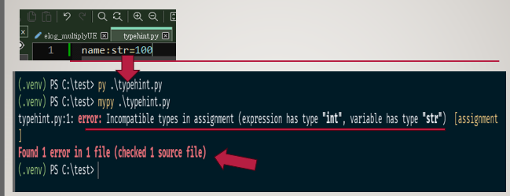
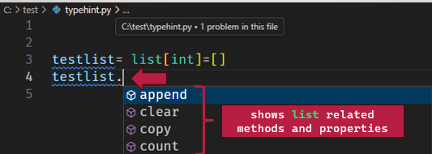

# Typing Anotation Note

## update 
- inital: 2024.11.15


## Introduction to Type Hinting in Python

Python is a **dynamically typed language**, which means there’s no need to define variable data types explicitly. If you’ve used languages like **Java** or **C++**, you may know that they **require** specifying a variable’s data type, like `int num = 100` or `string text = "hello"`.

-	**Python 3.8 and below:** the typing module does not support built-in type hints for collections(), so you need to import the typing type such as `List`, `Tuple`, and `Dict`
-	**Python 3.9+  and above:** you can use **built-in collection types** directly in type hints; without importing typing. However for more advanced types (such as Optional, Union, Callable, and other generic types), you’ll still need to import them from the `typing` module.

> For more detail, refer to [documentation](https://docs.python.org/3/library/typing.html)


The purpose of using type hints and the typing module is to make your code clearer and help catch errors before runtime. Type hints act like a comment to inform developers of the expected types for variables, function parameters, and return values.

However, type hints and the typing module don’t affect the code execution; they simply provide helpful information for developers.

To type-check your type hints, you can use `mypy` tool, which that reads type hints and checks for type errors in your code without running it


### Why Use the typing Module?

You might be wonder why typing module is needed. The typing provide tools for for type hint, especially for more complex types.
-	In **3.8 and below** type hints support only basic data types like `int`, `str`, and `float`. For collections like `list`, `tuple`, `dict`, and `set`, you need to import them from `typing` (e.g., List, Tuple, Set).
-	In **3.9 and above** common collections `like` `list`, `tuple`, and `set` are directly supported for type hints. You can use them without import `typing`, like `list[int]`, which makes type hints more convenient.

```
#python 3.8
from typing import List,Dict,Set,Dict
numbers: List[int] = []

#python 3.9+
numbers: list[int] = []
```
As you can see in the example above, in python 3.9+  there's no need to import the typing for collections, and can directly use it. 


### Basic Data Type 

This is define normal data type `string`, `integer`, and `bollean`:
```
name= "Hello Test"
age= 10
pay=1.5000
is_male=True
print(type(name)) # <class 'str'>
print(type(age)) # <class 'int'>
print(type(pay)) # <class 'float'>
print(type(is_male)) # <class 'bool'>
```
### Adding Type Hint
Now let add variable with **type hint**
> syntax: `variableName :<datatype>= <value>`

```
name: str = "Hello Test" 
age: int = 10
pay: float =1.5000
is_male: bool=True
print(type(name)) # <class 'str'>
print(type(age)) # <class 'int'>
print(type(pay)) # <class 'float'>
print(type(is_male)) # <class 'bool'>
```
As you can see, adding type hints in the example  will gives the same output result as no adding hint (basic data type example). For example, if you change `name: str = 100` and run the code again, it won’t raise an error. Type hints are simply annotations to inform developers of the expected data type, but they don’t affect the code during runtime.

However, you can check the correctness of your type hints using the `mypy` tool. You can install with this command:
> **install mypy**: `pip install mypy`


For example, if `name: str = 100` is in your code, `mypy` will raise an error:
> **run mypy:** `mypy `<pythonfile>.py`
>> **Error Message:** `error: Incompatible types in assignment (expression has type "int", variable has type "str"`

`mypy` identifies type errors based on the hints, helping catch issues before running the code, and highlights when a type is incorrect. 



Finally, another advantage of using type hints is in the editor. When you type `.` after a variable, it shows related methods and properties, which can be helpful. For example, with list, it will show methods like append, clear, and other relevant options.




Let’s recap the reasons for using type hints:
- Inform developers of the expected data types
- Use `mypy` to validate type hints and catch type errors
- Enable your editor to show relevant properties and methods for variables


### Return Function

In type hints for functions, the `->` symbol indicates the return type of the function. For example, `->` str means the function is expected to return a string value.
> **To specify a return value type:** `functionName(a:int, b:int)->int`
> **To specify no return value (None):** `functionName(a:int, b:int)->None`


- Function with a return value: 
```
# Function with a return value
def add_number(a: int, b:int, c:int)->int:
    return a+b+c
result= add_number(5,6,7)
print(result)

def hello(name:str)->str:
    return 'Hello {} '.format(name)
hello('Jane')
```

- Function with no return value:
```
## Function with no return value
def add_number(a: int, b:int, c:int)->None:
    print(a+b+c)
add_number(5,6,7)
```

### Collection

Let me explain how type hints differ between Python versions. As mentioned earlier, **Python 3.9+** supports built-in type hints for collections, whereas **Python 3.8 and below** requires importing the typing module. 
Below, I’ll demonstrate the differences in defining type hints for collections.

- **Python 3.8 and below**
You need to import the typing module to use type hints for collections, as shown in this example:
> `from typing import List, Set, Tuple, Dict`

```
# Python 3.8 and below
from typing import List, Set, Tuple, Dict
#List
name_list: List[str]= ['Jenny','Sammy','Mike', 'Joe']

```

- **python 3.9 or above** 
You no longer need to import the typing module for common collections such as `list`, `set`, `tuple`, and `dict`. These collections are now built-in and can be used directly, like this:

```
# list 
name_list: list[str]=  ['Jenny','Sammy','Mike', 'Joe']
numbers_list: list[int]=  [1,2,3,4,5]

# set
odd_number: set[int]={1,3,5,7}
type(odd_number)  

# Tuple
# This is invalid and will raise an error if check by mypy
odd_numberTuple: tuple[int]=(1,3,5,7)
type(odd_numberTuple)  

#This works and indicates a tuple of any number of int elements
tupleex3:tuple[int,...]=(50,50,60,44,52)
type(tupleex3)  

# Dict
mydict: dict[str,str]={'name': 'James'}
type(mydict)  
```

> **Note:** the `...` in tuple[int, ...] indicates that all elements in the tuple must be of the same data type.


### advanced types and features

In this section, I'll explain how to use some advanced types that aren’t built-in, so you'll need to import the typing module.
> **import typing:** `import typing`

I’ll cover a few of the most useful types, such as Optional, Union, and others. For a full list of types in the typing module, you can refer to the documentation or use these commands to check available options:

>  Lists all items in the typing module: `dir(typing)`
> Shows detailed help for the typing module: `help(typing)`

To import specific types directly, use the following syntax:
> **specify typing option:** `from typing import Union, Any, cast, Sequence, Optional`

- any option: indicates that a variable can be of any type
This is useful to restrict any data type is accepted. 
```
from typing import Union, Any, cast, Sequence, Optional
#any type
a1:Any="hello world"
a2: Any="hello 123"
a3: Any= [1,2,3,4]
print(type(a1)) #<class 'str'>
print(type(a2)) #<class 'str'>
print(type(a3)) #<class 'list'
```
- union: Allows a variable or collection to hold multiple specified types
The Union allows multiple types to be used in the list, and the order of the types doesn't matter.

```
b1: list[Union[str, int, bool]] = ['world', 50, True]

#100 is an int (valid).
#'hello' is a str (valid).
#True is a bool (valid).

b2: list[Union[str, int, bool]] = [100, 'hello', None] 

#100 is an int (valid).
#'hello' is a str (valid).
#None is not a valid type in the union (str, int, or bool), so it will cause an error.
```
in b1 it's valid, but b2 is invalid will occur error, because in b2 None does not match any of the types in the `Union[str, int, bool]`, None is not part of it. 
As long as the values in the list match one of the types in the Union, they are valid


- casting option: Used to override or "hint" a variable's type without modifying the actual object at runtime.
Casting is for telling the type checker to treat a variable as a different type
```
#casting help overwrite on
c1: Any="hello"
c2=12345
c3=cast(list[str], c1)
print(type(c3)) #<class 'str'>

c4=cast(list[str], c2)
print(type(c4)) #<class 'int'>
```
c1 is a string ("hello"), because Any allows it to hold any type, and it was assigned a string value. With cast(list[str], c1), you are telling the type checker to treat c1 as a list[str]. This means that while the type checker will consider c1 as a list of strings (even though it's actually a string), the actual value of c1 at runtime is still a string.

- Optional option: Indicates that a value can either be of the specified type or None.
Optional[X] is equivalent to Union[X, None]. `|` operator in type hints is essentially a shorthand for Optional, for example:

> `str | None`: shorter for Optional[str],below are same thing:
>> example using |: `name: str| None= "Hello"`: accepting string or none 
>> example using optional: `new: Optional[str]="happy"`


```
#optional
def testing(output:Optional[bool]=False):
    pass
testing() #output can be bool or None.
testing(True)  # No error
testing(False)  # No error
testing(None)  # No error
testing('ddd')  # Error


```

Default value is `False`, but if no value is passed, Python will interpret it as `None`.'  is commonly used for function parameters or return types where a value might not be provided, and thus could be None.

`variable: Optional[type] = value` is the same as `variable: Union[type, None] = value` which means it can accept value and none value. 


- Sequency: Represents an immutable or mutable sequence (e.g., list, tuple, str).
Sequence can be a list, a tuple, or even a string because they all follow the concept of being ordered and indexable collections.
It could also be immutable (like a tuple or string) or mutable (like a list). All elements within the sequence should be of the same data type.

```
#sequency
from typing import Sequence
def testing(seq:Sequence[str]):
    pass
testing(('a','x','y')) # Valid: Tuple of strings
testing(['a','x','y'])  # Valid: List of strings
testing("heeep") #Valid: strings
testing(['a','x',1])  # inValid: List of strings
#error: List item 2 has incompatible type "int"; expected "str"  [list-item]

```
The function testing accepts any sequence of strings, including tuples, lists, or strings (since strings are sequences of characters in Python).

