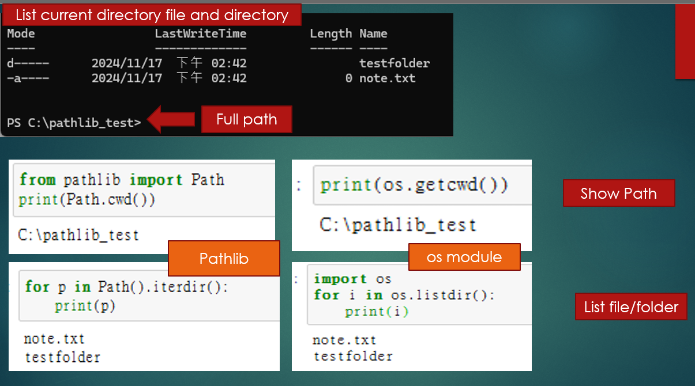
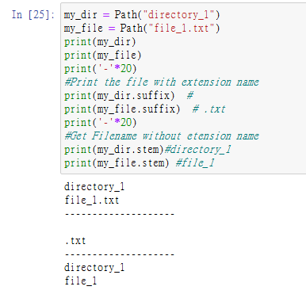

## Uodate 
- inital: 2024.11.17
- updated note: 2024.11.19
	-  change img location
	
## Python Path Operations (pathlib) with file and directory

I want to show using `pathlib`, however you can also use the `os` module to establish it, some example I will show using these module to implement it. 

**In this note will cover:**
- check yout cuurent path location using pathlib module
- check file and folder in current directory use both os and pathlib module
- rename, delete file or folder
- write into file like txt, csv

> **Pathlib** is module that allow you to check your full **path location**, **filter** specific **file or folder**. There is also another **alternative module** which use like `os` module. 
> - **import pathlib module:** `from pathlib import Path`
> - **import os module:** `import os`

**Compare OS module and Pathlib:**

- **os module** provides a more traditional approach to handling paths and directories, especially in older Python versions.
```
os.path.join() #Combines paths.
os.path.exists() #Checks if a file or directory exists.
os.mkdir() # Creates a directory.
os.rmdir() # Removes a directory (only if empty).
os.remove() # Removes a file
```

- **pathlib module** provides an object-oriented approach to handling file system paths and is generally considered more modern and convenient than os
```
Path.exists() # Checks if a file or directory exists.
Path.mkdir() # Creates a directory.
Path.rmdir() # Removes a directory (only if empty).
Path.touch() # Creates a new file.
Path.joinpath() or / operator #Combines paths.
Path.glob() #Searches for files matching a pattern
```
<a name="content"></a>
**Click on the section you want to see:**
- [Part1 Path Displaying ](#part1)
	- [1. Displaying and Navigating Paths](#part1-1)
	- [2. Path Object File Extensions](#part1-2)
		- [suffix and stem: filter file or extension name](#suffix_stem)
		- [endswith: filter extension name](#endswith)
	- [3. Combining and Creating Paths](#part1-3)
	- [4 Checking File Existence](#part1-4)
	- [5 Absolute and Relative Paths](#part1-5)
		- [Parent()](#parent)
		- [absolute()](#absolute)
		- [resolve()](#resolve)
	- [6. User Home Directory Access](#part1-6)
- [Part2 Searching and Opening Files](#part2)
	- [Searching File](#part2-1)
		- [glob():Case-Sensitive Search](#glob)
		- [rglob: recursive Search](#rglob)
		- [os.walk(): list all file from subdirectory](#os.walk)
	- [Opening and reading Files](#part2-2)
		- [read file](#read-file)
		- [write file](#write-file)
		- [write file to csv](#write_csv) 
		- [zip file folder: extract, and compress file](#zip)
- [Part3 Limitations of pathlib:create and remove](#part3)
	- [1. Directory Creation and Removal](#part3-1)
		- [mkdir: create Directory](#part3-1_create_subdir)
		- [parents=True: Create Directory with Subdirectories](#part3-1_create_subdir)
		- [rmdir: remove Directory](#part3-1_remove)
			- [rmdir: remove empty directory](#rmdir)
			- [rmtree: remove non empty directory or folder](#rmtree)
	- [2. File Creation, copy, rename, and delete](#part3-2)
		- [touch: Create File](#create-file_touch)
		- [rename() and replace(): reaname and replace file](#renamefiles)
		- [copy(): copy files](#copyfile)
		- [Delete File](#delete-file)
			- [unlink](#unlink)
			- [send2trash](#send2trash)

<a name="part1"></a>
## Part1 Path Displaying [🔝](#content)
This section will show your current full path location, and list file files. 

**Click on the section you want to see:**
- [1. Displaying and Navigating Paths](#part1-1)
- [2. Path Object File Extensions](#part1-2)
	- [suffix and stem: filter file or extension name](#suffix_stem)
	- [endswith: filter extension name](#endswith)
- [3. Combining and Creating Paths](#part1-3)
- [4 Checking File Existence](#part1-4)
- [5 Absolute and Relative Paths](#part1-5)
	- [Parent()](#parent)
	- [absolute()](#absolute)
	- [resolve()](#resolve)
- [6. User Home Directory Access](#part1-6)


<a name="part1-1"></a>
### 1. Displaying and Navigating Paths [🔼](#part1)

- Show current directory path
This allow you see what your full path of your current location, which is like the command `pwd`. This is often use if you want to assign to full path location. 
```
import os
from pathlib import Path
print(Path.cwd())  # Show your current path as a string
print(os.getcwd())
```
- iterate throught current path and list file and directory 
This code is like the command you use `dir` or `ls -al` which is list of the files and subfolders contained in a folder.

```
#using pathlib
for p in Path().iterdir():
    print(p)
```
There's also another old way you can use the `os.listdir()` also have the same effect
```
#using os module
os.listdir() # list current path folder and files`
os.listdir(target_path) #list specify path folder and files
```



<a name="part1-2"></a>
### 2. Path Object File Extensions [🔼](#part1)

<a name="suffix_stem"></a>
#### 2.1 suffix and stem: filter file or extension name [⏫](#part1-2)
You can use below to display your file extension name or just show file name. 

> show the file/directory **with extension name**: `.suffix`
> show the file/directory **without extension name**: `.suffix`

```
#  Create Path object file or folder
my_dir = Path("directory_1")
my_file = Path("file_1.txt")

#Print the file with extension name
print(my_dir.suffix)  # 
print(my_file.suffix)  # .txt

#Get Filename without extension name
print(my_dir.stem)#directory_1
print(my_file.stem) #file_1
```



<a name="endswith"></a>
#### 2.2 endswith: filter extension name [⏫](#part1-2)

You can also use `endswith` to filter your file name
```
import os
target_path ='C:\python_prj'
ext =input ('please enter file type: ')
for x in os.listdir(target_path):
    #if x.endswith('.txt'):
    if x.endswith(ext):
        print(x)
```

You can save the result into file:
```
import os
target_path ='C:\python_prj'
#ext =input ('please enter file type: ')
file = open('file_output.txt', 'w')

for x in os.listdir(target_path):
	# write into file_output.txt
    file.write(x+'\n')
	
file.close()
```

<a name="part1-3"></a>
### 3. Combining and Creating Paths [🔼](#part1)

Using combine path location with these method

-	Combine Paths
```
newfile = my_dir / "newfile"
print(newfile)
#directory_1\newfile
```
-	Using `joinpath` as an Alternative
```
newfile = my_dir.joinpath("newfile.txt")
print(newfile)
#directory_1\newfile.txt
```

<a name="part1-4"></a>
### 4. Checking File Existence [🔼](#part1)

Using this to check your file exist or not
```
print(my_dir.exists())  # Check if directory exists
print(my_file.exists())  # Check if file exists
print(newfile.exists())  # Check if newfile exists
```
<a name="part1-5"></a>
### 5. Absolute and Relative Paths [🔼](#part1)
> **File name:**
> - **newfile:** directory_1\newfile.txt 
> - **my_dir:** directory_1               

#### Parent()[⏫](#part1-5)
```
print(my_dir.parent) #.
print(newfile.parent)#directory_1
print(newfile.parent.parent)#.
```
It will show `.` when the file is in the current directory (relative to where your script is running or the current working directory).  For example, if you are running the script in  `C:\pathlib_test`, then `run my_dir.parent` it will show `.`.
> - `newfile.parent` it will show `directory_1`, because newfile parent is `directory_1` because newfile was defined with a path like "directory_1/file_1.txt", the parent of newfile is explicitly set to directory_1.

#### absolute()[⏫](#part1-5)

> `.absolute` will return the **full absolute of the directory or file** as a string.

```
print(my_dir.absolute())  #C:\pathlib_test\directory_1
print(newfile.absolute()) #C:\pathlib_test\directory_1\newfile.txt
```

#### resolve[⏫](#part1-5)

> `.resolve` will return the full absolute path of the directory or file, resolving any symbolic links or relative path components.
> - **Parent directory:** `Path("..").resolve()` → C:\Users
> - **Current directory:** `Path(".").resolve()` → C:\Users\test

```
p = Path(".").resolve()  
print(p) # C:\Users\test
p = Path("..").resolve()  # Get full path of the parent directory
print(p) #C:\
```

The key difference is that `.resolve()` can handle relative components like `..`, resolving them to the actual absolute path, whereas `.absolute()` does not process `..` and simply returns the **absolute path** as-is.

<a name="part1-6"></a>
### 6. User Home Directory Access [🔼](#part1)

```
p = Path("~/Pictures").expanduser()  # Access user’s home directory
print(p)#'C:/Users/test/Pictures

p = Path.home() / "Picture"  # Get path to user's Picture directory
print(p) #C:/Users/test/Picture

p=Path.home() #C:/Users/test/
p=Path.home().parent #C:/Users
p= Path.home().parent / "test" #C:/test
```


<a name="part2"></a>
## Part2 Searching and Opening Files[🔝](#content)
This section will show you 
- how to search or filter specfic file extension and directory. 
- open and write into file 

**Click on the section you want to see:**
- [Searching File](#part2-1)
	- [glob():Case-Sensitive Search](#glob)
	- [rglob: recursive Search](#rglob)
	- [os.walk(): list all file from subdirectory](#os.walk)
- [Opening and reading Files](#part2-2)
	- [read file](#read-file)
	- [write file](#write-file)
	- [write file to csv](#write_csv) 
	- [zip file folder: compress file ](#zip)

<a name="part2-1"></a>
### 1. Searching File: 

<a name="glob"></a>
#### glob():Case-Sensitive Search [⏫](#part2-1)

> **glob method** searches for files and directories that match a specific pattern in the current directory (non-recursively). It combines files or directories that match the given pattern

**search for files or directories** that contain the pattern `py` in their names(any file or directory name)

```
#dotfiles=Path.home().parent.parent / "test" #accessing to c:\test
dotfiles=Path.home().parent.parent  #accessing to c:\
for p in dotfiles.glob("*py*"):
    print(p)
#output:
#C:\pytest_apitest
#C:\python3.10
```
<a name="rglob"></a>
#### rglob: recursive Search[⏫](#part2-1)

> **rglob method** searches **recursively** through the current directory and all its subdirectories for files and directories that match the specified pattern.

It will **search for files or directories** (in `C:/Users/test/` and its **subdirectories**) that contain the `.pdf` pattern in their name, and the `*` indicate any matches any number of characters before `.pdf`
```
dotfiles=Path.home() #accessing to C:/Users/test/
for p in dotfiles.rglob("*.pdf"):
    print(p)
```

<a name="os.walk"></a>
#### os.walk(): list all file from subdirectory [⏫](#part2-1)

You can use `os.walk` to search Recursively of subdirectories

```
import os
target=r'C:\Python'
for root, dirname, files in os.walk(target):
    for x in files:
        print(root + '\\' + x)
'''
C:\Users\test\testdebug\.test12
C:\Users\test\testdebug\test1234.html
C:\Users\test\testdebug\hello\123\www.html
'''
```

**Search specfic file extension**
```
for root, dirname, files in os.walk(target):
    for x in files:
		#find specfic extension file
		if x.endswith('.txt'):
		#print all sub directory files
        print(root + '\\' + x)
```

**Search and write into a file**
```
file=open('export_file_sub.txt', 'w')
for root, dirname, files in os.walk(target):
    for x in files:
        file.write(root+'\\'+x +'\n')
```
<a name="part2-2"></a>
### 2. Opening and reading Files [🔼](#part2)

#### read file[⏫](#part2-2)

- Open method with pathlib

```
dotfiles = Path.home() / "titanic.csv" #('C:/Users/test/titanic.csv')
with dotfiles.open() as f:
    #print(f.read())
    for line in f:
        line = line.strip()
        print(line)
```

- with method reading file
```
with open(dotfiles) as f:
    for line in f:
        line = line.strip()
        print(line)
```
**Without** loop, the entire file is **read in one pass**, making it **suitable for small files**. However, for **large files**, this can be **memory-intensive and slow**. To handle large files more efficiently, a loop can be used to process the file line by line.

> `line.strip`: removes leading and trailing whitespace, and `print(line, end='')` print without newline


#### write file[⏫](#part2-2)
```
with open('test.txt') as f,open('out.txt', 'w') as f_out:
    for line in f:
        line = line.strip() 
        print(line)
		f_out.write('{}\n'.format(line))
```
<a name="write_csv"></a>
#### Write file to csv [⏫](#part2-2)
- read and write into csv
```
import csv

txt_file = r"mytxt.txt"
csv_file = r"mycsv.csv"
in_txt = csv.reader(open(txt_file, "rb"), delimiter = '\t')
out_csv = csv.writer(open(csv_file, 'wb'), delimiter = '\t')
out_csv.writerows(in_txt)

```
- read and split space write csv
```
import csv
with open('file1.csv', 'wb') as csvfile:
    spamwriter = csv.writer(csvfile, dialect='excel')
   
    with open('vocab2.txt', 'rb') as filein:
        for line in filein:
            line_list = line.strip('\n').split(' ')
            spamwriter.writerow(line_list)

```
<a name="zip"></a>
#### Zip file folder [⏫](#part2-2)

- List all Files in ZIP Archive **Without Decompression** 
```
import zipfile
target='C:\\test_folder.zip'
handle = zipfile.ZipFile(target)

#print 
listinng =handle.namelist()
for x in listinng:
    print(x)
	
#instead print write into file
file = open('zip-listing.txt', 'w')
for x in listinng:
    file.write(x+'\n')
```
- compress files to zip file 
```
import zipfile, os

# single 
handle=zipfile.ZipFile('zipfile_test.zip', 'w')
handle.write(file_output.txt, compress_type = zipfile.ZIP_DEFLATED)
handle.close()

# multiple file
handle = zipfile.ZipFile('ALL-PYD.zip', 'w')
for x in os.listdir():
    if x.endswith('.py'):
        handle.write(x, compress_type = zipfile.ZIP_DEFLATED)
handle.close()

```

- unzip
```
import zipfile, os
target='C:\\test_folder\\test_folder.zip'
handle=zipfile.ZipFile(target)
handle.extractall('C:\\test_folder\\unpack')
handle.close()

#specfic file 
#target=['test_folder1.zip','test_folder2.zip']
target='C:\\test_folder\\test_folder.zip'
handle=zipfile.ZipFile(target)
for x in handle.namelist():
    if x.endswith('.txt'):
        handle.extract(x, 'c:\\txtfile')
```

<a name="part3"></a>
## Part3 Limitations of pathlib [🔝](#content)
There are some limiatation of pathlib:
-** Directory:**
	- **Create Directory:** Only **creates one directory**; no recursive creation unless parents=True
	- **Remove Directory:**	Only **removes empty directories**; requires external tools for non-empty directories
- **Files:**
	- **Create File:** Only **creates an empty file**; no direct content creation
	- **Rename/Move File:**	Overwrites destination file if it exists, no way to prevent this directly
	- **Delete File:**	Only **deletes individual files**, not directories or recursive deletion

**Click on the section you want to see:**
- [1. Directory Creation and Removal](#part3-1)
	- [mkdir: create Directory](#part3-1_create_subdir)
	- [parents=True: Create Directory with Subdirectories](#part3-1_create_subdir)
	- [rmdir: remove Directory](#part3-1_remove)
		- [rmdir: remove empty directory](#rmdir)
		- [rmtree: remove non empty directory or folder](#rmtree)
- [2. File Creation, copy, rename, and delete](#part3-2)
	- [touch: Create File](#create-file_touch)
	- [rename() and replace(): reaname and replace file](#renamefiles)
	- [copy(): copy files](#copyfile)
	- [Delete File](#delete-file)
		- [unlink](#unlink)
		- [send2trash](#send2trash)

	
<a name="part3-1"></a>
### 1. Directory Creation and Removal)[🔼](#part3)

<a name=part3-1_create_subdir"></a>
#### mkdir: Create Directory [⏫](#part3-1)

There are some limiation with `mkdir()`:
- > can only create a single directory at a time
- > will **raise an error** if the **directory already exists**, unless you specify `exist_ok=True`,  not available Python before 3.5.

```
from pathlib import Path
p = Path(r"C:\test\123")
p.mkdir()  # Create directory, error if it exists
```
<a name="part3-1_create_subdir"></a>
#### parents=True: Create Directory with Subdirectories [⏫](#part3-1)

> To create Subdirectories, need to add `parents=True`
```
from pathlib import Path
p = Path(r"C:\test\123\sub")
p.mkdir(parents=True)
```
Another way you can do, create directory, and create sub directory

```
from pathlib import Path
p = Path(r"C:\test\123")
p.mkdir()  # Creates the "123" directory
# Add a subdirectory "testing" under "123" and create it
(p / "testing").mkdir()  # Creates "C:\test\123\testing"
```

<a name="part3-1_remove"></a>
#### rmdir: Remove Directory  [⏫](#part3-1)

Removing directories with rmdir() has some limitations. It only allows you to remove empty directories. To remove non-empty directories, you need to use the shutil module. If you attempt to use rmdir() on a non-empty directory, an error will occur with the message: 'Subdirectory should be empty'. 
> - **remove empty directory**: `rmdir()`
> - **remove non empty directory:** `shutil.rmtree()`

<a name="rmdir"></a>
##### rmdir: remove empty directory [👆](#part3-1_remove)
```
# Remove empty directory without content
p = Path(r"C:\test\123")
p.mkdir() #create 123 folder
p.rmdir() #remove 123 folder

# remove multiply directory without content
list_directory = ['alotoffolder','c:\\test_folder']
for x in list_directory:
    os.rmdir(x)list_directory
```
<a name="rmtree"></a>
##### rmtree: remove non empty directory or folder [👆](#part3-1_remove)

```
import shutil

#Delete single directory with content
shutil.rmtree(p)

# Delete Multiple folder with content
list_directory = ['alotoffolder','c:\\test_folder']
for x in list_directory:
    shutil.rmtree(x)    
	
```

<a name="part3-2"></a>
### 2. File Creation, copy, rename, and delete [🔼](#part3)

<a name="create-file_touch"></a>
#### Create File [⏫](#part3-2)
> It can **create an empty file**, but it **does not allow** you to create a **file with content** directly. 

```
p = Path("TempDir.txt")
p.touch()
```
<a name="renamefiles"></a>
#### Rename or Replace Files [⏫](#part3-2)

> Renaming a file or moving it to a new path. It will overwrite the destination file if it exists, which could lead to data loss. 

```
p.rename("hello.txt")  # Rename file
p.replace("hello_2.txt")  # Replace file
```
<a name="copyfile"></a>
#### copy files [⏫](#part3-2)

- copy file to another folder
```
import os, shutil
os.chdir('c:\\test_folder\\')
shutil.copy('copy-text.txt', 'c:\\test')
#same folder
shutil.copy('copy-text.txt', 'copy-text.txt_bk')
```
- copy folder with files to another folder
```
os.chdir('c:\\test_folder\\')
#copy folder 
shutil.copytree('alotoffolder', 'alotoffolder_backup')
#full path
shutil.copytree('c:\\test_folder\\alotoffolder', 'c:\\test_folder\\alotoffolder_backup2')
```

#### Delete File[⏫](#part3-2)

You can use with these two method to delete, please see the description: 
- **unlink():** is faster and more direct, but offers no recovery option
	- **Soft Delete:** Moves the file to the Recycle Bin or Trash, allowing for potential recovery 
	- **User-Friendly:** Provides a safety net for accidental deletions
	
- **send2trash():** is safer and more user-friendly
	- **Hard Delete:** Permanently removes the file from the system.
	- **No Recovery:** Once deleted, the file cannot be restored.
	- Built-in to Python's os module
		
##### unlink()[👆](#delete-file)

> It can only **remove a single file**. It does **not support** removing directories or recursively deleting files in subdirectories, just file, need to use `shutil()`

- delete single file
```
import os, time

#delete single file
p = Path("file_to_delete.txt")
p.unlink()  # Deletes the file
```

- delete multiple files
```
#delete specfic file extension
target ='C:\\test_folder\\'
for x in os.listdir(target):
    if x.endswith('.css'):
		print('Deleting File', x)
        os.unlink(target + x)
		time.sleep(2)
		print('File Delete') 
```

##### send2trash()[👆](#delete-file)

You can also use send2trash() module to delete files, please install the module first:
>install with pip:  `pip install send2trash`

```
import os, time
import send2trash as s2t

# delete single file
import send2trash as s2t
try:
    s2t.send2trash('C:\\test_folder\\test.css')
    print ('Job Done')
except:
    print('Can\'t delete that file')

#search specfic file and delete 
target ='C:\\test_folder\\'

for x in os.listdir(target):
    if x.endswith('.css'):
        #need to spefic full path
        s2t.send2trash(target + x)
```

