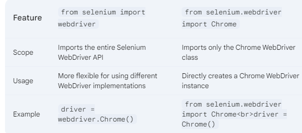
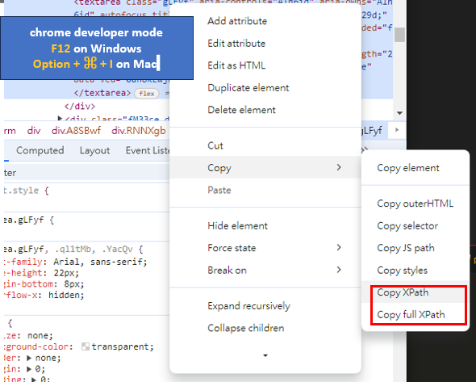
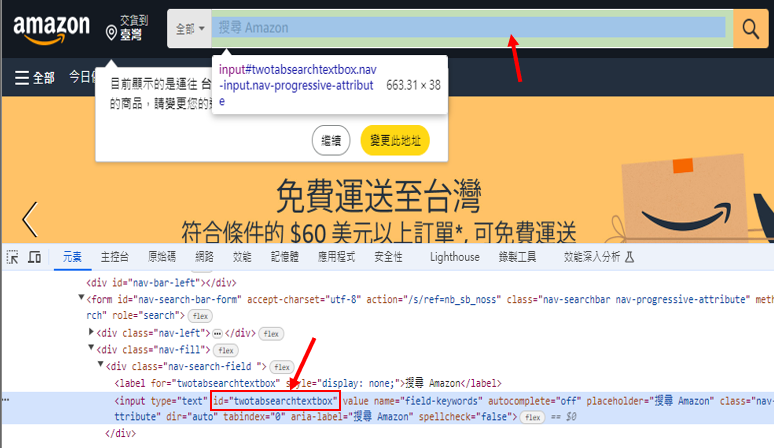

# Access Web using Selenium Framework Basic

## Introduction

In this project or example, I am going to show how to navigate to website like google, or amazon without password.

I will show using many different way to achieve it like with normal way, adding function, or class for more cleaner code.
**Note** This project will not contain any releate to account, I will show access to account like Instagram or Facebook in other project in future.

I just want to keep the note about using different way of writting selenium.
There are many people using many various method of writting selenium automation cause I see many different way throughout learning selenium myself.

I will show using selenium with two website, one is `google` one is `amazon`. I will also show how to use pytest to validate whether your search result is correct or not.

I will cover navigate to URL using:

- various way of using browser driver
- various way of wait method, like `sleep`, `implicit`, `explict` wait
- using cleaning code like function, or class
- pytest method to test it

## <a id="toc"> Table Of Content </a>

<details open>
<summary><b>(click to expand or hide)</b></summary>
	
1. [Install Library and How to run](#library)
2. [File Description](#filedescription)
3. [Part 1 Keypoint for Selenium Code](#part1)
	1. [Define webdriver and Option setting](#intialwebdriver)
   	1. [Chrome option](#option)
	2. [2. waiting method](#waiting)
   		1. [2.1 sleep](#sleep) 
   		2. [2.2 Implicity wait](#implicity) 
   		3. [2.3 Explicit wait](#explicit)
	3. [3. Find and Locate elements ](#locateelement)
   		1. [ 3.1 Locate element by Xpath](#xpath) 
   		2. [ 3.2 Locate element by id or class](#idclass ) 		
	4. [Part 2 Keypoint for Selenium and Pytest code ](#part2 )
   		1. [1. Pytest and Stucture of the code](#pyteststructure)
		2. [2. Access to URL and validate it](#pytestaccessurl)
   			- [ 2.1 Run Unittest with Pytestt](#unitest1)
   			- [ 2.2 Adding Unittest with parametrize](#unitest2)
4. [Update](#update)
5. [Reference](#reference)

</details>

### <a id="library"> Install Library and How to run </a> [(Top)](#toc)

> Install selenium, `request`, `beautifulsoup4`, and `pytest`:
>
> > `pip install selenium requests beautifulsoup4 pytest`

### <a id="filedescription"> File Description </a> [(Top)](#toc)

- Ex1: Navigate to Google search engine:
  - `access_google_basic.py`: with basic code
  - `access_google_function.py`: add the code into a function
- Ex2: Navigate to Amazon page search product
  - `access_amazonSearch_Basic.py`: with basic code
  - `access_amazonSearch_Function.py`: add code into a function
- Test the Amazon Site and check the match result
  - `test_amazonSearch_Class.py`: Test the code and validate the search string
  - `test_amazonSearch_Parametrize.py`: Test the code and validate the search string with parametrize on multiple search keyword

### <a id="part1"> Part 1 Keypoint for Selenium Code</a> [(Top)](#toc)

#### <a id="intialwebdriver"> 1. Define webdriver and Option setting</a> [(Top)](#toc)

You can use either method to initialize a Selenium WebDriver instance for the Chrome browser

- using the default system Chrome driver

```
from selenium.webdriver import Chrome
driver=Chrome()
url="https://www.amazon.com"
driver.get(url)
```
Please make sure one thing here, there is an alternative method you can do is import the entire webdriver api, below is comparision: 
> import all driver: `from selenium import webdriver`
> import all chrome driver: `from selenium.webdriver import Chrome`



To use different browser other than chrome, you can use like this: 
```
from selenium import webdriver

# To use Chrome
driver = webdriver.Chrome()

# To use Firefox
driver = webdriver.Firefox()

# To use Edge
driver = webdriver.Edge()
```


- assign your Chrome driver path
  You need to first [download chrome driver](https://developer.chrome.com/docs/chromedriver/downloads) and assign the path like below

```
from selenium import webdriver
#assign full path
driver = webdriver.Chrome("chrome full path ")
#if driver same directory can leave the full path empty
#driver = webdriver.Chrome()
url="https://www.google.com"
driver.get(url)
```

I believe there are many more way to initialize, but I think these two methods is most commonly been used.

##### <a id="option"> Chrome Option</a> [(Top)](#toc)

If you are interested in using the option, you can use it like this:

```
from selenium.webdriver.chrome.options import Options
chrome_options = Options()

# let the browser will not close
chrome_options.add_experimental_option("detach", True)
driver=Chrome(options=chrome_options)
driver=Chrome()
```

These are common use options, you can use as below. Please keep in mind if you want to use my setting on `driver` variable, then you need to change `driver=Chrome(options=chrome_options)`. Below is the official site syntax:

```
from selenium import webdriver
from selenium.webdriver.chrome.options import Options

options = webdriver.ChromeOptions()

#Opens Chrome in maximized mode:
options.add_argument("--start-maximized")

#set Chrome screen-specific size
options.add_argument("--window-size=1920,1080")

#Runs Chrome in headless mode (without a graphical interface):
options.add_argument("--headless") #ensure GUI is off

# Opens Chrome in incognito mode
options.add_argument("--incognito")

#change language, use either method or both
options.add_argument('--lang=en-US')
options.add_experimental_option('prefs', {'intl.accept_languages': 'en-US,en'})
```

#### <a id="waiting"> 2. waiting method </a> [(Top)](#toc)

From above you can access a URL, if you don't add the waiting option, then your window will automatically be closed. You need to let it wait for a specfic second depending on your system. I will show you different ways you can use the waiting option and choose which one you prefer.

##### <a id="sleep"> 2.1 sleep </a> [(Top)](#toc)

This is not the best approach, basically it just doing pauses that need to wait for a specific time or static time. For example, your web is open already, but you set it to `sleep(10)`, this means even if the URL is open still have to wait for 10 seconds to do the next process. It will just waste your time or your code might run longer if you use other waiting methods.

```
import time
driver.get(url)
time.sleep(10)
```

##### <a id="implicity">2.2 Implicity wait </a> [(Top)](#toc)

```
import time
driver.get(url)
driver.implicitly_wait(10)
```

##### <a id="explicit">2.3 Explicit wait </a> [(Top)](#toc)

Using Explicit, is much better than sleep, because once your element is been find, it will start to run the next process and not wait till the max time. Below is an example of how to use explicit wait, you need to import the module first.

```
from selenium.webdriver.support import expected_conditions as EC
wait = WebDriverWait(driver, 10)  # Set a timeout of 10 seconds
wait.until(EC.presence_of_element_located((By.ID, "twotabsearchtextbox")))
    search_box.send_keys('dress', Keys.ENTER)
```

#### <a id="locateelement">3. Find and Locate elements </a> [(Top)](#toc)

When access to web you we use mouse select or locate on specific target on web. So you need to located the element by finding the element, which is like select on html tag like `class`, `id`, `xpath` or etc.

##### <a id="xpath"> 3.1 Locate element by Xpath </a> [(Top)](#toc)

> There are `relative path` and `absolute path`
>
> > Relative Xpath: use often, which is much flexible
> > Absolute Xpath: use when you know the page structure will not change, then you can change. If not next time will not be able to find

```
# Relative XPath
driver.find_element(By.XPATH,"//span[@class='a-color-state a-text-bold']").text

# Absolute Path
driver.find_element(
        By.XPATH,
    "/html/body/div[1]/div[3]/form/div[1]/div[1]/div[1]/div/div[2]/textarea"
         )
```

- How to copy absolutive xpath:
Please go to chrome develper mode(window `F12`, mac: `Option + command + I` ), and click inspect will show. 


##### <a id="idclass"> 3.2 Locate element by id or class </a> [(Top)](#toc)

You can also use the `id` or `class` to locate the element, just like below example:

> locate element by ID:
>
> > `driver.find_element(By.ID,'twotabsearchtextbox')`



#### <a id="sendkey"> 4. send key or type string </a> [(Top)](#toc)

continue from above since we can click on specific button or location on the web, we can also type in string or send specific key or keyboard.

Once you have locate correct element using above method, now you can type some word by sending key like:

```
#type youtube on google search bar
search_text="Youtube"
search_bar.send_keys(search_text)

#press enter by key to search
search_bar.send_keys(Keys.ENTER)
time.sleep(10)

```

#### <a id="close"> 5. close driver </a> [(Top)](#toc)

after finish access to url, you need to close your driver. You can use either of these.

- `driver.close()`: Use when you want to close a specific window but keep the WebDriver session alive (for example, when handling multiple windows).
- `driver.quit()`: Use when you're finished with all your tests and want to completely terminate the browser session.

### <a id="part2"> Part 2 Keypoint for Selenium and Pytest code </a> [(Top)](#toc)

In Part1 already know how to use selenium basic knowledge, now in this part I would like to use pytest with selenium to validate test. In this example continue using above example on Amazon Website, and check whether out seach result match.

In this code change orginal code(function) to class, and move the function inside. All of the function will be name as test_XXX as unit test.

#### <a id="pyteststructure"> 1. Pytest and Stucture of the code </a> [(Top)](#toc)

I will not write all the code, you can refer this two full code file for this example:

- `test_amazonSearch_Class.py`: basic pytest code
- `test_amazonSearch_Parametrize.py`: add Parametrize

  ```
  class Testamazonsearch:
      def setup_method(self):
          self.driver=Chrome()
          self.driver.implicitly_wait(10)
          url="https://www.amazon.com"
          self.driver.get(url)
     def test_amazon_search_dress(self):
        	......
  	......
     def test_amazon_search_otheritem(self):
        	......
  	......
      def teardown_method(self):
          self.driver.quit()
  ```

#### <a id="pytestaccessurl"> 2. Access to URL and validate it </a> [(Top)](#toc)

##### <a id="unitest1"> 2.1 Run Unittest with Pytestt </a> [(Top)](#toc)

Below is example of `test_amazon_search_dress` from above, notice my function is name as `test`. Below this code will navigate to amazon page and search for dress, like the one in above. The only different is the `assert` us doing validate to compare it" ` assert except_txt == actual_txt`

```

# Locate the search product element
search_box = wait.until(EC.presence_of_element_located((By.ID, "twotabsearchtextbox")))

type in dress
search_box.send_keys('dress', Keys.ENTER)

except_txt='"dress"'
#compare the except_txt with the URL and validate
actual_txt=self.driver.find_element(By.XPATH,"//span[@class='a-color-state a-text-bold']").text
        assert except_txt == actual_txt, f"Error . Expected text: {except_txt}, but actual text: {actual_txt}"

```

##### <a id="unitest2"> 2.2 Adding Unittest with parametrize </a> [(Top)](#toc)

In this example searching on amazon page on specfic product, in my example is `dress`, but if you want to search multiply product, then you need to create multiple function or unittest, and add change `except_txt="item name"` to a different product name just like below, you have to define each test for each product.

```
     def test_amazon_search_dress(self):
    ......
  	......
     def test_amazon_search_otheritem(self):
```

This is not a good approach, you will have duplicate code and code will be longer. To solve this solution you just have to add `parametrize` like below. Now notiice I just have to add the product item inside the `search_Word` it will automatic run test by search each item and validate it.

```
class Testamazonsearch:
    def setup_method(self):
      search_word= ('dress','shoes')
      ....
      ....
    @pytest.mark.parametrize('searching',search_word)
    def test_amazon_searching(self, searching):
      ....
      search_box.send_keys(searching, Keys.ENTER)
      except_txt=f'\"{searching}\"'  #ignore quote
      ....
      ...

```

## <a id="update"> Update </a> [(Top)](#toc)

- 2024.8.1: intial added
- 2024.8.7: add a table of content
- 2024.9.9: upload image, reference page, description on option, and driver


## <a id="reference"> Reference </a> [(Top)](#toc)
- https://nariyoo.com/python-how-to-run-selenium-in-google-colab/
