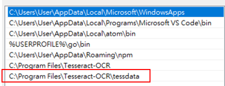
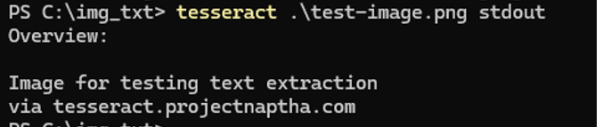
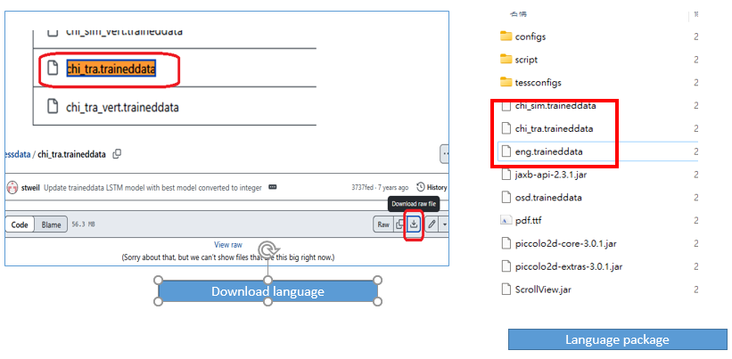

# OCR Note 

## Introduce
In this note I wants to show how to use ocr module to help read photo and convert it into images. There are many OCR library on the market. Today I am using `pytesseract`

- `easy_example.py`: example of single, multiple example with diffent langauge 
- `ex1_eng.png`: english image to extract 
- `ex2_chi_trad.png`: chinese image to extract 
- `ex3_chi_simple.png`: chinese image to extract 
## Update
- 20250302: inital update 

## Setup and installation 

### Step 1 Download 
link: https://tesseract-ocr.github.io/tessdoc/Installation.html

Please download tesseract on above link and install into your computer. 

### Step 2 Setup environment variable
After you install `tesseract`, it should located under `C:\Program Files\Tesseract-OCR`. Please add this location into your environment `PATH`. 



### Step 3: run with this command under command prompt to make sure it been install properly
> command: `Tesseract` which will look like below

You can extract image to text using this command:
```
#extract img to txt 
tesseract .\test-image.png stdout
```



### Step 4 Download language package (optional)
The default is English package, which means it allow picture with english string able to extract to text, but if you have other language you have to download the language package. 

- Check language support: `tesseract --list-langs`
- Language package store location: `C:\Program Files\Tesseract-OCR\tessdata`
	- english: `eng.traineddata`
- Download langauge: https://github.com/tesseract-ocr/tessdata 

Please download language package and store in the `tessdata` location


-	specify lang: `tesseract chi_tra .\chinese.jpg stdout`

### Other command 
Here are other command you can use: 
- specify lang and log: `tesseract --loglevel DEBUG -l chi_tra .\chinese.jpg stdout`
- Check language: `tesseract --list-langs`
- Check version: `tesseract –version`
- Run with explicit path: `tesseract --tessdata-dir "C:\Program Files\Tesseract-OCR\tessdata" -l chi_tra .\chinese.jpg stdout`
- Inspect log: `tesseract --loglevel DEBUG -l chi_tra .\chinese.jpg stdout`


## Run with python

- Install  pytesseract: `pip install pytesseract`

```
#without setting  environment variable
pytesseract.pytesseract.tesseract_cmd = r"C:\Program Files\Tesseract-OCR\tesseract.exe"
pytesseract.image_to_string(img)

```


### run with single image
```
from PIL import Image
from pathlib import Path
import pytesseract, os

img_name1 = 'ex1_eng.png'

#single image method1 one line
print(pytesseract.image_to_string(Image.open('ex1_eng.png')))

# single image method2 seperate line with open file

img = Image.open('ex1_eng.png')
text = pytesseract.image_to_string(img)
```

### run with different language
without specify language, default will use english
```
img_name1 = 'ex1_eng.png'
img_name2 = 'ex2_chi_trad.png'
img_name3 = 'ex3_chi_simple.png'

print(pytesseract.image_to_string(Image.open(img_name1),lang='eng+chi_tra+chi_sim'))
print(pytesseract.image_to_string(Image.open(img_name2),lang='eng+chi_tra'))
print(pytesseract.image_to_string(Image.open(img_name3),lang='eng+chi_tra+chi_sim'))
```
### multiple image

```
directory= Path().resolve()
files = Path(directory).glob('*.png')

for file in files:
    print(file)
    print(pytesseract.image_to_string(Image.open(file)))
    print('\n----------\n')
```

## Link to Download summary:
- [Tesseract](https://tesseract-ocr.github.io/tessdoc/Installation.html)
- [Tesseract testdata dowload](https://github.com/tesseract-ocr/tessdata)

## Reference
- https://www.youtube.com/watch?v=tFW0ExG4QZ4
- https://www.youtube.com/watch?v=HNCypVfeTdw&t=320s