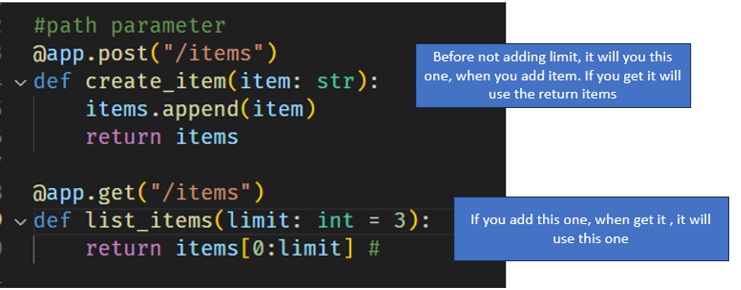

# Create a easy FastAPI

In this note I will share on how to create a easy api for testing, using FastAPI. You need to install some libary before get to start

## Library

> Install fastapi: `pip install fastapi`

> Install server: `pip install uvicorn`

Import module: `from fastapi import fastAPI`

## Create server and the path parameter

The syntax if using fastapi is using `app=FastAPI()` , so initially it will look like this below.

```
from fastapi import FastAPI
app= FastAPI()
```

### Term or keyword need to know about FastAPI

You can refer to more detail on [documentation](https://fastapi.tiangolo.com/tutorial/query-params/) if I didn't mention all of them.

You must know these basic terms:

- **Route**:
  - Defines the endpoint or URL path for an API. It's like the address of a resource
  - example: `/users`, `/items`
  - `Summary`: The fundamental path of your API, usually `/`
- **Path Parameter**:
  - dynamic part of the URL that identifies a specific resource, like `user_id`
  - example: `/users/{user_id}`, `/items/{user_id}`
  - `Summary`: Dynamic parts of the URL path, indicated by curly braces (`{}`)
- **Query parameters**:
  - Additional information provided in the URL after a question mark (?). It's like providing filters or options for the request.
  - Example: `/items?limit=3`
  - Summary: Additional information passed in the URL after a question mark (`?`)

#### **Path Parameters**:

You can declare path `parameters` or `variables` with the same syntax used by Python format strings.

> `@app.get("/items/{item_id}")`

The value of the path parameter `{item_id}` will be passed to your function as argument.

- Reading or get path parameter: `http://127.0.0.1:8000/items/0`

- Path parameters with types
  You can declare path parameters in functions with different data types, for example

> convert to integer: `def get_item(item_id: int)`
> assign to integer number: `def get_item(item_id: int, limit: int = 10)`

If it **cannot convert to integer** it will **raise validation error**.

#### **Query Parameters**:

The **query** is the set of **key-value** pairs after the `?` in a **URL**, separated by `&` characters. It is used to provide additional information or filters for the requested resource.

```
from fastapi import FastAPI

app = FastAPI()

fake_items_db = [{"item_name": "Foo1"}, {"item_name": "Bar1"}, {"item_name": "Baz"}]

@app.get("/items" )
def list_items(limit: int = 3):
    return fake_items_db[0:limit]
```

For example, in the URL: `curl -X GET 'http://127.0.0.1:8000/items?limit=2'`.

As you can see my route is set to `/items`, to add a **query parameter**, you need to add `?` after it and `limit`. If your route is set to `/items/` then when you query the parameter you need to use the same root followed by `?` like this `/items/?limit`

### Add Path Parameter

After understanding the terms of Path parameter and Query Parameter, let's start to create a **Path Parameter**.

Let's add the path parameter to it

```
from fastapi import FastAPI

app= FastAPI()
items= []

#create a path in fastapi

#root
@app.get("/")
def root():
    return {"hello":"world"}
```

### Run Server

Let's run the server with the below command, and it will run on the terminal.

> **syntax**: uvicorn <filename>:app --reload

```
uvicorn main:app --reload
```

You can access to the URL: `http://127.0.0.1:8000/`

### Create Route or item

continue from the above code, let's create a new method to add items to the list.

```
.....
@app.get("/")
.....

@app.post("/items")
def create_item(item: str):
    str.append(item)
    return item
```

Now you can add items to list by send requests to items need to use this command, need to open a new terminal and run below:

```
curl -X POST -H "Content-Type: application/json" 'http://127.0.0.1:8000/items?item=apple'
```


In this case, I am adding Apple to the list

### Get the item with index ID

Previously I had created a route and items, now let me show how to get the items.

```
.....
@app.get("/items/{item_id}")
def get_item(item_id: int) -> str:
    item= items[item_id]
    return item
```

You get the item from the list you need to run with this command:

> `curl -X GET http://127.0.0.1:8000/items/0`
>
> > `0`: is index 0
> > `1`: is index 1

Now there's one problem if you use the index not exist will get **Internal Server Error**, which is not a good error message, and hard to identify what's the problem.


### Raising error

In the previous example, if you enter index does not exist, it will display a default error message `Internal Server Error`, which is kind of hard to identify what's the problem. Instead, you can write our own error message.

> You need to import `HTTPException`

```
from fastapi import FastAPI, HTTPException
…..
@app.get("/items/{item_id}")
def get_item(item_id: int) -> str:
    if item_id< len(items):
        return items[item_id]
    else:
        raise HTTPException (status_code=404, detail= f"Item {item_id}  not found")
```

Now let's see the below output when I execute `items/5` which will not exist, it will display the error that you define, not using the default error message.


### Request & Query parameter (limit)

In the above already has a Path Parameter(query parameter), let's create another endpoint with a parameter limit. This limit will only display the limit number you want to display.

Below you can see pass a parameter as `limit`

```
@app.get("/items")
def list_items(limit: int = 3):
    return items[0:limit]
```

If you put `limit=10` it will return 3 items from the list. You can run with the command with a `limit` argument, like below:

> `curl -X GET 'http://127.0.0.1:8000/items?limit=3'`


If you don’t specify the limit argument, it will list all the items as default, in this example `limit: int =10` will be default.

> `curl -X GET 'http://127.0.0.1:8000/items`


You can refer below example, I added 3 4 items in a list and set `limit: int =3` which means it will be the default value. When I display the items in the list without specifying the limit option, then it will only display 3 items. Now I also specify `limit=2`, then 2 items will show.


Let's make some summary and recap over here, please refer comparison of `create_item()` which will display all items, and `list_item()`: which can be displayed by index with limit parameter.

When there's no limit added when you get the items, it will use the create_items, and if you add a limit then it will use this one.



- Matching Routes:
  - Path: item is the path for both `create_item`, and `list_items`
  - HTTP Method:
    - Post: matches create_item route, which adds an item to the item list
    - Get: match the list_items route, which retrieves and returns items.
- Route Order:

  - If multiple routes share the same path, FastAPI generally prioritizes routes defined earlier in the code

- Behavior:
  - create items:　 When you send a POST request to `/items`, FastAPI calls the `create_item` function because it matches the path and HTTP method. The function will add items to the items list.
  - get items: When you send a GET request to `/items`, FastAPI calls the `list_items` function because it matches the path and HTTP method, and will get the item from the list.

## Create Pydantic BaseModel

In the above, we use the path parameter and query parameter like, but in this part let use use Pydantic BaseModel. BaseModel object item is part of its argument. It’s excepting it to be into json payload request.

> **Pydantic models** are used to define the structure of data, often for request and response bodies.

> import model: `from pydantic import BaseModel`

Below is the syntax for creating the model:

```
class Item(BaseModel):
    name: str
    price: float
    is_active: bool = True
```

### create Pydantic datamodel

Let restucture the code here:

> Step1: Define Pydantic data model
> Step2: Change data type to Item

```
from fastapi import FastAPI, HTTPException
from pydantic import BaseModel
app = FastAPI()

class Item(BaseModel):
    text: str = None
    is_done: bool = False

....
#change str and change to Item
@app.post("/items")
def create_item(item: Item):
    items.append(item)
    return items
....
@app.get("/items")
def list_items(limit: int = 3):
    return items[0:limit] #
.....
@app.get("/items/{item_id}")
def get_item(item_id: int) -> Item:
    if item_id< len(items):
        return items[item_id]
```

Now when you add the item using the previous method like below:

```
curl -X POST -H "Content-Type: application/json" 'http://127.0.0.1:8000/items?item=apple'
```

it will not add to the list. The result will show you `{"type":"missing","loc":["body"],"msg":"Field required","input":null}`. Please refer below picture for the output.


In the previous we used query parameters like `items?item=apple`, but when using BaseModel object item is part for its argument. It’s excepting it to be into json payload request.

To send a request or add items to list, you have to add items by dictionary like this:

```
curl -X POST -H "Content-Type: application/json" -d '{"text": "apple"}' 'http://127.0.0.1:8000/items'
```


from above `is_done` by default is false, because we didn’t specify in item.

```
class Item(BaseModel):
    text: str = None
    is_done: bool = False
```

Let remove `None` in `str = None` which will look like this:

```
#original
class Item(BaseModel):
    text: str
    is_done: bool = False
```

Let's send a request or add the item again using the below command:

```
curl -X POST -H "Content-Type: application/json" -d '{"test": "apple"}' 'http://127.0.0.1:8000/items'
```

It will occur `{"type":"missing","loc":["body"],"msg":"Field required","input":{"test":"apple"}}`.


Recap here I set the text as variable, and data type as string, and the value I leave empty, which means if I send a request it will occur error. This is the reason why we put `none` as default, which is **flexibility in assigning values to the text field**.

It helps validate the type is missing which is an advantage of it helps checking the name exists or not. In that example just want to show if you don't put the value to it, it will encounter a validation error `text: null` or something like that.

## Troubleshooting

For window user, if you are unable to close the server by `ctrl+c`, you can use this command:

> - Check your process: `tasklist  |grep uvicorn`
> - kill your process or uvicorn: `taskkill /pid <uvicorn pid> /f`
>   > If none of these work, then press `ctrl + shift+ esc` will open taksmanager, go to services> find Python and click end task.

## Documentation

In fastapi web, we are able to see documentation, by accessing the url with docs like:

> access url documentation: `http://127.0.0.1:8000/docs`

It allows you to test, just click try it, and then change the request body and press execute. It will give you curl command to run


## Summary

Let's recap important commands in this part, so you can be useful without searching the page.

- **Start server**: `uvicorn main:app --reload`
- **Stop server**: `ctrl+c`
- **path parameter**:
  - **add item**:
    `curl -X POST -H "Content-Type: application/json" 'http://127.0.0.1:8000/items?item=apple'`
  - **get route**:
    `curl -X GET 'http://127.0.0.1:8000/items/0`
- **Query Parameter**: `curl -X GET 'http://127.0.0.1:8000/items?limit=3'`
- **Pydantic datamodel**:
  - **add item**:
    `curl -X POST -H "Content-Type: application/json" -d '{"test": "apple"}' 'http://127.0.0.1:8000/items'`

## Update

- 2024.08.09: initial create
- 2024.08.13: Update the note, finish updating
