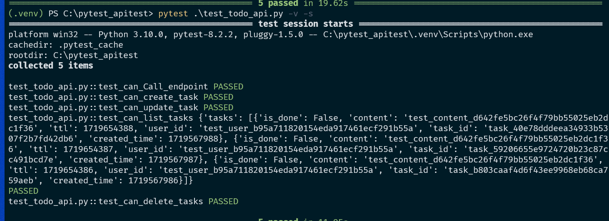

## Test Case Description

This is a good practice for learning how to use the RestAPI automation test.This YouTube tutorial teaches a great concept on it. Please refer to my Python code, I will keep you updated if there are some notes in advance. `2024 June`

- **TestCase1** :Testing the Create() endpoint 
- **TestCase2 :** Testing the Update() endpoint
- **TestCase3:** Testing the List() endpoint with unique users
- **TestCase4:** Testing the Delete() endpoint

### Status Update

- `20240628`: initial add the code learn from youtube
  - add the full code
  - add a draft code for some debug

## Python Libary:
`requests`
`pytest`

## Reference:

- [Youtube Video ](https://www.youtube.com/watch?v=7dgQRVqF1N0&t=1434s)
- [Github from author](https://github.com/pixegami)

## API URL:
- test endpoint: `https://todo.pixegami.io/`
- UI interface: `https://todo.pixegami.io/docs`

## Command and Note:

### How to run test suite with pytest

in `pytest` it will only run the function that start with `test\_`,

> - run all the test suite, all function start with `test` > `pytest <testscript.py>`

> - run specfic test suite or function
>   `pytest <testscript.py> -v -s ::<functionname>`

### Pytest some option to use
- `-m`: if pytest run error, please use `python3 -m`. It means import a module *or package* for you, then run it as a script.
- `-v`: verbose, print more information pass or fail
- `-s`: show output, like print

### How to run this code:

```
pytest .\test_tofo_api.py -v -s .\test_tofo_api.py::test_can_delete_tasks
```


