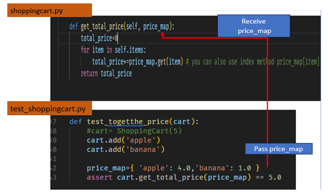
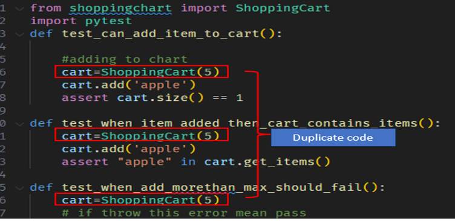
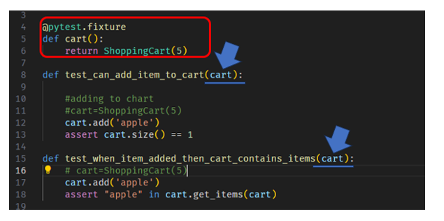
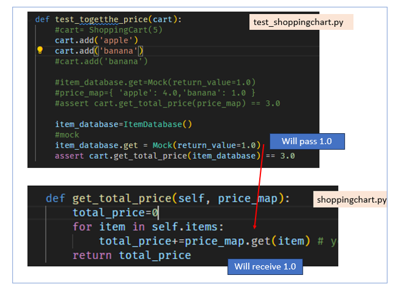
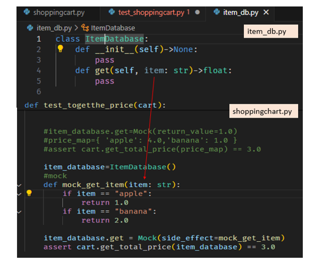

# Note for Run UnitTest using pytest

## Introuction
This tutorial covers most of creating a unit test using `pytest`. I think it a good tutorial on teaching how to write unitest.
In this tutorial, it covers on `pytest`:
- **fixture**: for duplicate code, so since it is a class, we need to inital an object `cart=ShoppingCart(5)`, so we need to reuse the code. This can be a `fixture` as setup since it needs to inital on every test. 
- **mock**:  `mock` object is a simulated object used in testing to isolate the component you're testing.

I really like his explanation on the mock that if you need to use a function that is implement by other developers, but it's not ready yet, you can use the `mock` and stimulate. 

##  <a id="toc"> Table Of Content </a> 

<details open>
<summary><b>(click to expand or hide)</b></summary>
	
1. [Reference](#reference)
2. [UnitTest/ TEST Case](#unittest)
	1. [Case1: Add an item ](#case1)
	2. [Case2: Check cart contain item ](#case2)
	3. [Case3: Trigger Exception Error when meet max value ](#case3) 
	4. [Case4: Total Up Price](#case4)
		- [Will Not Trigger Exception when reach MAX](#case4-nottrigger)
		- [Solution to fix trigger exception](#case4-trigger) 
	5. [Cleaning Code for the duplicate](#duplicate)
	6. [Mock with fake database](#mock)
		- [Adding Mock-return_value](#mock1)
		- [Customize Mock-side_effect](#mock2)
3. [ How to run and package](#package)
</details>


## <a id="reference">  Reference </a>   [(Top)](#toc)
- This tutorial is based on [Youtube Channel:pixegami](https://www.youtube.com/playlist?list=PLZJBfja3V3RvxooZ5SNOr7CMFzURr4NBs) on `How To Write Unit Tests in Python • Pytest Tutorial`
- [mock documentation](https://docs.python.org/3/library/unittest.mock.html)


## <a id="unittest"> UnitTest/ TEST Case </a>  [(Top)](#toc)
In Case1~Case5 will use `shoppingcart.py`, and `test_shoppingcart.py`, but in case5 will also use `item_db.py` which is the fake database
- Case1: add an item
- Case2: check cart contains item
- Case3: Trigger Exception Error when meeting max value
- Case4: Total Up Items 
- Duplicate: Cleaning duplicate code
- Mock with fake database

In Note 5 create a fake database which have a get method, but the get method, just thinks it's implemented by other people, and not done yet. So If you are a person to write Unittest, then you need to test it. So you will need a mock to validate your unittest. 


### <a id="case1"> Case1: add an item </a>  [(Top)](#toc)
Will add an item and check the size 

- You can use either `self.items = []` or `self.items:List[str]=[]` they are all the same. 
- will add an item to the list: `self.items.append(item)` 
- Get the size of the list: `return len(self.items)`
- Validate whether `size = 1`: `assert cart.size() == 1`

It will add an apple to the list, and return the size of the list, which in this case is `1`


> `shoppingcart.py`

```
from typing import List
class ShoppingCart:
    def __init__(self)-> None:
        #self.items = []
        self.items:List[str]=[]
        
    def add(self, item: str):
       self.items.append(item)

    def size(self)-> int:
        return len(self.items)
```

> `test_shoppingcart.py`
```
from shoppingcart import ShoppingCart
import pytest

def test_can_add_item_to_cart():
    #adding to chart
    cart=ShoppingCart()
    cart.add('apple')
    assert cart.size() == 1
```

### <a id="case2"> Case2: check cart contain item </a>  [(Top)](#toc)
Validate the item is `apple`

**Note:** I will not include all code, the `...` means same as above
- return the list items: `return self.items`
- validate item in list: `assert "apple" in cart.get_items()`

> `shoppingcart.py`

```
from typing import List
class ShoppingCart:
	...... #please refer above 
	def get_items(self)->List[str]:
        return self.items
```
> `test_shoppingcart.py`
```
def test_when_item_added_then_cart_contains_items():
    cart=ShoppingCart(5)
    cart.add('apple')
    assert "apple" in cart.get_items()

```
### <a id="case3"> Case3: Trigger Exception Error when meet max value</a>  [(Top)](#toc)
Validate when the cart is full will trigger an exception error. 

- Adding max_value:  `self.max_size=max_size`
- raise exception: `pytest.raises(OverflowError)`

> `shoppingcart.py`
```
class ShoppingCart:
    def __init__(self, max_size: int)-> None:
        #self.items = []
        self.items:List[str]=[]
        self.max_size=max_size
    
    def add(self, item: str):
        #check size with max_size, if same then raise error
        if self.size()== self.max_size- 1:
            raise OverflowError("Cannot add more items")
        #else continue adding
        self.items.append(item)
```

#### <a id="case4-nottrigger"> Will Not Trigger Exception when reach MAX </a>  [(Top)](#toc)

In `shoppingcart.py`, when using `if self.size()== self.max_size -1` will not catch the exception not trigger Error, it will still be pass. 
The reason is because of this code below, when you add all item full into cart, but the 6th time will not be execute, so indeed this test will fail. 
- When `Size=0` and `max_value=5-1` condition false so add item to list: The condition size == max_value - 1 is false, so the item is added.
- When `size=1` and `max_value=5-1` conditions false so add item to list: The condition is still false.
- When `size=4` and `max_value=5-1` condition true  so will not add to item: The condition is true, so the item is not added.
- when `size=5` and `max _value=5-1` condition false will not add, but because **check happen before add**, so **will not trigger error**: This is where the issue lies.

The problem is that the check happens before the item is added. So, when size is 5, the condition size == max_value - 1 is false. The cart is already full after the 4th item, so we need to add one more to cause an overflow. Please refer below solution to fix this problem
> `test_shoppingcart.py`
```
from shoppingcart import ShoppingCart
import pytest
def test_when_add_morethan_max_should_fail():
    cart=ShoppingCart(5)
    #if throwing this error means pass
	#if you run this will not catch the bug if self.max_size-1
    with pytest.raises(OverflowError):
        for i in range(6):
            cart.add('apple')
```

#### <a id="case4-trigger">Solution to fix trigger exception </a>  [(Top)](#toc)

Just remove the below code on `test_shoppingcart.py`: 
```
with pytest.raises(OverflowError):
        for i in range(6):
            cart.add('apple')
```
and change to below code and run the test

> `test_shoppingcart.py`
```
def test_when_add_morethan_max_should_fail():
    cart=ShoppingCart(5)
    # if throwing this error means pass
    # if you run this will not catch the bug if self.max_size-1
#     #run 5 times
    for i in range(5):
        cart.add('apple')
    with pytest.raises(OverflowError):
        cart.add('apple')
```


Now when you run the case will fail, it catch the error. Now you can remove the `-1` and run the test will pass. 


### <a id="case4"> Case4: Total Up Items </a>  [(Top)](#toc)
Will sum the value of list , and do validate the items
- total up the list: `total_price+=price_map.get(item)`or `price_map[item]`.
	- since it's dictionary, can access using get method to get key value. 

> `shoppingcart.py`
```
from typing import List
class ShoppingCart:
    .....
    def get_total_price(self, price_map):
        total_price=0
        for item in self.items:
            total_price+=price_map.get(item) 
# you can also use index method price_map[item]
        return total_price
```

> `test_shoppingcart.py`
```
def test_togetthe_price():
    cart= ShoppingCart(5)
    cart.add('apple')
    cart.add('banana')
    price_map={ 'apple': 4.0,'banana': 1.0 }
    assert cart.get_total_price(price_map) == 5.0
```



### <a id="duplicate"> Cleaning Code for the duplicate </a>   [(Top)](#toc)
As you can see the unit test's code has a lot of duplicate logic, you can use fixture to `fixture` for duplicate logic `cart= ShoppingCart(5)`.


To make the code clearer without adding the same logic, you can create a cart is is the setup and add a fixture decorator. 
You can see the defined `cart()`, which means all the initial carts will write over here. Now you have to do this: 
- create `cart()` function
- create `pxtest.fixture`
- pass all the arguments with the cart



> `shoppingcart.py`
```
@pytest.fixture
def cart():
    return ShoppingCart(5)

def test_can_add_item_to_cart(cart):

def test_when_item_added_then_cart_contains_items(cart):
    cart.add('apple')
    assert "apple" in cart.get_items()
```


### <a id="mock"> Mock with fake database </a>  [(Top)](#toc)
A mock object is a simulated object used in testing to isolate the component you're testing.

Previous we store data in a dictionary, and we knew we could use `get` method. But what if we want to use the get method, but it's not implemented yet? This test will create a fake database and will have a get method. 
Just image if the get method is developed by other developers in our team and is not working yet, but you needs to validate the unit test to make sure it works. In this situation, we need to add `get` method to mock. To let the get method work, we need to mock, to stimulate `get` method to work properly. 

> Create a fake database that gave get method: `item_db.py` 
```
class ItemDatabase:
    def __init__(self)->None:
        pass
    def get(self, item: str)->float:
        pass

```
 
please import mock and ItemDatabase 
> `test_shoppingcart.py`
```
from shoppingcart import ShoppingCart
from item_db import ItemDatabase
from unittest.mock import Mock
import pytest
…. 
def test_togetthe_price(cart):
    cart.add('apple')
    cart.add('banana')
    cart.add('banana')
    item_database=ItemDatabase()
    assert cart.get_total_price(item_database) == 3.0
```
When you run this test it will Fail, instead of waiting for the get method to implement in order to rely on `item_database` or `ItemDatabase()`, we can use `mock` behavior of `item_database`.

####  <a id="mock1"> Adding Mock-return_value </a>  [(Top)](#toc)
- mock get method: `item_database.get = Mock()`

get method is not implemented and is still being developed, so needs to mock it like this:
>>　`item_database.get = Mock(return_value=1.0)`


> `test_shoppingcart.py`
```
def test_togetthe_price(cart):
    #cart= ShoppingCart(5)
    cart.add('apple')
    cart.add('banana')
    cart.add('banana')
    item_database=ItemDatabase()
    #mock 
    item_database.get = Mock(return_value=1.0)
    assert cart.get_total_price(item_database) == 3.0

```

Now when you run it will pass, and assert will pass. 
But the problem here is that I want to set specfic value for each item , not giving all the same value 1. 
In the above basically each item will have 1.0 so having three item  total up to 3.0 so indeed assert will pass. 




####  <a id="mock2"> Customize Mock-side_effect </a>  [(Top)](#toc)
To customize the mock of the value, need to create a function and use `side_effect` argument. 
Let's change the code like below
> `test_shoppingcart.py`
```
def test_togetthe_price_mock(cart):
 ..... #same as above
    #mock 
    def mock_get_item(item: str):
        if item == "apple":
            return 1.0
        if item == "banana":
            return 2.0
        
    item_database.get = Mock(side_effect=mock_get_item)
    assert cart.get_total_price(item_database) == 3.0
```
Now as you can see to need to create a function, and need to add the argument `side_effect`, and assign the function to it. 
Now you can see each item has it's value, not like the previous one has a fixed value. 



##  <a id="package"> How to run and package  </a>  [(Top)](#toc)
- Install: 
	- please install pip pytest 
- Import library
	- pytest import `import pytest -vs`
	- mock import `from unittest.mock import Mock`
- pytest command to run use either method
	- default `pytest`
	- specific unit test `pytest -vs test_shoppingcart.py`
	
