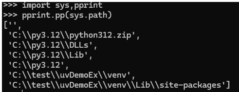
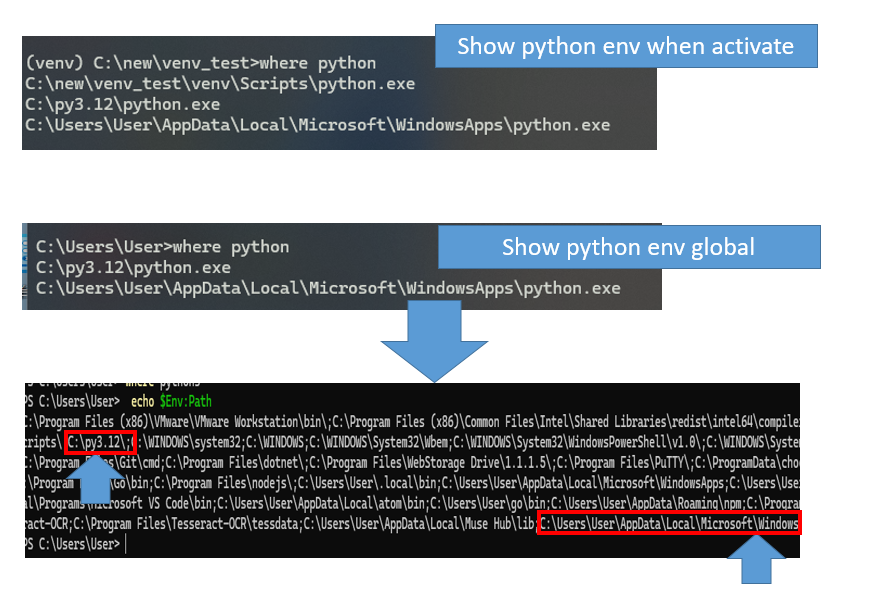

# Python Package Management UV Note 

UV is a Python package and project manager that is 100X faster than pip in a specific condition. It helps to solve Python tools like:
- Virtual environment
- Installing dependency
- Using pip with single tool to replace pip, pip-tools, pipx, poetry, pyenv, twine, virtualenv, and more

Please refer [office site](#https://docs.astral.sh/uv/) of [github](#https://github.com/astral-sh/uv)


## without UV (tradional method)
This is using tradional method, using virtual env without using uv command. 

### virtual envirnoment
- create folder for project 
```
#creat folder for project 
mkdir venv_test
cd venv_test
``` 
- create virtual env and activate it
```
#creat virtual env and activate it 
python -m venv .venv 
.venv\Scripts\activate
```
- check path for virtual env
You have multiple Python executables in your environment. Since you've activated a virtual environment, the system prioritizes the Python executable within it, which is why it appears first in the list. The other installations are then ordered according to your system's PATH environment variable.


You can also use where or which to check activate and global path
```
#window use where
which python3
#linux use which 
which python3
```


you can use this command to check the order for window path:
```
#powershell
echo $Env:Path
#command prompt
echo %PATH%
```

Overall activate virtual envirnoment is use to isolation your envirnoment with global. This mean virtual envirnoment will have a clean new envirnoment. 


- install dependency 
```
pip install requests pandas
pip list
```

- Export (or save) your dependencies to a file
If you want to share your envirnoment to different developer 
```
pip freeze > requirements.txt
````
you can install dependencies from the file: `pip install -r requirements.txt`

- deactivate venv
```
.venv\Scripts\deactivate.bat
```
### using pyproject.toml file 
In above you use the virtual envirnoment wh


## UV

### UV Installation

- On macOS and Linux
```
curl -LsSf https://astral.sh/uv/install.sh | sh
```
- window
```
powershell -ExecutionPolicy ByPass -c "irm https://astral.sh/uv/install.ps1 | iex"
```
- pip 
```
pip install uv
```

## UV build package 

### uv init: Project Initialization

When you use uv, it creates and manages an isolated virtual environment. You can initialize a UV project using the command below:

> Syntax: `uv init <project or folderName>`

This command generates essential project files such as:
- `pyproject.toml`: (for project metadata and dependencies)
- `.python-version`: (to pin the Python version)
- `.gitignore`: exclude the .venv folder and other files or folders when push to github
- `README.md`: description of code


Alternatively, you can manually create a project folder and run `uv init` inside it, it will generate the same as above. 
```
mkdir testuv
uv init 
```

The key difference with UV is its clever approach to managing dependencies and environments. While it still uses an isolated virtual environment (typically .venv), it automatically sets it up and interacts with it, so you never have to manually create or explicitly activate it.


## Reference
- 
- 