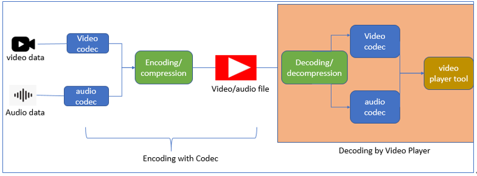
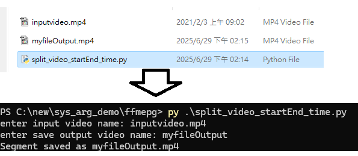
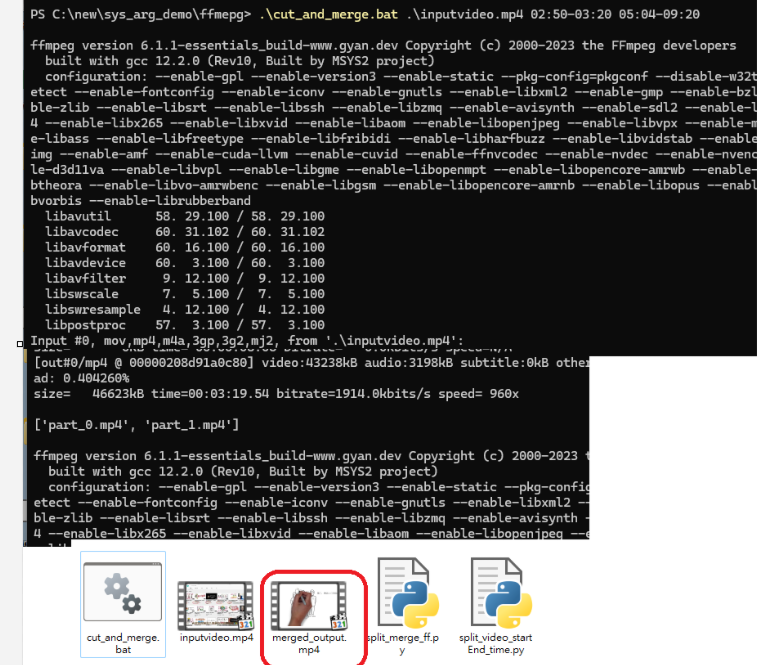

# **FFmpeg & Video Encoding Notes**  


There are more functions you can deal with video, which I will not cover for more details, check the ffmpeg [documentation](https://ffmpeg.org/ffmpeg.html). 
Please download ffmpeg from this link [Download](https://www.ffmpeg.org/download.html). 

> **FFmpeg syntax:** 
>> `ffmpeg [global_options] -i input_file [input_options] [output_options] output_file`

## Part 1 Understand codec and encoding



### **1️ What is a Codec?**  

A **codec** (short for COmpressor-DECompressor) is an algorithm or method for compressing (encodes) and decompressing (decodes) video (e.g., H.264, H.265)or audio data to reduce file size while keeping quality.

- A **codec** (e.g., H.264, H.265) **compresses video** to reduce file size while keeping quality.  
- **Common video codecs:**  
  - **H.264 (AVC)** → Most widely used, good for 1080p.  
  - **H.265 (HEVC)** → Better compression, good for 4K.  
  - **VP9 / AV1** → Used for web streaming (YouTube).  
  - **ProRes / Lossless** → High-quality for editing, very large files.  
- **Common audio codecs:**  AAC, MP3, Opus

---

### **2️ What is a Container (File Format)?**  

**container** (e.g., MP4, MKV) holds **video, audio, subtitles** inside one file. Based on the diagram above, you can see that video and audio data contain **video codec** and **audio codec**. You can use the encoding to compress two components/containers into a file. You can then use media player to open the file, which will decode the file to play the video. 

MP4 is a container that holds video, audio, and subtitles inside one file, and `H.264` is a video codec that is compressed inside the container. The actual video inside MP4 can be `H.264`, `H.265`, or others.

- ✅ MP4, MKV, AVI = Containers (File Formats).
- ✅ H.264, H.265, VP9 = Video Codecs (Compression Methods).
- ✅ AAC, MP3, AC3 = Audio Codecs.
- ✅ A video file = Container + Video Codec + Audio Codec.

📌 **Common containers & their supported codecs:**  

| **Container (Format)** | **Supported Codecs** | **Best for** |
|----------------|----------------|----------------|
| **MP4** | H.264, H.265, AV1 | General use, mobile, web |
| **MKV** | H.264, H.265, VP9, AV1 | High-quality videos, multiple audio tracks |
| **WebM** | VP9, AV1 | Web streaming (YouTube, browsers) |
| **AVI** | MPEG-4, Xvid | Old format, not recommended |
| **MOV** | ProRes, H.264 | Apple devices, editing |

📌 **MP4 ≠ H.264!**  
- MP4 is just a container. It usually contains H.264 but can also have H.265 or AV1.  
- MKV is more flexible because it supports more codecs.  

---

### **3️ Encoding vs. Copying (No Encoding)**  

#### Encoding
is the process of applying a codec to compress or convert video/audio.

**Feature of encode:**
- reduces file size while keeping quality as high as possible.
- can change the format, converting media from one format to another by decoding the original file and then encoding it again using a specific codec. You Need Both a Codec & Encoding, when convert different format you usually need to encode because different formats support different codecs. 
- Encoding = Compressing video into a new format (affects quality).  
- Re-encodes the video to H.264 and audio to **AAC**((e.g., `-c:v libx264 -c:a aac`) can reduce file size and improve compatibility, but can also lower quality due to data loss.
	- **Effects on Quality**: The quality is affected because the compression process discards some details, which might cause quality loss. You can use `crf` to control the bitrate to adjust quality. 
	- **Bitrate**: Lower bitrate = smaller file, but worse quality. 
	- **Codec efficiency**: H.265 is better than H.264 at keeping quality with smaller files.
		- Encoding settings(please refer crf setting)
			- crf 23: Controls quality (lower CRF = better quality).
			- preset slow: Uses better compression but takes longer. 
```sh
ffmpeg -i input.mp4 -c:v libx264 -crf 23 output.mp4
```
#### **Copy (No Encoding)**: 
You can skip encoding by using the `copy` option, which also means no encoding, instead keeps the exact(original) quality but doesn't reduce file size (no quality loss). Use copy mode when you just need to change the container without modifying the media. 

It simply copies the existing streams into a new file, keeping the original quality
- No quality loss at all (because nothing is changed)
- Fast processing
- File remains the same size.

```sh
ffmpeg -i input.mp4 -c:v copy -c:a copy output.mp4
```
**Feature of copy** 
- No encoding → Keeps the original quality.
- No compression → Same file size.
- Fast processing → Just changes the container format.


| Option  |Meaning   | Example |
| ------------ | ------------ |------------ |
| `-c:v copy`  |  Keeps the original video without re-encoding |Fast, retains quality |
| `-c:v libx264`  | Re-encodes video using H.264 codec  |Slower, but compatible |
| `-c:a copy` |  Keeps the original audio without re-encoding |No quality loss |
| `-c:a aac`	 |  Converts audio to AAC format |Good for MP4 |

---

#### When should encode and not encode?


### **4️ CRF (Constant Rate Factor) – How It Affects Quality**  
- CRF controls video quality & file size when encoding.
- Lower CRF = Better quality = Larger file.
-  Recommended CRF values:*
  > - 0 (Lossless): No quality loss, very large file
  - 18-20 (High Quality): Near-lossless, best for archiving.  
  - 23 (Default): Good balance (most people use this).  
  - 30+ (Lower Quality): Smaller size, more noticeable loss.  
- Default CRF = 23, which is fine for most cases.*
	- default value depending on the codec:
		- `H.264 (libx264)` default CRF = 23
		- `H.265 (libx265)` default CRF = 28
		-  `VP9 (libvpx-vp9)` default CRF = 32

By default, FFmpeg applies "normal" compression (medium quality, medium file size)

---

### **5️ Choosing the Right Codec for Encoding**  
| **Goal** | **Best Codec** | **Why?** |
|------------|----------------|---------|
| **Works on all devices** | H.264 (AVC) | Most compatible. |
| **Smaller file size, same quality** | H.265 (HEVC) | 50% smaller than H.264. |
| **Web streaming (YouTube, browsers)** | VP9 / AV1 | Better for online videos. |
| **Highest quality (editing, archiving)** | ProRes / Lossless | No compression artifacts. |

---

### **6️ How to Check Video Codec & Format**  

#### **Using FFmpeg (Command Line)**
- **Check video codec only:**  
  ```sh
  ffprobe -v error -select_streams v:0 -show_entries stream=codec_name -of default=noprint_wrappers=1 input.mp4
  ```
- **Check full video & audio info:**  
  ```sh
  ffmpeg -i input.mp4
  ```

#### **Using Python (FFmpeg + subprocess)**
```python
import subprocess

def get_video_codec(file):
    cmd = ['ffprobe', '-v', 'error', '-select_streams', 'v:0', 
           '-show_entries', 'stream=codec_name', '-of', 'default=noprint_wrappers=1', file]
    result = subprocess.run(cmd, capture_output=True, text=True)
    return result.stdout.strip()

video_file = "input.mp4"
print("Video codec:", get_video_codec(video_file))
```

---

### **7️ When Do You Need to Compress Video?**
Most people **don’t need to manually compress** because:  
✅ **MP4 (H.264) is already optimized.**  
✅ **Most apps (YouTube, phones) compress automatically.**  
✅ **Storage is cheaper, so size isn’t a big issue.**  

📌 **When should you compress?**  
- **Uploading to websites (YouTube, social media).**  
- **Sending via email/messenger (file size limits).**  
- **Saving storage space (especially for 4K videos).**  
- **Streaming (VP9, AV1, or H.265 are more efficient).**  

---

### Summary – What Should You Use?
- **For general use → Use MP4 (H.264, CRF 23).**  
- **For 4K videos → Use MP4 (H.265, CRF 28).**  
- **For YouTube/web → Use WebM (VP9 or AV1).**  
- **For editing/archiving → Use ProRes or Lossless H.264.**  

## Part2 Example 

### 1. Common FFmepg command
> syntax: 
>> `ffmpeg [global_options] -i input_file [input_options] [output_options] output_file`

| **Option** | **Description**| 
|----------------|----------------|
| -i <file> |  Specifies the input file |
| -y | Overwrite output without asking |
| -n | Do not overwrite existing files |
| -loglevel <level> | Controls output messages (quiet, info, error, etc.) |


- **Video Options**

| **Option** | **Description**| 
|----------------|----------------|
|-c:v copy |	Copy video without re-encoding|
|-c:v libx264	|Encode video with H.264|
|-c:v libx265	|Encode video with H.265 (HEVC)|
|-crf <value>	|Set video quality (lower = better, 23 is default)|
|-preset <speed>	|Set encoding speed (ultrafast, slow, medium, etc.)|

- **audio Options**

| **Option** | **Description**| 
|----------------|----------------|
|-c:a copy |	Copy audio without re-encoding|
|-c:a aac	|	Encode audio to AAC (default for MP4)|
|-c:a mp3	|Encode audio to MP3|

- **Subtitle Options**

| **Option** | **Description**| 
|----------------|----------------|
|-c:s copy |	Copy subtitles without re-encoding|
|-c:s mov_text|Convert subtitles for MP4|
|-sn|Remove all subtitles|


### 2. Cut trim(Split video with time)
You can use the command to split a video to a specfic start and end time. 

#### (Manual) using the command
> - `-ss START_TIME`: Specifies the start time for cutting.
> - `-to END_TIME` or `-t`:  Specifies the start time for cutting.
> - `-i INPUT_FILE`: Specifies the input file.
> - `-c copy`: Copies the video and audio streams without re-encoding (faster and avoids quality loss).
> - `-avoid_negative_ts make_zero`: Ensures timestamps in the output file are consistent.  This option is often recommended when splitting videos without re-encoding, as it can prevent playback problems.
> - `-OUTPUT_FILE`:  Specifies the name of the output file.
> - `-y`: Overwrites the output file if it already exists


- extract video 
```
# Start extracting the video from the 30th second, and -t 10 is the duration of the output video.
ffmpeg -ss 30 -i input.wmv -c copy -t 10 output.wmv

# Timestamps can also be in `HH:MM:SS.xxx` format.
ffmpeg -ss 00:00:30.0 -i input.wmv -c copy -t 00:00:10.0 output.wmv 

ffmpeg -ss 02:50 -to 03:20 -i input_video.mp4 -c copy -avoid_negative_ts video.mp4 -y

```

- Cropping
```
#Inserting Timestamps into the video file
ffmpeg -i video-cropped.mp4 -vf "drawtext=fontfile='C\:\\Windows\\Fonts\\arial.ttf':text='timestamp\:%{pts \: hms}': x=20: y=40: fontsize=24: fontcolor=white" -c:a copy video-cropped-timestamps.mp4

#Creating Image Files every second
ffmpeg -i video-cropped-timestamps.mp4 -start_number 1 -vf fps=1 video-%04d.jpg

ffmpeg -i video.mp4 -filter:v "crop=1850:250:0:830" -c:a copy video-cropped.mp4
```

#### (Automation) using code
Please refer `split_video_startEnd_time.py` this code, this python file, you have to provide a input video in current directory. 
```
import subprocess

# Command to cut a segment of a video using FFmpeg
#input_file = 'input_video.mp4'
input_file=input('enter input video name: ')
output_file=input('enter save output video name: ')
start_time = '00:00:00'
end_time = '00:01:20'
#output_file = 'part_1.mp4'
output_file=output_file+'.mp4'
# Run the FFmpeg command
cmd = [
    'ffmpeg',
    '-ss', start_time,
    '-to', end_time,
    '-i', input_file,
    '-c', 'copy',
    '-avoid_negative_ts', 'make_zero',
    output_file,
    '-y'
]

# Execute the command
subprocess.run(cmd, check=True, capture_output=True)
print(f"Segment saved as {output_file}")

]

# Execute the command
subprocess.run(cmd, check=True, capture_output=True)
print(f"Segment saved as {output_file}")
```

**Output result:**
```
#output:
enter input video name: inputvideo.mp4
enter save output video name: myfileOutput
Segment saved as myfileOutput.mp4
```




### 3. Merge audio and  video

> - `-f concat`: Specifies the concatenation demuxer for combining files.
> - `-safe 0`:Allows unsafe file paths (e.g., containing special characters or spaces).
> - `-i inputs.txt`: Specifies the text file listing the input video files. 
> - `-c copy`: Copies the streams without re-encoding, preserving quality and processing faster.
> - `-c:v copy`: copy the video stream directly from the input "video.mp4" without re-encoding it. This is very fast and preserves the original video quality.
> - `-c:a aac`: This option tells FFmpeg to re-encode the audio stream from "audio.mp3" into the AAC (Advanced Audio Coding) format.
> - `merged_output.mp4`: The final merged output file

- Merge Multiple video 

If you want to merge multiple video, you can add the file into txt file like `input.txt file` contains `'part_1.mp4' file 'part_2.mp4' file 'part_3.mp4'` and use the comamnd to merge multipel video
```
#merge multiple video: 
ffmpeg -f concat -safe 0 -i inputs.txt -c copy merged_output.mp4
```

- Merge audio and video

```
#merge audio and video, copies the video stream, preserving its original quality
ffmpeg -i video.mp4 -i audio.mp3 -c:v copy -c:a aac output.mp4


#re-encodes the video using libx264, which compresses it.
ffmpeg -i input.ts -c:v libx264 -c:a aac output.mp4
```
#### Code

You can use the code to establish it, or use this code `split_merge_ff.py`

```
def cut_video(input_file, start_time, end_time, output_file):
    cmd = [
        'ffmpeg',
        '-ss', start_time,
        '-to', end_time,
        '-i', input_file,
        '-c', 'copy',
        '-avoid_negative_ts', 'make_zero',
        output_file,
        '-y'  # Overwrite output file if it exists
    ]
    
	
def merge_videos(files, output_file):
    with open('inputs.txt', 'w') as f:
        for file in files:
            f.write(f"file '{file}'\n")

    cmd = [
        'ffmpeg',
        '-f', 'concat',
        '-safe', '0',
        '-i', 'inputs.txt',
        '-c', 'copy',
        output_file,
        '-y'  # Overwrite output file if it exists
    ]
```

**Output result:**
```
#run by python 
py .\split_merge_ff.py .\inputvideo.mp4 02:50-03:20 05:04-09:20
# run by bat from command prompt
.\cut_and_merge.bat .\inputvideo.mp4 02:50-03:20 05:04-09:20
```




### 4. Extract Audio from Video
Extracts the audio from `input.mp4` and saves it as `output.mp3`.

Use Case: If you want to extract background music or dialogue from a video.
```
ffmpeg -i input.mp4 -vn output.mp3# (Re-encoding required)
ffmpeg -i input.mp4 -vn -c:a copy output.aac  #without re-encoding (Keep original audio format)
```
> `-vn`: "no video" (removes video data).

### 5. Overwrite file
This forces FFmpeg to overwrite output.mp3 if it already exists
```
ffmpeg -i input.mp4 -vn output.mp3 -y
```

### 6. Remove 
- `-an`: Removing audio stream from a video file
```
#Convert a video but remove the audio 
ffmpeg -i input.mp4 -an output.mp4 #output file has no audio, only video.
```

- `-vn`: remove video
```
ffmpeg -i input.mp4 -vn output.mp3 # output file has only audio, no video
```
- `-sn`: remove subtitle
```
ffmpeg -i input.mkv -sn output.mp4 #ignore (remove) subtitle tracks when converting the file
```

### 7. Add Text Subtitles to a Video

**Subtitle Options**
| **Option** | **Description** 
|----------------|----------------|
|-c:s copy|	Copy subtitles without re-encoding|
|-c:s mov_text|Convert subtitles for MP4|
|-sn|Remove all subtitles|

> - `-c:s` applies to subtitles
> - `mov_text`:  is a subtitle format used for embedded subtitles in MP4 files.

```
ffmpeg -i input.mp4 -i subtitles.srt -c copy -c:s mov_text output.mp4
```

### 8. Other 

- Convert a Video to X Images
```
ffmpeg -i video.mpg image%d.jpg
```

## Reference

- https://ostechnix.com/20-ffmpeg-commands-beginners